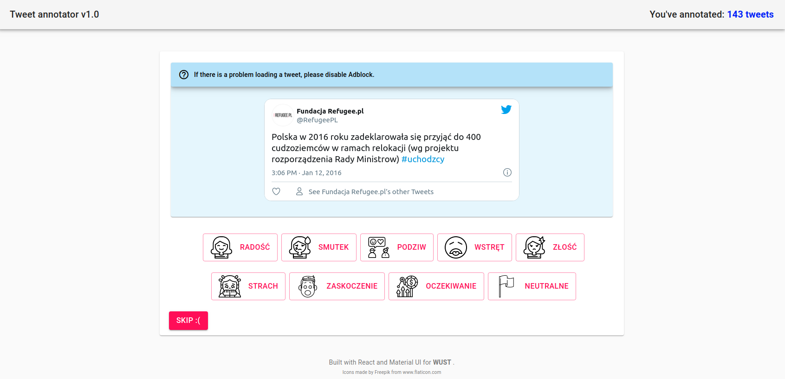
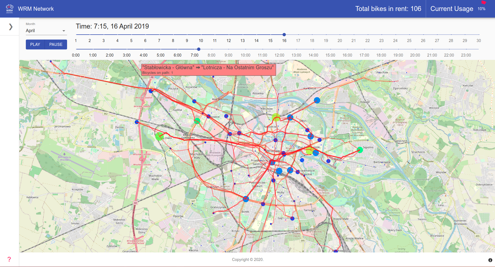
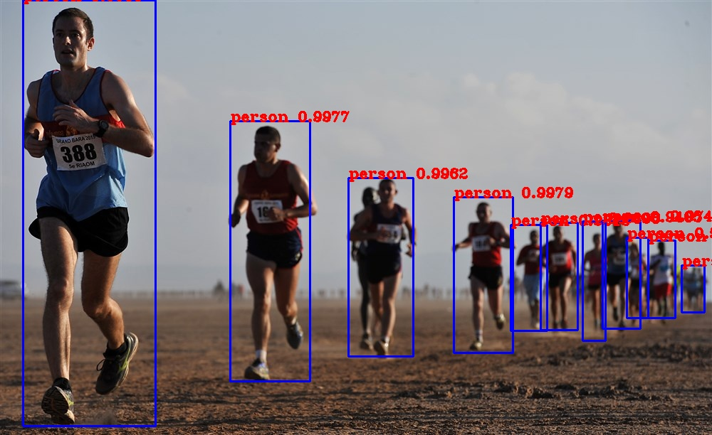

## My recent work/project

#### Tweet Dataset Annotator [(GitHub)](https://github.com/burnpiro/tweet-annotator) (PL)

Application to annotate tweets and create the first polish annotated dataset.

#### Temporal Network of city bicycles [(GitHub)](https://github.com/burnpiro/wod-bike-dataset-generator) [(Website)](https://burnpiro.github.io/wod-bike-dataset-generator/)

Creation of usage network to provide historical information about trends and users preferences.

#### DengAI: Predicting Disease Spread [(DrivenData)](https://www.drivendata.org/competitions/44/dengai-predicting-disease-spread/)

DrivenData competition for predicting sprad of dengue disease with data provided by [CDC](http://www.cdc.gov/) and [NOAA](http://www.noaa.gov/). Scored **14th place** out of over 8000 competitors.
<figure class="image" style="float: right;">
  
  <figcaption>Mosquito image courtesy of <a href="https://www.flickr.com/photos/sanofi-pasteur/5284040324/in/photolist-93W66w-arV2fF-3p8QNh-cnF7KE-cnF7Mj-cnF8a7-3p8RvU-cnF88u-cnF7Nu-arXFfy-cnF7J7-arXFto-arXDno-cnF7Hb-rwLX9d-cnF7UC-yM76y7-cnF7Ps-cnF85Q-cnF84G-cnF7TE-9wSDw-e4U78V-qRQpJa-e8GxDY-d4YEBA-d4YEwu-e8AVyt-e8GoTN-cnF873-4Gq9Y9-cnFty3-cnF7SQ-c3urbq-cnF7RY-qRJm2d-cnF7VL-62BwyV-qRJj2S-r9i7QB-r99a5k-62Bwt8-c3urhL-c3urd5-5xe7XE-pNRXZp-qRSbMx-pocK57-5xe13J-cnF7XY" target="_blank">flickr user sanofi-pasteur</a></figcaption>
</figure>

#### WOD bike usage predictor model [(GitHub)](https://github.com/burnpiro/wod-usage-predictor)

ML project to predict bicycle usage in the city of Wrocław. It's using historical data and current weather to predict usage in particular parts of the city.

<figure class="image" style="float: right;">
  
  <figcaption>Sample from model's prediction</figcaption>
</figure>

#### Deep Q-Learning Pong Game [(GitHub)](https://github.com/burnpiro/pong-deep-q-learning)

Deep Reinforcemenet Learning solution for playing Pong using Atari simulator. Application is using DoubleDeep Q-Learning algorithm.

#### Monte Carlo Tree Game [(GitHub)](https://github.com/burnpiro/monte-carlo-tree-pong)

MCTS solution for Pong game using Atari simulator

<figure class="image" style="float: right;">
  
  <figcaption>Playout example, (right agent is an AI)</figcaption>
</figure>

#### Tiny Face Detection [(GitHub)](https://github.com/burnpiro/tiny-face-detection-tensorflow2)

Tiny Face Detection with TensorFlow 2.0

<figure class="image" style="float: right;">
  
  <figcaption>Output sample</figcaption>
</figure>

#### YOLOv3 [(GitHub)](https://github.com/burnpiro/yolov3-tensorflow2)

YOLOv3 implementation in TensorFlow 2.0

<figure class="image" style="float: right;">
  
  <figcaption>Output sample</figcaption>
</figure>

#### Puppeteer Screenshot Tester [(GitHub)](https://github.com/burnpiro/puppeteer-screenshot-tester) [(NPM)](https://www.npmjs.com/package/puppeteer-screenshot-tester)

Small library that allows us to compare screenshots generated by puppeteer in our tests.

#### RentalSearch Chrome extension [(GitHub)](https://github.com/burnpiro/rentalSearch) [(Chrome WebStore)](https://chrome.google.com/webstore/detail/rentalwatch-wyszukiwarka/cjaiampoeklkdecjifpekmpjdmpailig)

Chrome extenstion which allows scrapping Gumtree and OLX.

<figure class="image" style="float: right;">
  
  <figcaption>Extension screen</figcaption>
</figure>

#### People Matcher [(GitHub)](https://github.com/burnpiro/people-matcher)

Application to create a weighted network of people with similar skils/interests.

<figure class="image" style="float: right;">
  
  <figcaption>Network Screen</figcaption>
</figure>

#### git-branch-pattern-check [(GitHub)](https://github.com/burnpiro/git-branch-pattern-check) [(NPM)](https://www.npmjs.com/package/git-branch-pattern-check)

Simple library to validate git branch name before pushing it to repository. Helpful if you want to enforce naming convention in your team without manually checking branch names.

## Talks/presentation

#### Airport Gate Optimization Problem [Slides](https://burnpiro.github.io/agap-presentation/#/)

Our aporach to solving airport gate optimization.

#### Temporal Network of city bicycles [Slides](https://burnpiro.github.io/wrm-presentation/)

Presentation about [Temporal Network Project](http://localhost:8000/pages/work#temporal-network-of-city-bicycles-github)

#### t-SNE lecture at [WUST](http://pwr.edu.pl/en/) (talk in polish) [Slides](https://burnpiro.github.io/t-sne-presentation/#/)

<iframe width="560" height="315" src="https://www.youtube-nocookie.com/embed/qJxL6H0b-F0" frameborder="0" allow="accelerometer; autoplay; encrypted-media; gyroscope; picture-in-picture" allowfullscreen></iframe>

#### Extreme Machine Learning [Slides](https://burnpiro.github.com/elm-presentation/#/)

Presentation about Extreme Learning Machines. Additionally, there is a implementation of basic ELM in python [https://github.com/burnpiro/elm-pure](https://github.com/burnpiro/elm-pure)

#### JavaScript the Dark Side of the engine [Slides](https://burnpiro.github.io/how-js-engine-works/#/)

Presentation about how JS engine works and why your browser uses all your RAM

#### Hard Events to follow [Slides](https://burnpiro.github.io/hard-events-to-follow/#/)

A modern guide to Events in JavaScript.

#### Geek Girls Carrots Wroclaw (PL) [Slides](https://burnpiro.github.io/carrots-wroclaw-day1/#/)

Presentation on the first day of Geek Girls Carrots workshop in Wrocław.

#### How to become headless puppet master [Slides](https://burnpiro.github.io/HeadlessPuppetMaster/)

Talk about how to write e2e tests in modern way without using Selenium of even Java. Introduction to Puppeteer. Code: [Github](https://github.com/burnpiro/puppeteer-wiki-test-suite)

#### Handling JS Production In Modern Way [Slides](https://github.com/burnpiro/HandlingJSProductionInModernWay)

Talk about how to transpile, and bundle you JS application in production environment? Modern JavaScript deployment.

#### Why Rendering in JS is slow [Slides](https://github.com/burnpiro/why-renderin-in-js-is-slow)

Talk about JS engines and browser performane when rendering web applications. Code: [CodePen](https://codepen.io/burnpiro/pen/JNRBjd)
