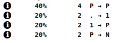

> This post requires a basic knowledge about Shapes and Inline Cache. If you didn't read [V8 function optimization](/2019/08/v-8-function-optimization), it might be difficult to follow this one.

## Problem

Creating a copy of an object is common practice in JS. You've probably done that while creating **reducers** in **Redux** or anywhere else. Currently, most used syntax to do this is spread

```javascript
const objA = { name: 'Jack', surname: 'Sparrow' };
const objB = { ...objA };
```

usage in practice:

```javascript
function dataReducer(state = { name: '', surname: '' }, action) {
  switch (action.type) {
    case ACTION_TYPES.SET_NAME:
      return {
        ...state,
        name: action.name,
      };
    case ACTION_TYPES.SET_SURNAME:
      return {
        ...state,
        surname: action.surname,
      };
    default:
      return state;
  }
}
```

but it can be done in many ways (not to count various libraries)

```javascript
const objC = Object.assign({}, objA);
const objD = JSON.parse(JSON.stringify(objA));
```

If you test how long it would take to copy 10^9 object using those methods you get results like (every time we're copying `objA`):

```
test with spread: 14 ms.
test with Object.assign: 36 ms.
test with JSON.parse: 702 ms.
```

Clearly `JSON.parse` is the slowest of them, and by some margin. Why should you even consider using it instead of spread?

## Not so obvious behavior of V8 engine

Everything comes to how V8 is optimizing functions. Every time function is executed V8 is comparing object passed to it with `IC` (Inline Cache) and if `Shape` of that object is stored inside one of the "caches" then V8 could follow "fast path".

So if you have a function like that

```javascript
function test(obj) {
  let result = '';
  for (let i = 0; i < N; i += 1) {
    result += obj.a + obj.b;
  }
  return result;
}
```

you can run it with a multiple object of the same shape and have a great performance

```javascript
const jack = { name: 'Jack', surname: 'Sparrow' };
const frodo = { name: 'Frodo', surname: 'Baggins' };
const charles = { name: 'Charles', surname: 'Xavier' };
test(jack);
test(frodo);
test(charles);
```

Reason for that is because V8 is going to mark that function as **Monomorphic** and optimize its code. As you know only time it happens is when the function is called with one and only one shape.

Let's check what kind of shapes are produced when using each of 3 copy methods:

> Run code below using `d8 --allow-natives-syntax index.js` to get access to V8 internal methods like `%HaveSameMap()`

```javascript
const objA = { name: 'Jack', surname: 'Sparrow' };
const objB = { ...objA };
console.log(%HaveSameMap(objA, objB)); // false
```

```javascript
const objA = { name: 'Jack', surname: 'Sparrow' };
const objC = Object.assign({}, objA);
console.log(%HaveSameMap(objA, objC)); // false
```

```javascript
const objA = { name: 'Jack', surname: 'Sparrow' };
const objD = JSON.parse(JSON.stringify(objA));
console.log(%HaveSameMap(objA, objD)); // true
```

As you can see only `JSON.parse(JSON.stringify(objA))` create an object that has the same shape as `objA`.


## Cost of non-monomorhpic functions

Here is our function

```javascript
function test(obj) {
  let result = '';
  // Any costly operation
  for (let i = 0; i < N; i += 1) {
    result += obj.name + obj.surname;
  }
  return result;
}
```

What is important here is that function does sth expensive and thread blocking. This example is stupid but imagine there is some complex mathematical operation going on. That's how we call our function in two different ways

```javascript
const jack = { name: 'Jack', surname: 'Sparrow' };
const frodo = { name: 'Frodo', surname: 'Baggins' };
const charles = { name: 'Charles', surname: 'Xavier' };
const legolas = { name: 'Legolas', surname: 'Thranduilion' };
const indiana = { name: 'Indiana', surname: 'Jones' };

for (let i = 0; i < N; i += 1) {
  test(JSON.parse(JSON.stringify(jack)));
  test(JSON.parse(JSON.stringify(frodo)));
  test(JSON.parse(JSON.stringify(charles)));
  test(JSON.parse(JSON.stringify(legolas)));
  test(JSON.parse(JSON.stringify(indiana)));
}

for (let i = 0; i < N; i += 1) {
  test({ ...jack });
  test({ ...frodo });
  test({ ...charles });
  test({ ...legolas });
  test({ ...indiana });
}
```

This is quite common scenario. We don't want to affect existing objects, so we decided to create a copy of it.

If you set `N` to **10000** and run this loop, the result might surprise you:

```
test with PARSE: 2522 ms.
test with spread: 10046 ms.
```

What? Spread is 4 times slower than `JSON.parse`? If that's weird remember what I've said before

> V8 is going to mark that function as **Monomorphic** and optimize its code

Because the test is not a simple function (code is simple but expensive to run), initial cost of calling `JSON.stringify` and `JSON.parse` is way lower than running that function without optimization.



In the second test run that function becomes **Megamorphic** and V8 stops optimizing it. You can check <a href="https://gist.github.com/burnpiro/03ebfca377bc037cda840757cddc528d" target="_blank">this gist</a> to try it on your machine.

## Conclusion

It's important to understand how JS optimisation works when designing complex computation methods in JavaScript. Sometimes even a simple thing can cause performance to drop and you can spend days trying to figure out what's happening.

I'm not saying to replace all spread operators with `JSON.parse`, that would definitely decrease performance of your app. My point it that sometimes reducing performance of one thing can drastically improve performance of another. 

Case I've just describes is really special one, and might affect you only when a function does sth expensive, but knowing that can help you approach the problem differently.