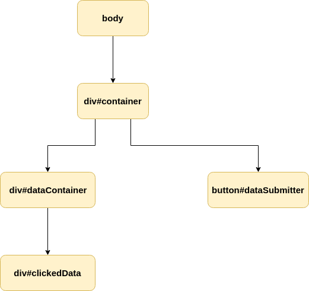
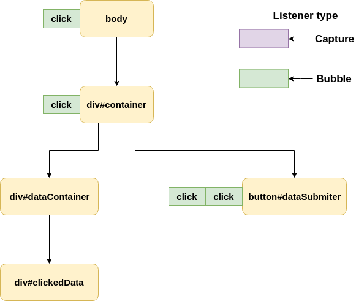
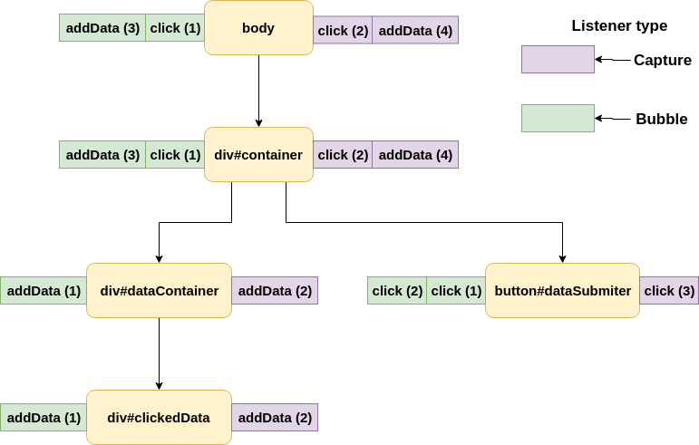
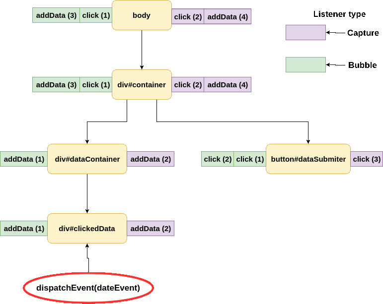

### What are Events?

> Events are objects and implement the [Event interface](https://dom.spec.whatwg.org/#interface-event)

Those objects are dispatched by the user agent (or the application itself) and handled by the [Event Listener](https://dom.spec.whatwg.org/#concept-event-listener). Events are responsible for handling user interactions or network activity. There are different types of events but you can check then on [MDN](https://developer.mozilla.org/en-US/docs/Web/API/Event#Introduction) if you want. We have to focus on how events are propagating through the DOM.

### Event propagation

First, we have to create some simple DOM to explain event propagation

```html
<div id="container">
  <div id="dataContainer">
    <div id="clickedData"></div>
  </div>
  <button id="dataSubmitter">Add Data</button>
</div>
```



To handle events we need to add some Event Listeners. To do that in VanillaJS we have to get DOM element and call `addEventListener` on it. DOM Element is implementing EventTarget interface and because of that, we have access to `addEventListener(type, callback, options)` and `removeEventListener(type, callback, options)` methods.

- **type** - the name of the event
- **callback** - function to be called
- **options** - object to change default listener behavior

```javascript
const button = document.getElementById('dataSubmitter');

button.addEventListener('click', e => {
  console.log('clicked');
});
```

After calling `addEventListener` we've added a listener to **event listener list** on that element (button). This list is a list of zero or more event listeners which means you can add more listeners for the same event.

```javascript
const button = document.getElementById('dataSubmitter');

button.addEventListener('click', e => {
  console.log('clicked first');
});
button.addEventListener('click', e => {
  console.log('clicked second');
});
```

In this case when `click` event is dispatched, listeners will be called in the order in which they were assigned (we'll see `clicked first` and then `clicked second` in the console).

Everyone knows what will happen after clicking on our button (2 console logs) but to show how the event is propagating through our DOM tree we have to add more listeners



And now after user interaction event is **bubbled** through the DOM upwards


This process is called **bubbling** and it's easy to understand, but it's not the whole path. Every event starts its path from the top of the tree. This process is called **capturing** and to access events in the **capture** phase we have to create listeners with extra options passed as the third argument.

```javascript
const container = document.getElementById('container');
container.addEventListener(
  'click',
  e => {
    console.log("container capture 'click'");
  },
  {
    capture: true,
  }
);
```

`capture: true` informs our listener to listen for events in **phase 1 or 2**. Every event has 3 phases:

- **Capture (1)** - going down the tree
- **On Target (2)** - that's self-explanatory
- **Bubble (3)** - going up the tree

Now let's see how our event is propagating (numbers next to event type is the order in which event listener is added).


After click event is dispatched it starts at the `body` level with `eventPhase === 1`. After that is propagates through the tree until it reaches its target (button).

At the button level phase change to **2** and we can spot unusual behavior. If you look closely on the order in which listeners are called (`button`), first we're calling event listeners which are responsible for **bubbling** event and then listener responsible for **capturing**. It might seem weird at the beginning, but at the `button` level, our event is not in any of those phases. Because of that, our listeners are executed in order of creation. In **On Target** phase, listener type doesn't matter.

After that our event is bubbling in the same way as in the previous example.

### How to stop events from propagating?

Sometimes we want our events to top at the specific point of the tree. To do that we need to use `e.stopPropagation()` or `e.stopImmediatePropagation()`. Those functions are preventing other listeners from being called with the same event.

#### stopPropagation()

```javascript
const button = document.getElementById('dataSubmitter');

button.addEventListener('click', e => {
  console.log('clicked first');
  e.stopPropagation();
});
button.addEventListener('click', e => {
  console.log('clicked second');
});
button.addEventListener(
  'click',
  e => {
    console.log("button capture 'click'");
  },
  {
    capture: true,
  }
);
```


Even if we call `stopPropagation()` inside the first listener, all listeners assigned to current elements are called. Event is not propagated into another `EventTarget`. We can call `stopPropagation()` inside any of our listeners on the way, it doesn't have to be target or even **bubbling** phase. If you want to prevent the event from reaching the target you can call `stopPropagation` in one of the listeners listening on the **capture** phase.

#### stopImmediatePropagation()

```javascript
const button = document.getElementById('dataSubmitter');

button.addEventListener('click', e => {
  console.log('clicked first');
  e.stopImmediatePropagation();
});
button.addEventListener('click', e => {
  console.log('clicked second');
});
button.addEventListener(
  'click',
  e => {
    console.log("button capture 'click'");
  },
  {
    capture: true,
  }
);
```


You've probably already spotted the difference. `stopImmediatePropagation` is stopping propagation on the same listener in which it's called. If we call it inside `click (2)` then propagation stops at `click (2)` and doesn't execute `click (3)`. You should be aware of that difference when dealing with multiple listeners on your elements.

#### preventDefault()

It's a good time to mention `preventDefault` method. It's quite common in modern frameworks to do something like that:

```javascript
e.preventDefault();
e.stopPropagation();
```

A lot of people are doing that without even knowing why. You know that `stopPropagation()` is stopping an event from going through the event listeners. `preventDefault` on the other hand, is telling the browser not to execute its default behavior.

<iframe src="https://codesandbox.io/embed/awesome-wildflower-z3wn2?fontsize=14" title="awesome-wildflower-z3wn2" allow="geolocation; microphone; camera; midi; vr; accelerometer; gyroscope; payment; ambient-light-sensor; encrypted-media" style="width:100%; height:500px; border:0; border-radius: 4px; overflow:hidden;" sandbox="allow-modals allow-forms allow-popups allow-scripts allow-same-origin"></iframe>

If we call `preventDefault()` on `click` event from checkbox then browser won't change our checkbox to the selected state. We can handle our event manually (e.g. apply custom action instead). That's also helpful when it comes to submitting the form. In most of the popular libraries, we don't actually want form element to send HTML from. We want to handle form data manually, apply validation, parsing and add some extra data before sending.

### Dispatching events manually

I've said before, event doesn't have to be created by the browser, we can create them. To do that we have to create new `CustomEvent` instance, and `dispatchEvent`. [`CustomEvent`](https://dom.spec.whatwg.org/#interface-customevent) is basically the same standard `Event` but has an additional attribute in `options` object called `details`. That attribute is used to store custom data.

```javascript
const clickedData = document.getElementById('clickedData');
const dataEvent = new CustomEvent('addData', {
  detail: { test: 'test2' },
});

clickedData.dispatchEvent(dataEvent);
```

Let's add listeners to our tree to listen for our custom event



What will happen when our code is executed?


Wait for the second, why there is no bubbling?! In our case event stays on **On Target** phase. Reason for that is because by default all events created using `new CustomEvent()` have `bubbles` set to `false`.

To enable bubbling for this event we have to create it with `options` object:

```javascript
new CustomEvent('addData', {
  bubbles: true,
  detail: { test: 'test2' },
});
```



> Using `CustomEvent` is not mandatory. If you want you can create instance of `new Event()` and use it for your propagation.

### When we might want to use custom events?

I think sending data to elements it's obvious. A good example to show you why you might want to hook up into event propagation is React's HOCs (Higher Order Components). Imagine an application with multiple layers of logic wrapped around your form. It might look sth like:

```html
<div id="app">
  <div id="addUserData">
    <div id="prefillAfterReset">
      <form>
        {...}
      </form>
    </div>
  </div>
</div>
```

In this case, we can hook into form's `submit` and `reset` events even before they reach our form component and add/modify data on submitting/resetting the form. I'm not saying to implement such behavior because there are better ways to do it.

If you want to play with events please check this sandbox
<iframe src="https://codesandbox.io/embed/blissful-wilson-6ce25?fontsize=14" title="blissful-wilson-6ce25" allow="geolocation; microphone; camera; midi; vr; accelerometer; gyroscope; payment; ambient-light-sensor; encrypted-media" style="width:100%; height:500px; border:0; border-radius: 4px; overflow:hidden;" sandbox="allow-modals allow-forms allow-popups allow-scripts allow-same-origin"></iframe>