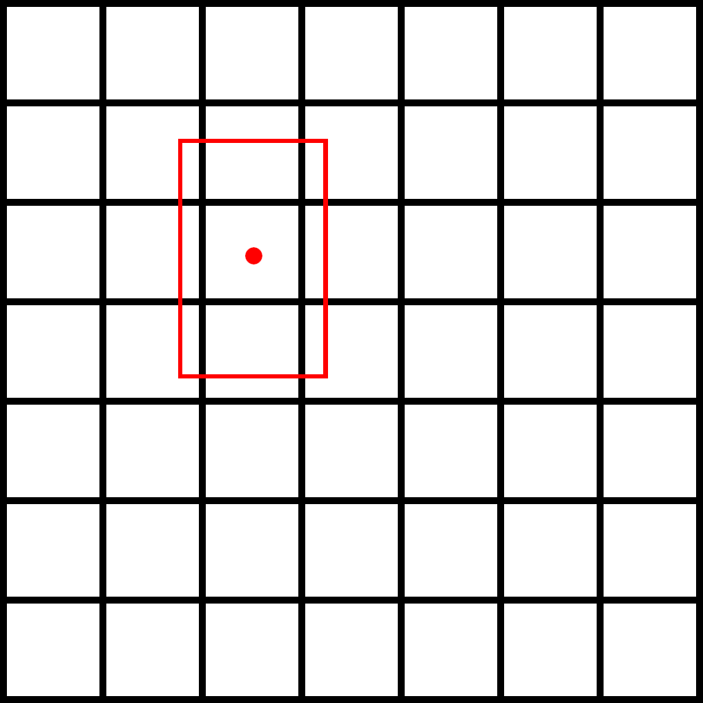

<figure class="image">
  
  <figcaption>Image source: https://swinghu.github.io/assets/face-detection-recognition/From_Facial_Parts_Responses_to_Face_Detection_A_Deep_Learning_Approach_index.png</figcaption>
</figure>

## The problem
Modern Machine Learning solutions require a huge amount of data, that's definitely the case when working with image recognition/object detection. Because of that, we need to create more and more complex datasets to teach our models. At this moment we cannot store the whole thing in the memory (sometimes even hard drive has a problem), quite often a description of that dataset is not directly readable by Tensorflow's __Dataset__. That's why we need to create a modern solution to handle and preprocess an enormous amount of data in easy to understand way using Sequences.

> __TLDR__:
>
> Here is a code: [https://gist.github.com/burnpiro/c3835a1f914545f2034f4190b1e83153](https://gist.github.com/burnpiro/c3835a1f914545f2034f4190b1e83153)
>
> Use Sequences to make datasets maintainable and fast.

## What is the Sequence?
According to documentation, Sequence is:

> __Base object for fitting to a sequence of data, such as a dataset.__

Sequence object is created using [__Sequence Class__](https://github.com/tensorflow/tensorflow/blob/r2.0/tensorflow/python/keras/utils/data_utils.py#L331-L406). The best thing about it is that we can extend it. Every Sequence has to implement 3 methods:
- `__getitem__` - used to extract item from dataset
- `__len__` - returns the length of our dataset
- `__init__` - initializing our dataset (this one is not required but we need some kind of initialization)

Sequence allows us to create complex datasets and even modify them at the end of each epoch by implementing `on_epoch_end`. We're going to focus only on those 3 methods but if you can you can play with `on_epoch_end`.

## Our Test Dataset

In our example, we're going to use WIDER FACE dataset

> Instruction how to get dataset is [Here](https://github.com/burnpiro/tiny-face-detection-tensorflow2#dataset)

This dataset contains over 32k images and weights around 2GB so we don't really want to keep it in the memory all the time. This dataset is used to teach object detection models so it contains bounding boxes for every face on the image.

### Data structure

Dataset is already split into __Train__ and __Validation__ so we don't have to do it again. We have two folders: __WIDER_train__ and __WIDER_val__. The image description is stored in `wider_face_train_bbx_gt.txt` and `wider_face_val_bbx_gt.txt`. Here is an example of one of the images

<figure class="image">
  
  <figcaption>Image source: WIDER FACE dataset</figcaption>
</figure>

Description for that image in `.txt` file is as follows:

```
22--Picnic/22_Picnic_Picnic_22_277.jpg
3
196 410 74 114 1 0 0 0 0 0 
344 404 62 88 1 0 0 0 0 0 
634 222 58 86 1 0 0 0 0 0 
```

It might seem unclear at first but everything is explained in Dataset's Readme file:

```
File name
Number of bounding box
x1, y1, w, h, blur, expression, illumination, invalid, occlusion, pose
```

So our image contains 3 boxes. The first two numbers are X and Y coordinates followed by box width and height. After that we have more information about the face inside the box, we're not going to use those ones because our goal is just object detection (face detection) but feel free to check Readme file for properties description.

## Model's input and output

Now after we know how our dataset looks like we need to figure out what is an input and output of our __Model__.

> You can skip this section if you want. It's not necessary to know anything more than the input and output size of the model to construct training examples.
>- Input - __224x224x3__
>- Output - __7x7x5__
>
>Imho, it's beneficial to understand it but not required. I've selected this model because most of the guides are using simple examples from regression networks and it's hard to find a solution for a complex one.

For this example we're going to use __MobileNetV2__ (`mobilenet_v2_0.75_224` to be precise), our model has input size of __224x224x3__ (width x height x RGB). So every example in our sentence has to produce input of that size.

Output, on the other hand, is completely up to us. We're using MobileNet as a feature extractor that gives us output from the last Conv layer of __7x7x240__. We want to keep 7x7 grid and our detection requires only 5 values per grid (because we have only one class). In the end, our output should look like __7x7x5__ (grid width x grid width x number of classes times 5).

I'm not going to discuss how this network works, you can easily find any tutorial on CNNs and how to use them as a feature extractor for object detection (maybe some other guide in the future).

This is how our model looks like at the end:
```
__________________________________________________________________________________________________
Layer (type)                    Output Shape         Param #     Connected to                     
==================================================================================================
input_1 (InputLayer)            [(None, 224, 224, 3) 0                   
________________________________________________________________________
                         
----- Rest of MobileNetV2 ------
__________________________________________________________________________________________________
block_16_project_BN (BatchNorma (None, 7, 7, 240)    960         block_16_project[0][0]           
__________________________________________________________________________________________________

----- Our Layers conected to MobileNet output------    
__________________________________________________________________________________________________
conv2d_2 (Conv2D)               (None, 7, 7, 5)      1205        activation[0][0]                 
```

Now it should be clear that our Dataset should generate examples like:

- Input - __224x224x3__
- Output - __7x7x5__

## Extend Sequence Class

```python
# Data generator boilerplace
class DataGenerator(tf.keras.utils.Sequence):

    def __init__(self, file_path, config_path, debug=False):
        # Sequence initialization
        
    def __len__(self):
        # Should return Sequence length

    def __getitem__(self, idx):
        # Returns preprocessed data

```

### Initialization

The first thing we need to implement is data initialization. 

```python
    def __init__(self, file_path, config_path, debug=False):
        # Sequence initialization
        
```

Because dataset description is located in two different files (one for training and one for validation) we need to pass paths to the folder with images (`file_path`) and the path to our dataset spec (`config_path`). `debug` options allow us to display additional messages when processing dataset.

Inside `__init__` method we have access to `self` object. This object represents our sequence and we want to initialize some default values on it.

```python
self.boxes = []
self.debug = debug
self.data_path = file_path
```

- `self.boxes` is going to store all boxes definitions from dataset
- `self.debug` enables __debug__ mode
- `self.data_path` stores path to images for later processing

After initialization we need to check if paths are valid (if not there is no reason to create Sequence).

```python
if not os.path.isfile(config_path):
    print("File path {} does not exist. Exiting...".format(config_path))
    sys.exit()

if not os.path.isdir(file_path):
    print("Images folder path {} does not exist. Exiting...".format(file_path))
    sys.exit()
```

When everything is correct we can start reading config file

```python
with open(config_path) as fp:
    image_name = fp.readline()
    cnt = 1
    while image_name:
        # image_name - relative path to our image
        # in this loop we have to process each image definition
```

We're going to read this file line by line but as you remember file is structured in a specyfic way:

```
File name
Number of bounding box
x1, y1, w, h, blur, expression, illumination, invalid, occlusion, pose
```

So after reading __File name__ and __Number of bounding box__ we need to use that number to know how many lines to read as bounding boxes definition.

```python
with open(config_path) as fp:
    image_name = fp.readline()
    cnt = 1
    while image_name:
        num_of_obj = int(fp.readline())
        for i in range(num_of_obj):
            obj_box = fp.readline().split(' ')
            x0, y0, w, h = get_box(obj_box)
            if w == 0:
                # remove boxes with no width
                continue
            if h == 0:
                # remove boxes with no height
                continue
            self.boxes.append((line.strip(), x0, y0, w, h))
        line = fp.readline()
        cnt += 1
```

First thing we have to do inside `while` loop is to extract how many boxes there are. To do this we're calling `int(tf.readline()` which returns next line value as integer. We're using this numer to iterate through next `num_of_obj` lines. Each line values are separated by empty string so we have to split values before processing `obj_box = fp.readline().split(' ')`. We're interested in first 4 values from each line but those values have to be integers. To extract those values it's easier to create helper function `get_box`:

```python
# Input: [x0, y0, w, h, blur, expression, illumination, invalid, occlusion, pose]
# Output: x0, y0, w, h
def get_box(data):
    x0 = int(data[0])
    y0 = int(data[1])
    w = int(data[2])
    h = int(data[3])
    return x0, y0, w, h
```

This function receives list of strings and returns 4 integers we need. After that we're appending our box to Sequence object `self.boxes.append((line.strip(), x0, y0, w, h))` and read next line.

Everything seems fine and we should be ready to move to the next part, but if we try to execute this code it will fail.

```bash
ValueError: invalid literal for int() with base 10: '0--Parade/0_Parade_Parade_0_630.jpg\n'
```

Did we make a mistake in the code? No we didn't. We just didn't explore our dataset carefully enough. If we jump to our __.txt__ file and find line with that sentence it's much clearer what just happen.

```
0--Parade/0_Parade_Parade_0_452.jpg
0
0 0 0 0 0 0 0 0 0 0 
0--Parade/0_Parade_Parade_0_630.jpg
```

We didn't antycipated there are images wihtout faces and because of how our iteration is designed it's not going to skip line with zeros after reading `num_of_obj = 0`. Knowing that we can create quick fix just after for loop:

```python
if num_of_obj == 0:
    obj_box = fp.readline().split(' ')
    x0, y0, w, h = get_box(obj_box)
    self.boxes.append((line.strip(), x0, y0, w, h))
```

That way, when there are no faces on image we're going to create empty example.

### Return length of the dataset

That should be easy... But it isn't :) When implementing `__len__` method we need to remember that training works in batches. Because of that, we have to divide the number of boxes by our batch size and return that instead of just the length of our array.

```python
def __len__(self):
    return math.ceil(len(self.boxes) / cfg.TRAIN.BATCH_SIZE)
```

Notice that we're using a mysterious config called `cfg`. This is just an `EasyDict` dictionary that holds our dataset settings. You don't have to worry about it right now, I'll show you its definition at the end. For now, just assume that it stores all config values.

### Returning items

Till now we've managed to create our Sequence but we still didn't define how to process images in the dataset. Each box in Sequence has 5 values:
- path to image
- x value for box center
- y value for box center
- box width
- box height

`__getitem__(self, idx)` method should return two values (input, output). But because we're working in batches those values will be arrays with multiple images and corresponding boxes.

```python
def __getitem__(self, idx):
    boxes = self.boxes[idx * cfg.TRAIN.BATCH_SIZE:(idx + 1) * cfg.TRAIN.BATCH_SIZE]
```

First, we have to extract boxes definition from given __idx__ to __idx + BATCH_SIZE__. So if our __BATCH_SIZE__ is __16__ and __idx__ is __0__ then we're processing boxes from __0__ to __16__.

Now we have to define zeros matrix for input and output

```python
batch_images = np.zeros((len(boxes), cfg.NN.INPUT_SIZE, cfg.NN.INPUT_SIZE, 3), dtype=np.float32)
batch_boxes = np.zeros((len(boxes), cfg.NN.GRID_SIZE, cfg.NN.GRID_SIZE, 5), dtype=np.float32)
```

- `batch_images` contains images and has a size of __16x224x224x3__. 
- `batch_boxes` contains expected output in a grid and has size of __16x7x7x5__.

Now we have to iterate over our batch and process each example.

```python
for i, row in enumerate(boxes):
    path, x0, y0, w, h = row
```

First, we have to create input from image path. To do that we're going to use `tf.keras.preprocessing.image.load_img`.

```python
proc_image = tf.keras.preprocessing.image.load_img(self.data_path + path)

image_width = proc_image.width
image_height = proc_image.height

proc_image = tf.keras.preprocessing.image.load_img(self.data_path + path,
                                               target_size=(cfg.NN.INPUT_SIZE, cfg.NN.INPUT_SIZE))

proc_image = tf.keras.preprocessing.image.img_to_array(proc_image)
proc_image = np.expand_dims(proc_image, axis=0)
proc_image - tf.keras.applications.mobilenet_v2.preprocess_input(proc_image)

batch_images[i] = proc_image
```

For each image, we need to extract original width and height to be able to scale __x0, y0, w, h__ of our box. That's why we're calling this method twice (second time with `target_size` set to our __224x224__). In the end, our processed image is stored in `batch_images`.

Next, we have to deal with box position and size. Original values are integers and represent a point on the original image. What we need to do is to scale them into __<0,1>__ values. That's why we need `image_width` and `image_height` from the original image.

```python
    image_width = proc_image.width
    image_height = proc_image.height

    # make sure none of the points is out of image border
    x0 = max(x0, 0)
    y0 = max(y0, 0)

    x0 = min(x0, image_width)
    y0 = min(y0, image_height)

    x_c = (cfg.NN.GRID_SIZE / image_width) * x0
    y_c = (cfg.NN.GRID_SIZE / image_height) * y0

    floor_y = math.floor(y_c)  # handle case when x i on the corner
    floor_x = math.floor(x_c)  # handle case when y i on the corner

    batch_boxes[i, floor_y, floor_x, 0] = h / image_height
    batch_boxes[i, floor_y, floor_x, 1] = w / image_width
    batch_boxes[i, floor_y, floor_x, 2] = y_c - floor_y
    batch_boxes[i, floor_y, floor_x, 3] = x_c - floor_x
    batch_boxes[i, floor_y, floor_x, 4] = 1
```

This section applyies extra validation to be sure that our point lays inside the image. Except that we're calculating relative position of that point to whatever grid cell it is in. 



Default values for this point might be:
- x = 0.35 (relative to top left corner)
- y = 0.35 (relative to top left corner)

But our output requires position in relation to the grid cell (one which contains the point). Because of that new coordinates are as follows:
- x = 0.5 (relative to cell top left corner)
- y = 0.5 (relative to cell top left corner)

In the end, we're saving those values inside i-th output and 3x3 grid cell (rest of them remains zero). Notice that the __width__ and the __height__ of the box are still scaled to the full image.

After we process all examples in the batch we need to only return both arrays

```python
return batch_images, batch_boxes
```

To use our generator just create instance of it and pass right paths

```python
train_datagen = DataGenerator(file_path=cfg.TRAIN.DATA_PATH, config_path=cfg.TRAIN.ANNOTATION_PATH)
val_generator = DataGenerator(file_path=cfg.TEST.DATA_PATH, config_path=cfg.TEST.ANNOTATION_PATH, debug=False)
```

now we can fit our data for training
```python
model.fit_generator(generator=train_datagen,
                        epochs=cfg.TRAIN.EPOCHS,
                        callbacks=[# your callbacks for TF],
                        shuffle=True,
                        verbose=1)
```

Here is a full code for __DataGenerator__ Class:
[https://gist.github.com/burnpiro/c3835a1f914545f2034f4190b1e83153](https://gist.github.com/burnpiro/c3835a1f914545f2034f4190b1e83153)

## Summary

If you're working with complex datasets (or just really large ones) it's a good idea to think about Sequences and create your won Sequence Class for data generation. It's efficient (multithreading out of the box) and easy to maintain way you'll appricieate, especially when working with the team of engineres and version controll.

This code is just an example, your implementation may (and probably will) look different. Everything depends on specific problems and structure of the dataset but imho it's a lot easier to define data processing inside class than using C like approach you can find inside Tensorflow guides.

Have a Happy New Year and see you in 2020!!!