<figure class="image">
  
  <figcaption>Original Fast R-CNN architecture. Source: <a href="https://arxiv.org/pdf/1504.08083.pdf" target="_blank">https://arxiv.org/pdf/1504.08083.pdf</a></figcaption>
</figure>

> We're going to discuss original RoI pooling described in __Fast R-CNN__ paper (light blue rectangle on the image above). There is a second and a third version of that process called __RoIAlign__ and __RoIWarp__. I'm going to create another article about them soon.

## What is RoI?

__RoI__ (Region of Interest) is a proposed region from the original image. We're not going to describe how to extract those regions because there are multiple methods to do only that. The only thing we should know right now is there are multiple regions like that and all of them should be tested at the end.

## How Fast R-CNN works?

### Feature extraction

__Fast R-CNN__ is different from the basic __R-CNN__ network. It has only one convolutional feature extraction (in our example we're going to use VGG16).

<figure class="image">
  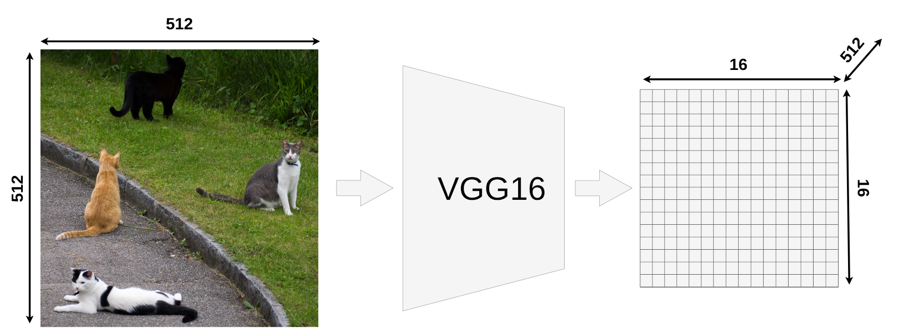
  <figcaption>VGG16 feature extraction output size</figcaption>
</figure>

Our model takes an image input of size __512x512x3__ (width x height x RGB) and VGG16 is mapping it into a __16x16x512__ feature map. You could use different input sizes (usually it's smaller, default input size for VGG16 in Keras is 224x224).

If you look at the output matrix you should notice that it's __width__ and __height__ is exactly 32 times smaller than the input image (512/32 = 16). That's important because all RoIs have to be scaled down by this factor.

### Sample RoIs

Here we have 4 different RoIs. In the actual Fast R-CNN you might have thousands of them but printing all of them would make image unreadable.

<figure class="image">
  
  <figcaption>Regions of Interest</figcaption>
</figure>

It's important to remember that __RoI is NOT a bounding box__. It might look like one but it's just a proposal for further processing. Many people are assuming that because most of the papers and blog posts are creating proposals in place of actual objects. It's more convenient that way, I did it as well on my image. Here is an example of a different proposal area which also is going to be checked by Fast R-CNN (green box).

<figure class="image">
  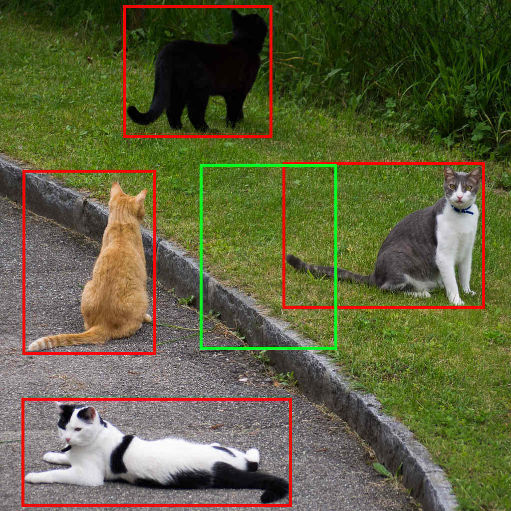
  <figcaption>Region of Interest which doesn't make sense :)</figcaption>
</figure>

There are methods to limit the number of RoIs and maybe I'll write about it in the future.

### How to get RoIs from the feature map?

Now when we know what RoI is we have to be able to map them onto VGG16's output feature map.

<figure class="image">
  
  <figcaption>Mapping our RoIs onto the output of VGG16</figcaption>
</figure>

Every RoI has it's original coordinates and size. From now we're going to focus only on one of them:

<figure class="image">
  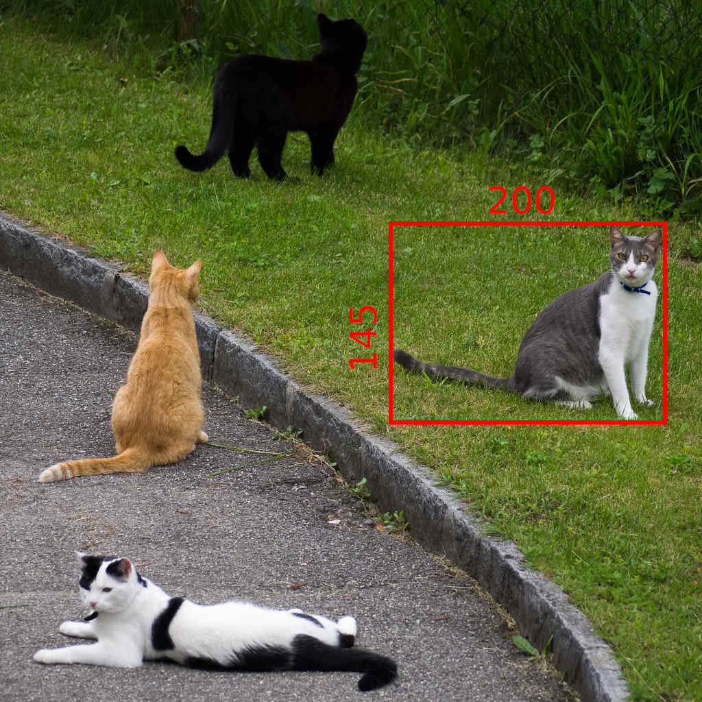
  <figcaption>Our RoI target</figcaption>
</figure>

Its original size is __145x200__ and the top left corner is set to be in __(192x296)__. As you could probably tell, we're not able to divide most of those numbers by __32__.

- width: 200/32 = 6.25
- height: 145/32 = ~4.53
- x: 296/32 = 9.25
- y: 192/32 = 6

Only the last number (Y coordinate of the top left corner) makes sense. That's because we're working on a __16x16__ grid right now and only numbers we care about are integers (to be more precise: Natural Numbers).

### Quantization of coordinates on the feature map

> __Quantization__ is a process of constraining an input from a large set of values (like __real numbers__) to a discrete set (like __integers__)

If we put our original RoI on feature map it would look like this:

<figure class="image">
  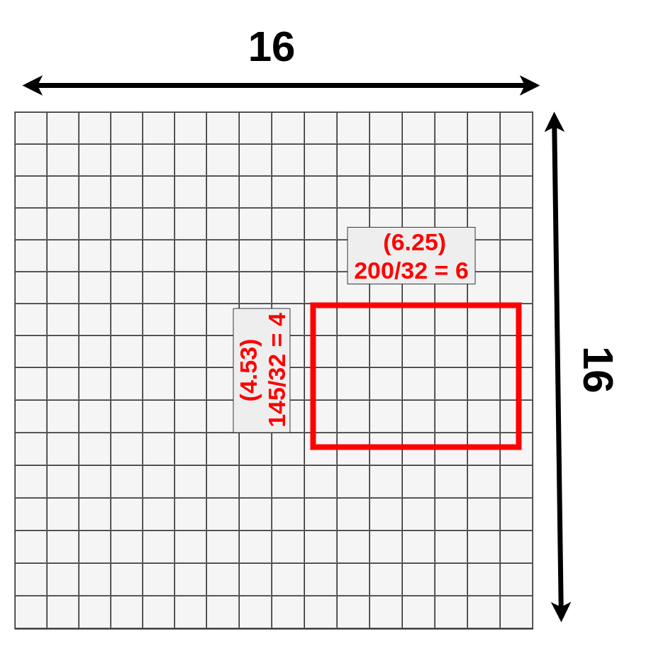
  <figcaption>Original Roi on the feature map</figcaption>
</figure>

We cannot really apply the pooling layer on it because some of the "cells" are divided. What quantization is doing is that every result is rounded down before placing it on the matrix. __9.25__ becomes __9__, __4.53__ becomes __4__, etc.

<figure class="image">
  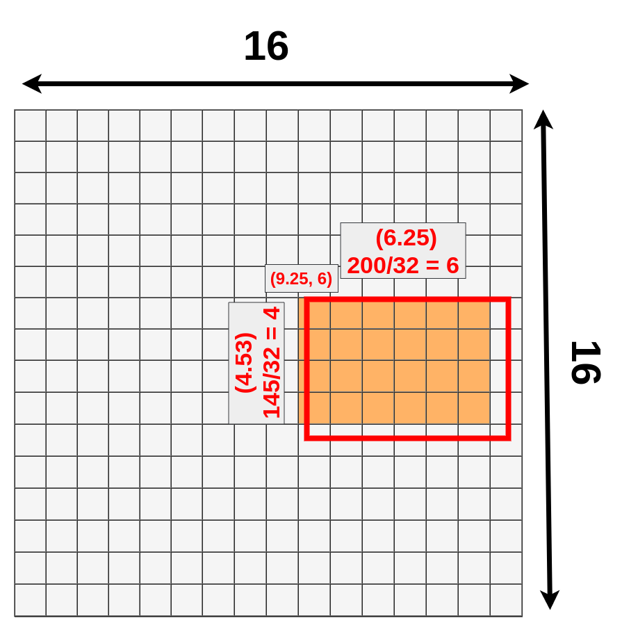
  <figcaption>Quantized RoI</figcaption>
</figure>

You can notice that we've just lost a bunch of data (dark blue) and gain new data (green):

<figure class="image">
  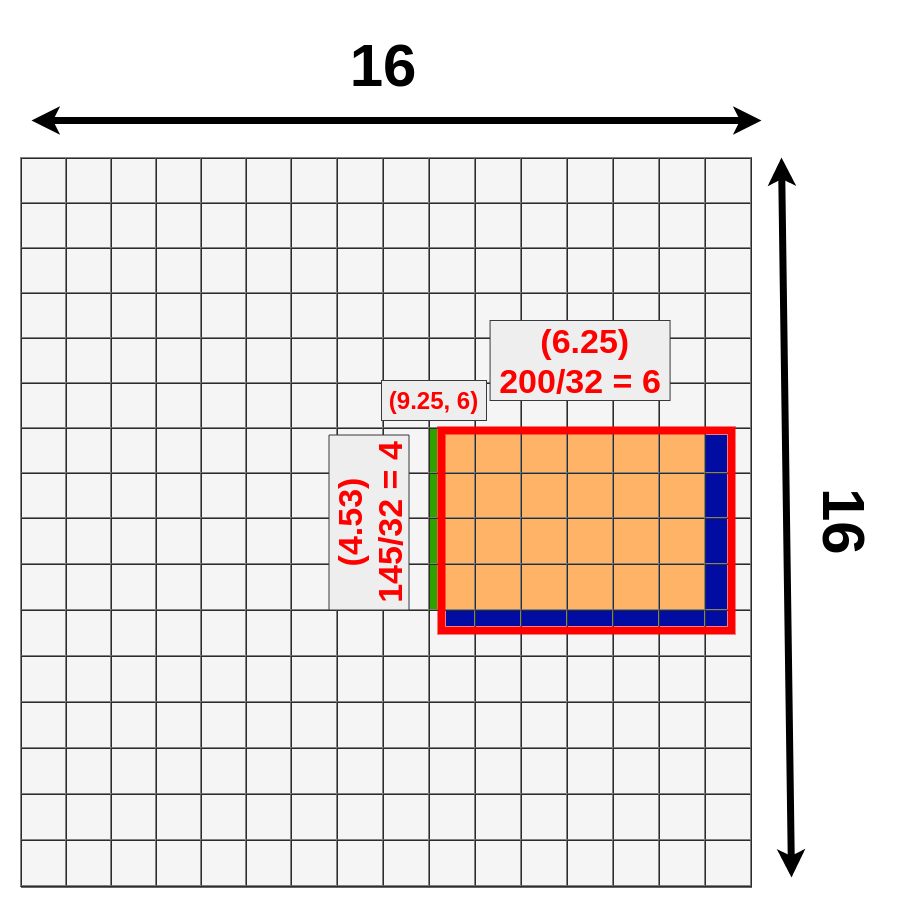
  <figcaption>Quantization losses</figcaption>
</figure>

We don't have to deal with it because it's still going to work but there is a different version of this process called __RoIAlign__ which fixes that.

### RoI Pooling

Now when we have our RoI mapped onto feature map we can apply pooling on it. Once again we're going to choose the size of __RoI Pooling__ layer just for our convenience, but remember the size might be different. You might ask "Why do we even apply RoI Pooling?" and that's a good question. If you look at the original design of Fast R-CNN:

<figure class="image">
  
  <figcaption>Original Fast R-CNN architecture. Source: <a href="https://arxiv.org/pdf/1504.08083.pdf" target="_blank">https://arxiv.org/pdf/1504.08083.pdf</a></figcaption>
</figure>

After __RoI Pooling Layer__ there is a __Fully Connected layer__ with a fixed size. Because our RoIs have different sizes we have to pool them into the same size (__3x3x512__ in our example). At this moment our mapped RoI is a size of __4x6x512__ and as you can imagine we __cannot divide 4 by 3__ :(. That's where quantization strikes again.

<figure class="image">
  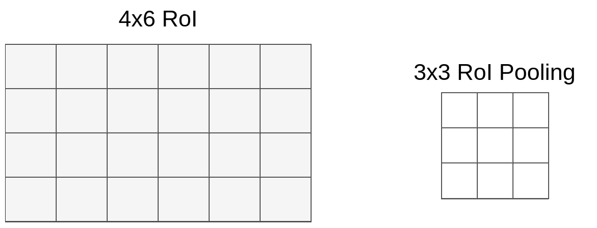
  <figcaption>Mapped RoI and pooling layer</figcaption>
</figure>

This time we don't have to deal with coordinates, only with size. We're lucky (or just convenient size of pooling layer) that 6 could be divided by 3 and it gives 2, but when you divide 4 by 3 we're left with 1.33. After applying the same method (round down) we have a __1x2 vector__. Our mapping looks like this:

<figure class="image">
  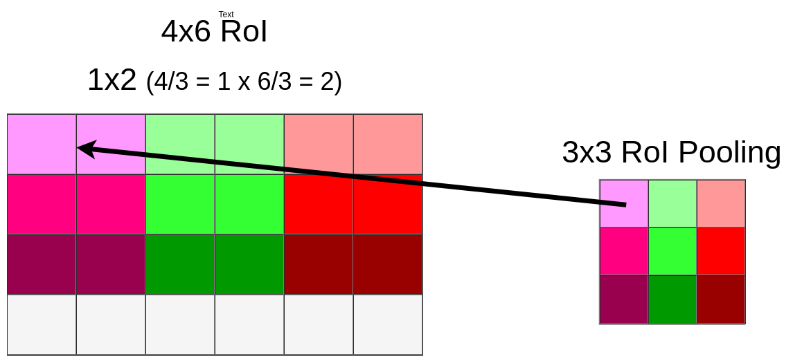
  <figcaption>Data pooling mapping</figcaption>
</figure>

Because of quantization, we're losing whole bottom row once again:

<figure class="image">
  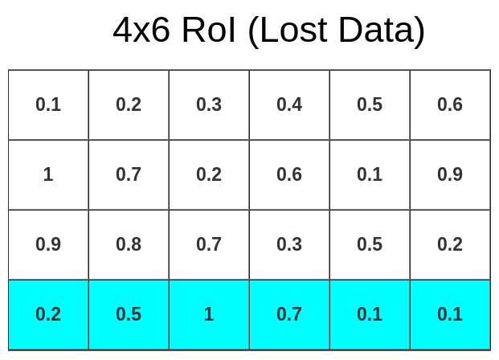
  <figcaption>Data pooling mapping</figcaption>
</figure>

Now we can __pool data into 3x3x512 matrix__

<figure class="image">
  
  <figcaption>Data pooling process</figcaption>
</figure>

In this case, we've applied __Max Pooling__ but it might be different in your model. Ofc. this process is done on the whole RoI matrix not only on the topmost layer. So the end result looks like this:

<figure class="image">
  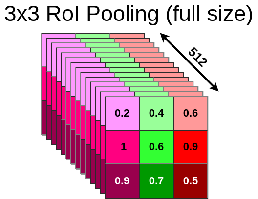
  <figcaption>Full-size pooling output</figcaption>
</figure>

The same process is applied to every single RoI from our original image so in the end, we might have hundreds or even thousands of 3x3x512 matrixes. Every one of those matrixes has to be sent through the rest of the network (starting from the FC layer). For each of them, the model is generating bbox and class separately.

### What next?

After pooling is done, we're certain that our input is a size of __3x3x512__ so we can feed it into FC layers for further processing. There is one more thing to discuss. We've lost a lot of data due to the quantization process. To be precise, that much:

<figure class="image">
  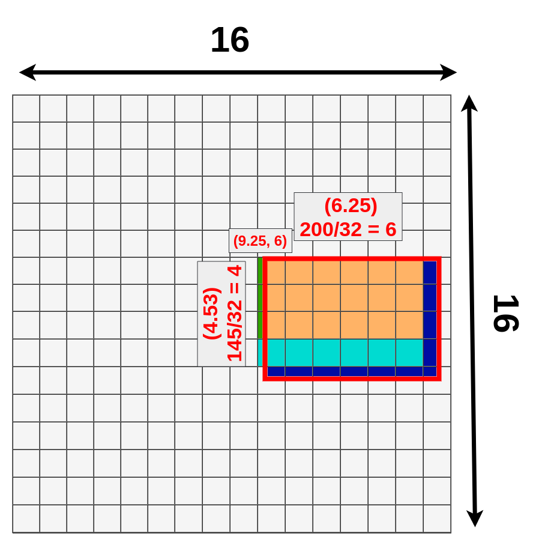
  <figcaption>Data lost in quantization (dark and light blue), data gain (green)</figcaption>
</figure>

This might be a problem because each "cell" contains a huge amount of data (1x1x512 on feature map which loosely translates to 32x32x3 on an original image but please do not use that reference, because that's not how convolutional layer works). There is a way to fix that (RoIAlign) and I'm going to write a second article about it soon.