<figure class="image">
  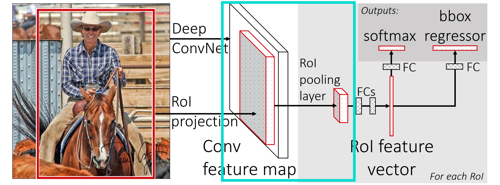
  <figcaption>Original Fast R-CNN architecture. Source: <a href="https://arxiv.org/pdf/1504.08083.pdf" target="_blank">https://arxiv.org/pdf/1504.08083.pdf</a></figcaption>
</figure>

> This is the second part of RoI Series. It doesn't include an introduction about what RoI is, so if you didn't read **[the First Part](https://erdem.pl/2020/02/understanding-region-of-interest-ro-i-pooling)** it might be hard to follow this one.

## Why do we want to modify RoI Pooling?

As you remember from the first part of the series, RoI Pooling has one major problem. It loses a lot of data in the process.

<figure class="image">
  
  <figcaption>RoI Pooling losses in quantization (dark and light blue), data gain (green)</figcaption>
</figure>

Every time it does that, part of the information about the object is missing. That lowers the precision of the whole model and a lot of really smart people thought about it.

## Setup

Before we start I need to quickly explain our model.

<figure class="image">
  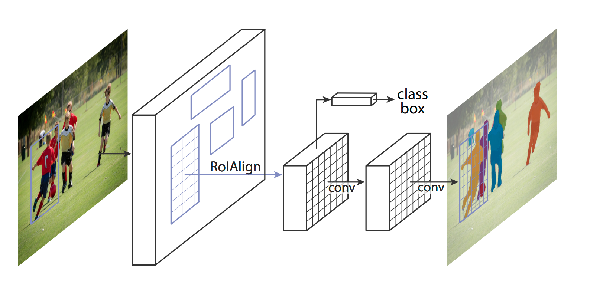
  <figcaption>Original Mask R-CNN architecture. Source: <a href="https://arxiv.org/pdf/1703.06870.pdf" target="_blank">https://arxiv.org/pdf/1703.06870.pdf</a></figcaption>
</figure>

<figure class="image">
  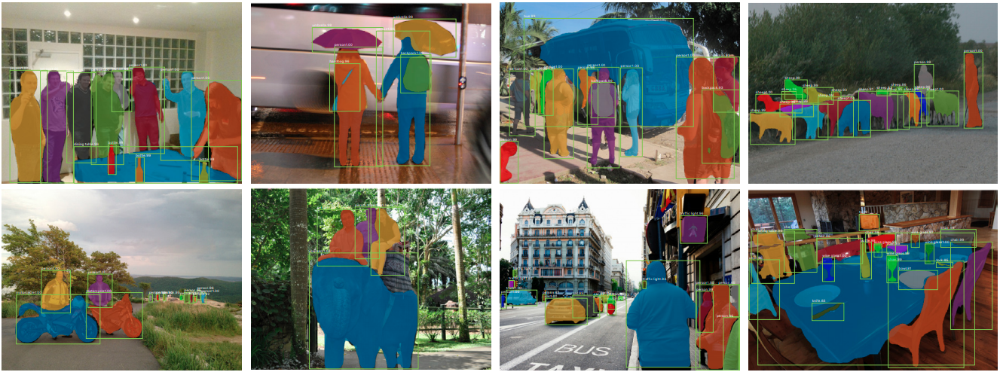
  <figcaption>Mask R-CNN output. Source: <a href="https://arxiv.org/pdf/1703.06870.pdf" target="_blank">https://arxiv.org/pdf/1703.06870.pdf</a></figcaption>
</figure>

We're going to use **Mask R-CNN** network for testing. The only reason we're using it is that this kind of network benefits more from a precise pooling layer, so it's easier to show a **difference between RoI Align and RoI Pooling**. It doesn't really matter which network we're using until it does RoI Pooling. Because of that our setup remains the same and looks like that:

<figure class="image">
  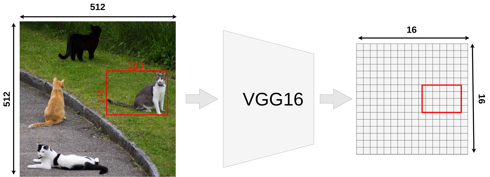
  <figcaption>Model feature mapping process</figcaption>
</figure>

Our model takes an image input of size **512x512x3** (width x height x RGB) and VGG16 is mapping it into a **16x16x512** feature map. A scale factor is **32**.

Next, we're using one of the proposed RoIs (**145x200** box) and try to map it onto the feature map. Because not all of our object dimensions can be divided by 32, we're placing RoI not align with our grid.

<figure class="image">
  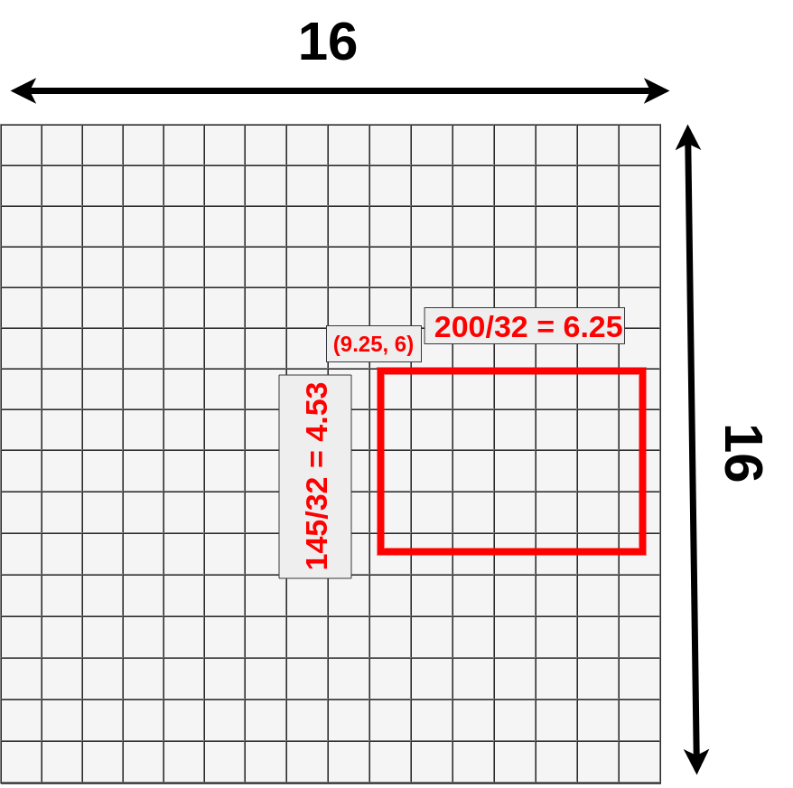
  <figcaption>RoI placement</figcaption>
</figure>

- **(9.25,6)** - top left corner
- **6.25** - width
- **4.53** - height

Once again we're choosing our pooling layer to have a size of **3x3** so the end result shape is **3x3x512** (That's just an arbitrary example to make it easier to display on image. Your pooling layer will probably have a different size).

<figure class="image">
  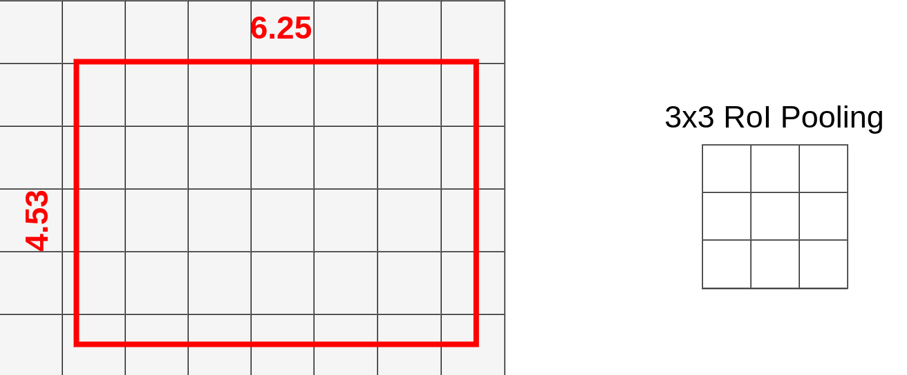
  <figcaption>Pooling layer</figcaption>
</figure>

Up till this point, everything looks exactly the same as in [Part One](https://erdem.pl/2020/02/understanding-region-of-interest-ro-i-pooling).

## Introducing RoI Align

The main difference between RoI Pooling and RoI Align is quantization. **RoI Align is not using quantization** for data pooling. You know that Fast R-CNN is applying quantization twice. First time in the mapping process and the second time during the pooling process.

<figure class="image">
  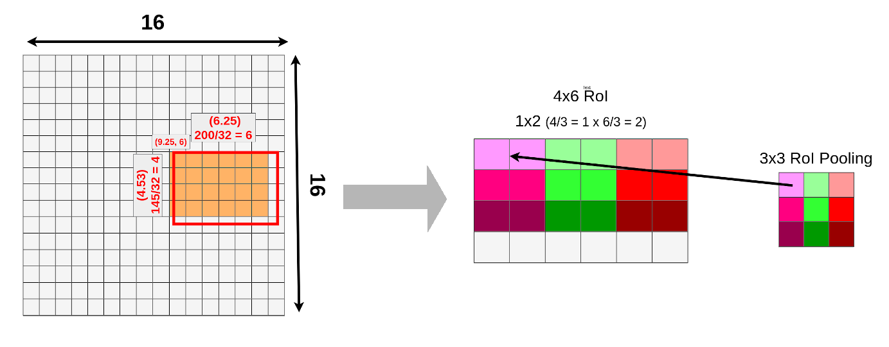
  <figcaption>Quantization when mapping and pooling</figcaption>
</figure>

We can skip that by dividing original RoI into 9 equal size boxes and applying bilinear interpolation inside every one of them. Let's define boxes then:

<figure class="image">
  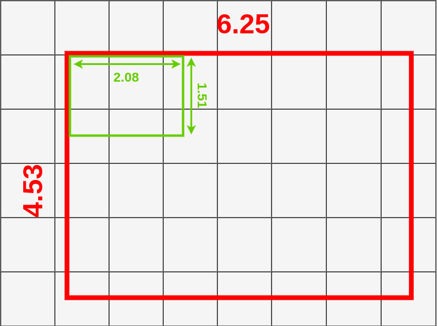
  <figcaption>RoI Box size</figcaption>
</figure>

Each box size is determined by the size of the mapped RoI and the size of the pooling layer. We're using a **3x3** pooling layer so we have to divide mapped RoI (**6.25x4.53**) by 3. That gives us a box with a height of __1.51__ and a width of __2.08__ (I'm rounding values here to make it easier). Now we can put our boxes into mapped RoI:

<figure class="image">
  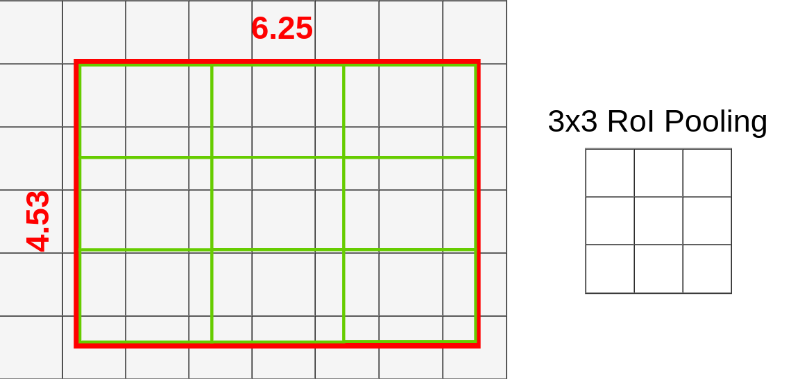
  <figcaption>RoI divided into boxes</figcaption>
</figure>

If you look at the first box (top left), you can notice that it covers six different grid cells. To extract value for the pooling layer we have to sample some data from it. To sample data we have to create **four sampling points** inside that box.

<figure class="image">
  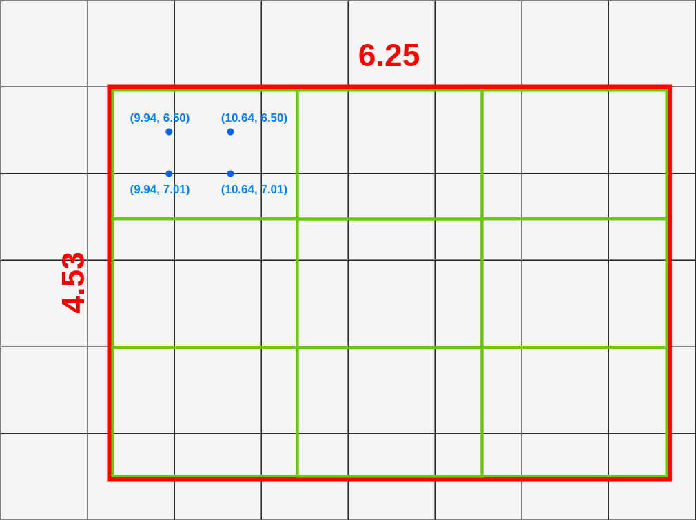
  <figcaption>Sampling points distribution</figcaption>
</figure>

You can calculate where each of those points should be by **dividing height and width of the box by 3**.

In our case we're calculating first point (top left) coordinates like this:

- X = X_box + (width/3) \* 1 = 9.94
- Y = Y_box + (height/3) \* 1 = 6.50

To calculate the second point (bottom left) we have to change only the Y:

- X = X_box + (width/3) \* 1 = 9.94
- Y = Y_box + (height/3) \* 2 = 7.01

Now when we have all the points we can apply bilinear interpolation to sample data for this box. Bilinear interpolation is usually used in image processing to sample colors and its equation looks like this:

<figure class="image">
  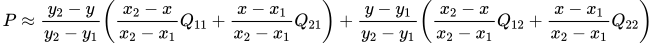
  <figcaption>Bilinear Interpolation equation</figcaption>
</figure>

Instead of trying to understand this equation please take a look on a graphical interpretation of how it works:

<figure class="image">
  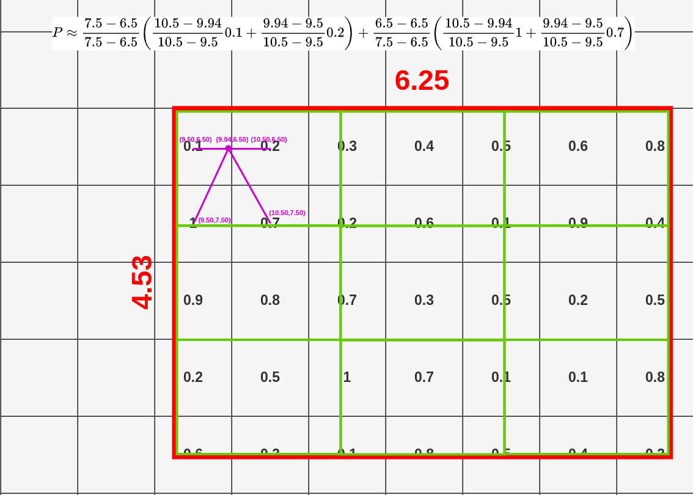
  <figcaption>Bilinear Interpolation for the first point</figcaption>
</figure>

When you take the first point from our box, you're connecting it with closest neighboring cells (exactly to the middle), unless it's already taken. In this case, our point has coordinates **(9.44, 6.50)**. Closest middle of the cell in top-left direction is **(9.50, 6.50)** (it would be (9.50, 5.50) if our point was only 0.01 higher on the grid). Then we have to select a bottom-left point and the closest one is **(9.50, 7.50)**. Following the same rule, we're selecting **(10.50, 6.50)** and **(10.50, 7.50)** as top-right and bottom-right points. Above the RoI, you could see the whole calculation to get the value for the first point (0.14).

<figure class="image">
  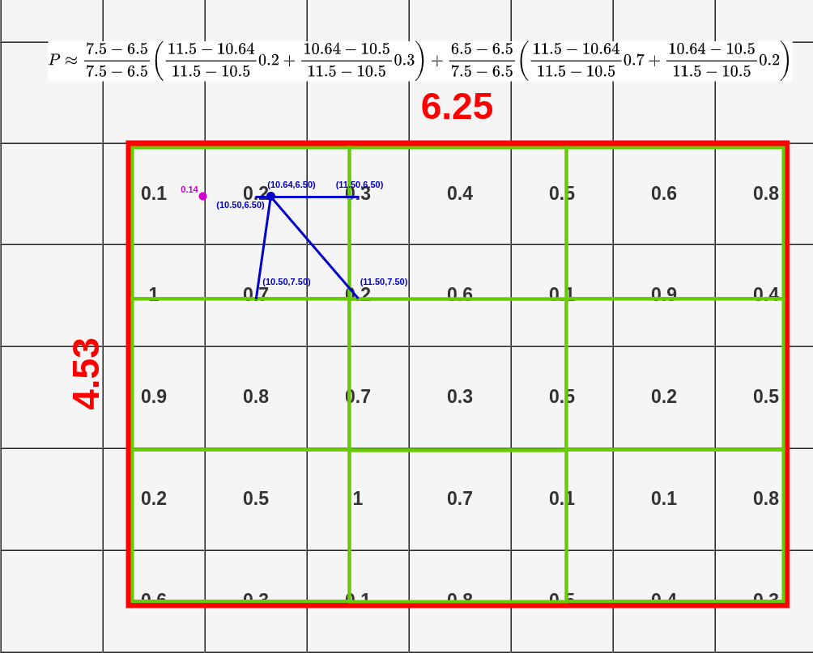
  <figcaption>Bilinear Interpolation for the second point</figcaption>
</figure>

This time we're interpolating from:

- top-left: (10.50, 6.50)
- bottom-left: (10.50, 7.50)
- top-right: (11.50, 6.50)
- bottom-right: (11.50, 7.50)

You should start seeing a pattern here :). Here are the other points:

<figure class="image">
  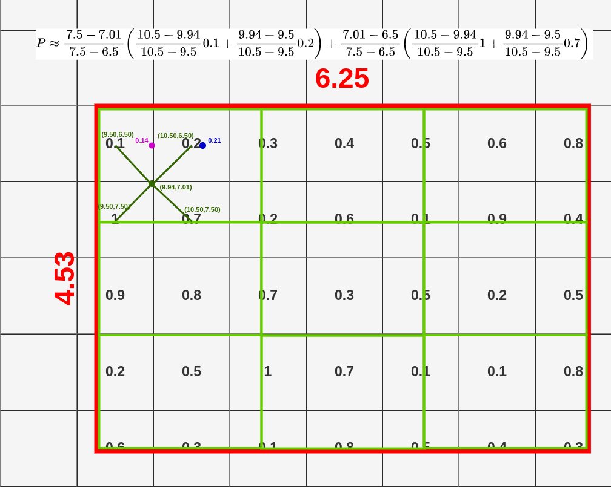
  <figcaption>Bilinear Interpolation for the third point</figcaption>
</figure>

- top-left: (9.50, 6.50)
- bottom-left: (9.50, 7.50)
- top-right: (10.50, 6.50)
- bottom-right: (10.50, 7.50)

<figure class="image">
  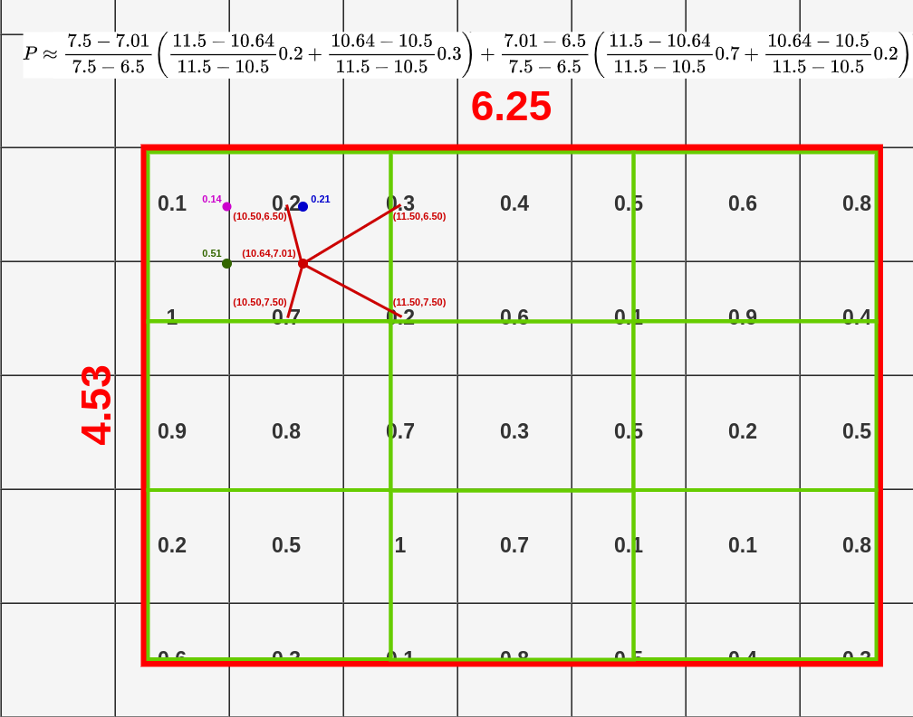
  <figcaption>Bilinear Interpolation for the fourth point</figcaption>
</figure>

- top-left: (10.50, 6.50)
- bottom-left: (10.50, 7.50)
- top-right: (11.50, 6.50)
- bottom-right: (11.50, 7.50)

Now we have all the points calculated and can apply **Max Pooling** on them (it could be Avg Pooling if you want):

<figure class="image">
  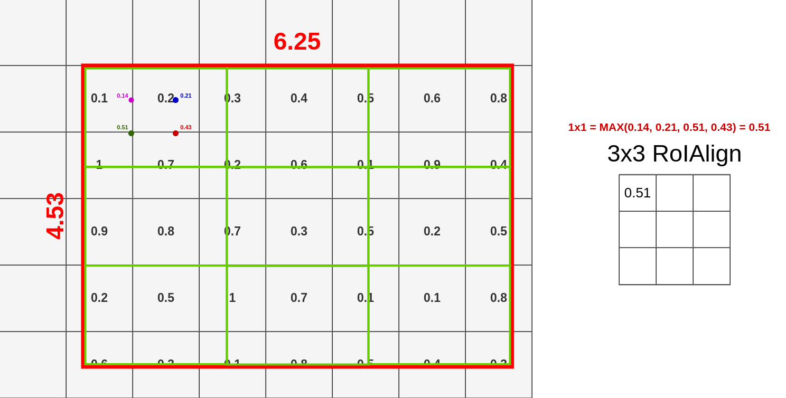
  <figcaption>First Box Pooling</figcaption>
</figure>

I'm not going to show you all interpolations because it would take to long and you probably know how to do them already. I'm going to show you how the whole process works for pooling data from this RoI using RoIAlign:

<figure class="image">
  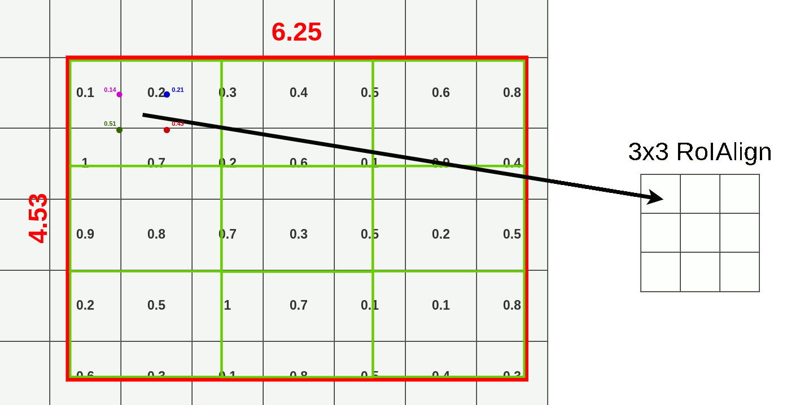
  <figcaption>RoIAlign pooling process (open image in new tab to check all calculations)</figcaption>
</figure>

And ofc. this process goes for every layer there is so end result contains 512 layers (the same as feature map input)

<figure class="image">
  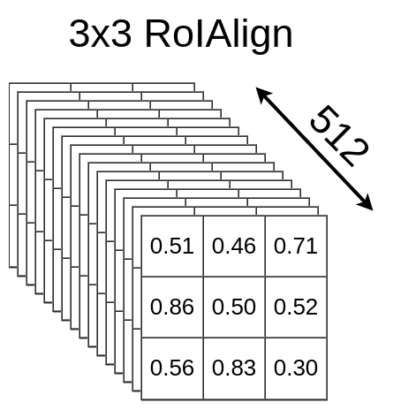
  <figcaption>RoIAlign full size</figcaption>
</figure>

Notice that even if we're not placing our sampling points inside all cells from the feature map, we're extracting data from them by bilinear interpolation.

In this case, cells 11x6, 11x7, 11x8, 11x9, 11x10, 13x6, 13x7, 13x8, 13x9, 13x10, 15x6, 15x7, 15x8, 15x9, 15x10 will never have any points in it. If you look on second point calculation (first box), it still uses cells 11x6 and 11x7 for bilinear interpolation even if the point is in cell 10x6.

If you compare data lost/data gain from RoIAlign and RoIPooling you should see that RoIAlign uses the whole area to pool data from:

<figure class="image">
  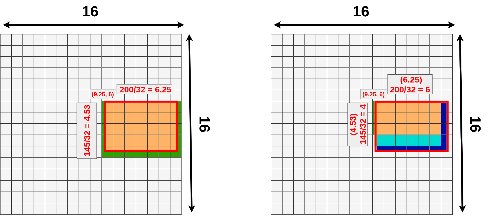
  <figcaption>Comparing RoIAlign(left) and RoIPooling(right) data sources.</figcaption>
</figure>

- green means additional data used for pooling.
- blue (both shades) means data lost when pooling.

## RoIWarp - meet me in the middle

There is a third method of pooling data that was introduced in _[Instance-aware semantic segmentation via multi-task network cascades](https://arxiv.org/pdf/1512.04412.pdf)_ and it's called **RoIWarp**. The idea of RoIWarp is more or less the same as RoIAlign, the only difference is that **RoIWarp is quantizing RoI mapping onto a feature map**.

<figure class="image">
  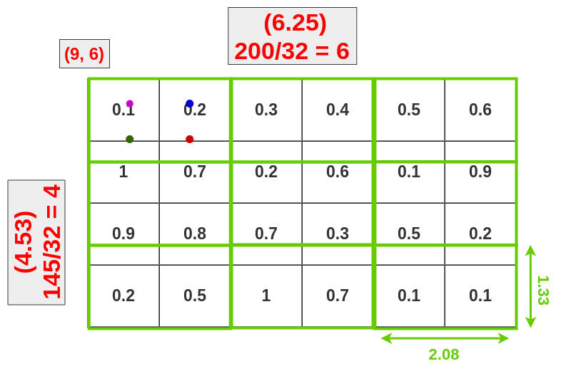
  <figcaption>RoI Warp</figcaption>
</figure>

And if you look on data lost/data gain:

<figure class="image">
  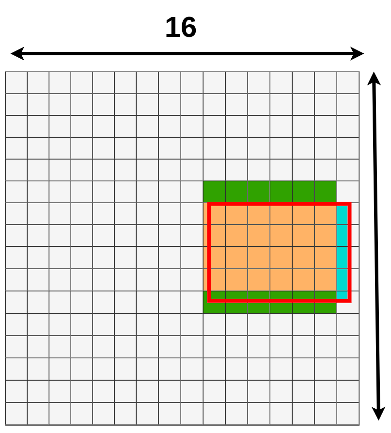
  <figcaption>RoI Warp data lost/data gain</figcaption>
</figure>

We're only losing a small amount of it due to bilinear interpolation.

## How RoIAlign and RoIWarp affects the precision

If we look at Mask R-CNN paper there are some important numbers to discuss. First one is a change in **average precision** when applying different RoI layers on ResNet-50-C4 with stride 16:

|          | align?   | bilinear? | agg. | AP  | AP50 | AP75 |
| -------- | -------- | ---------- | ---- | -------------- | --------------- | --------------- |
| RoIPool  |          |            | max  | 26.9           | 48.8            | 26.4            |
| RoIWarp  |          | &#10003;   | max  | 27.2           | 49.2            | 27.1            |
|          |          | &#10003;   | ave  | 27.1           | 48.9            | 27.1            |
| RoIAlign | &#10003; | &#10003;   | max  | 30.2           | 51.0            | 31.8            |
|          | &#10003; | &#10003;   | ave  | 30.3           | 51.2            | 31.5            |

There is only a small improvement when RoIWarp is applied but applying RoIAlign gives us a significant boost in precision. That boost increases with stride:

|          | AP   | AP 50 | AP 75 | APbb  | APbb50 | APbb75 |
| -------- | -------------------------- | --------------------------- | --------------------------- | --------------------------- | ---------------------------- | ---------------------------- |
| RoIPool  | 23.6                       | 46.5                        | 21.6                        | 28.2                        | 52.7                         | 26.9                         |
| RoIAlign | 30.9                       | 51.8                        | 32.1                        | 34.0                        | 55.3                         | 36.4                         |
|          | +7.3                       | +5.3                        | +10.5                       | +5.8                        | +2.6                         | +9.5                         |

Where __APbb __ is an average precision for detecting bounding boxes. The test is done on ResNet-50-C5 with stride 32.

## Summary

Understanding RoI Pooling is important when we want to improve our R-CNN-like model accuracy. There is a significant difference between the standard approach proposed in the 2014 paper about Fast R-CNN and a new one proposed in the 2018 paper about Mask R-CNN. It doesn't mean those methods apply only to specific networks, we can easily use RoIAlign in Fast R-CNN and RoIPooling in Mask R-CNN but you have to remember that RoIAlign gives us better precision on average.

I really hope that my explanation is easy to understand because I've seen a lot of post writing about RoI Pooling without getting into calculations. In my opinion, a more visual approach is always better, especially if you don't want to spend a whole day reading the original paper over and over to finally understand what it does.

### References:

- R. Girshick. Fast R-CNN. In ICCV, 2014 [https://arxiv.org/pdf/1504.08083.pdf](https://arxiv.org/pdf/1504.08083.pdf)
- J. Dai, K. He, and J. Sun. Instance-aware semantic segmentation via multi-task network cascades. In CVPR, 2016 [https://arxiv.org/pdf/1512.04412.pdf](https://arxiv.org/pdf/1512.04412.pdf)
- K. He, G. Gkioxari, P. Dollar and R. Girshick. Mask R-CNN In ICCV, 2018 [https://arxiv.org/pdf/1703.06870.pdf](https://arxiv.org/pdf/1703.06870.pdf)
