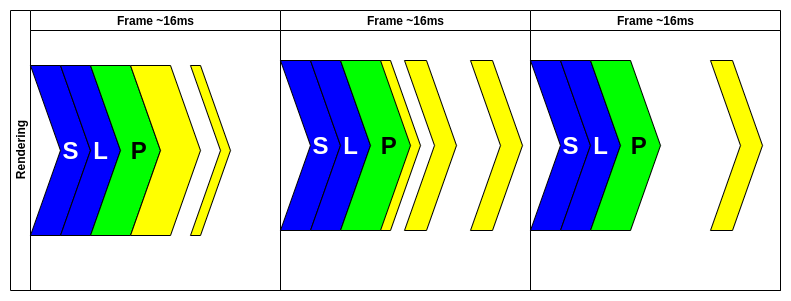
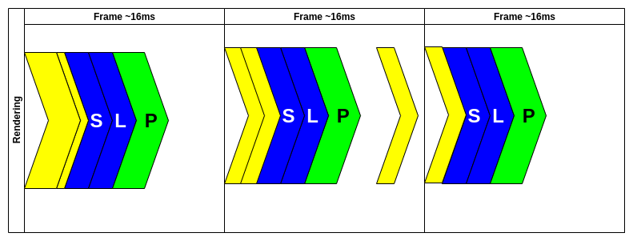
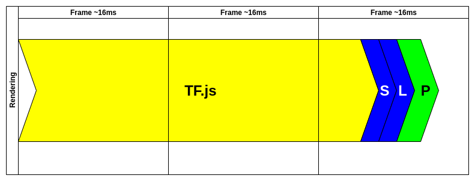
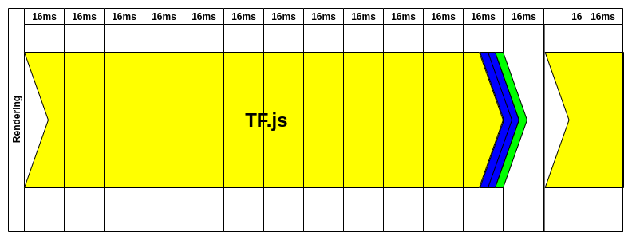

## The issue

If you've ever worked with TensorflowJS you probably know that running data through models (especially image processing) takes a long time. Because JavaScript is single-threaded, that poses a huge problem for a site responsivenes. Everytime sth is blocking the main thread, user cannot interact with your website. What can you do to fix that? The answer is simple, use WebWorker to run your model.

## Event Loop

[Event Loop](https://html.spec.whatwg.org/multipage/webappapis.html#event-loops) is responsible for executing the code, collecting and processing events, and executing queued sub-tasks. At least that's what [MDM says](https://developer.mozilla.org/en-US/docs/Web/JavaScript/EventLoop)...

> I'm not going to spend much time describing how it works but if you're interested check out [Jake Archibald's talk on JSConf.Asia](https://www.youtube.com/watch?v=cCOL7MC4Pl0)

Basically every time you run sth in JS it is blocking the main thread. Your goal is to achieve 60FPS (or 16ms per frame). That means, if the main thread is executing for more than 16ms (exact number is a little less because of style and layout recalculation and printing) user can notice a "lag". Usually browser does sth like this:



There is ofc. a better way of executing your code. You can batch it up into **requestAnimationFrame**. This way ensures that your code is executed before render (except Safari :( because Safari is weird). If you look on the second frame you could notice that sometimes there is an "event" executed outside of **requestAnimationFrame**. That event could be a click of sth similar and doesn't really affect UX.



### Why event loop cannot handle TF models execution?


Passing data through our model takes time, a lot of time. It's highly unlikely it could be done under 16ms. In this case even putting it into requestAnimationFrame won't help:



If you look on those images you might think "Ehh, it's just 2 frames missing. Not a big deal, we can life with that.". That's true if you're working with small models. Usually (e.g. image processing) it looks like:



If you concider applications like real time object detection which takes at least 65ms to process one frame (tiny YOLOv3). If you're using more presise models it's even more (0.25s for standard YOLOv3). And you have to remember that those number are achived on hi-end computer which your user probably doesn't have (it's easy to forget about that when working as a software developer).

## How to use WebWorker/s to fix this issue?

If we stick to the rule where main thread is used only to perform crucial work (user interaction, app logic etc.) we can offload some work (TF processing) to [WebWorker](https://developer.mozilla.org/en-US/docs/Web/API/Web_Workers_API/Using_web_workers). If you're not familiar with the idea of workers, you can treat them as separate threads (not multi-threading) which whom you can exchange data.

Each worker (there could be many of them) runs in the separate process so even if you want to run function which takes 0.25s to finish, you won't block main application for that time.

### Worker solution


Let me disect that animation for you. First, we have to initialize webworker but that's done before our animation. Once we have WW, we need to create input data for our model. This is done inside RAF(requestAnimationFrame) at the first frame. It could be camera image extraction etc.

.png>)

Inside the WW, we don't care about the frames. It could take a while to process data we've just sent but that's ok. In that time, user could still use the website because nothing is blocking the main thread. Every time new frame passes we're reprinting app changes still listening for a message from the WW.

.png>)

After around 50ms, our model is done and w're receiving message from WW. This message is not received in RAF. We're processing it inside current frame and update state so result could be picked up by next RAF.

.png>)

Next RAF recognise there was a new data from WW so it would be great to send the new image to process by our model. "Style", "Layout", and "Print" are updating what user should see on the screen and there is no lag.

You might notice that we're updating predictions every 64ms. That gives us ~15FPS (which is far from fluid montion). User could see that on the screen because camera image updates every frame and our predictions are updated every 4th frame. That's still better than frozing camera for this period of time while waiting for TF to process our image.

### Implementation details

> We're going to use [workerize-loader](https://github.com/developit/workerize-loader) which is available for webpack and makes it easier to communicate with our WW. The main difference is that in workerize we don't have to deal with WW messages.

You don't even have to load TF in the main thread, we don't need it there. Because we're using werkerize-loader we can just export our async **getPrediction** function and use it inside main thread.

```javascript
// get-predictions.worker.js

// Import TF and Model
import '@tensorflow/tfjs';
import * as ssd from '@tensorflow-models/coco-ssd';

let net;

// Load our model from the web
ssd
  .load({
    base: 'lite_mobilenet_v2',
  })
  .then(model => {
    net = model;
  });

// export function you want to call to get predictions
export async function getPrediction(image) {
  // check if model is loaded
  // sometime you might want to handle if function returns null
  if (!net) {
    return null;
  }

  // run object detection
  const result = await net.detect(image);
  const boxes = result.map(boxInfo => [
    boxInfo.bbox[0],
    boxInfo.bbox[1],
    boxInfo.bbox[0] + boxInfo.bbox[2],
    boxInfo.bbox[1] + boxInfo.bbox[3],
  ]);
  const scores = result.map(boxInfo => boxInfo.score);
  const classes = result.map(boxInfo => boxInfo.class);

  // return data we need to print our boxes
  return { result, boxes, classes, scores };
}
```

Inside WW code only thing that we're doing is to load proper model when worker is initialized. **getPrediction** is quite simple but we still need to check if model is loaded, if not then we can just return null so the main thread know there is no model yet.

In line 27 we're calling TF model with our image as an input.

```javascript
const result = await net.detect(image);
```

After that result is processed and returned in the form of new object.

Code responsible for sending images to WW uses **navigator.mediaDevices** to access the camera and then get current frame from it.

```javascript
navigator.mediaDevices
  .getUserMedia({
    audio: false,
    video: videoConstraints,
  })
  .then(stream => {
    window.stream = stream;
    webcamRef.current.srcObject = stream;
    return new Promise(resolve => {
      webcamRef.current.onloadedmetadata = () => {
        resolve();
      };
    });
  });
```

After that we only have to send image to the WW and process the response.

```javascript
const predictionResults = await predict(stopDetection);

const ctx = canvasRef.current.getContext('2d');
predictionResults.result.forEach(box => {
  drawBoxWithLabel(box, ctx);
});
```

You can check the whole code here (it has a lot of extra features but core remains the same):
[https://github.com/burnpiro/erdem.pl/blob/master/src/components/Detector/Detector.js](https://github.com/burnpiro/erdem.pl/blob/master/src/components/Detector/Detector.js)

And object detection example is here:
[https://erdem.pl/object-detection/](https://erdem.pl/object-detection/)

## Summary

If you're dealing with TF on the web it's almost always a good idea to offload that work into new thread. It forces us to deal with communication between main app and WW but with the help of loaders like __workerize__ we can use it almost as it would be just a pure function.