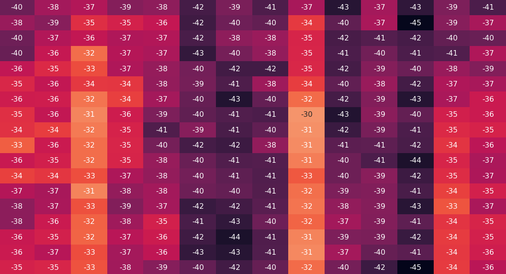

## Problem description

If you've ever worked with data analysis it's highly likely that you know about the idea of [data correlation](https://en.wikipedia.org/wiki/Correlation_and_dependence). There are many ways of calculating correlation within your data, and most of them are already implemented in popular data science toolkits. What I want to show you today is how to figure out a correlation between different length of time series vectors and target result (or any other value).

This might come handy when trying to design models that rely on time series data. Let me give you an example. Imagine you're dealing with weather data. Your goal is to predict the population at some point in the future. That population is not dependent on current weather conditions but rather on the past.

### Data Sample

| Temp [C] | Prec [mm] | Humidity [%] | Population |
| -------- | --------- | ------------ | ---------- |
| 21       | 0         | 45           | 100        |
| 22       | 10        | 95           | 85         |
| 21       | 23        | 100          | 115        |
| 25       | 0         | 55           | 255        |
| 19       | 8         | 88           | 476        |

Here we have a few samples from our dataset. It shows five consecutive time periods with some population numbers and the end of each period. **Our goal is to predict a population in each time period**. Usually to solve that problem we need to design some kind of model. The model itself doesn't matter that much, important thing is to find what kind of features we should feed into it.

We know that the current population doesn't depend on current conditions but rather on the condition through its life cycle. We can search for publication on that subject and try to figure out the right amount of data. After a while, we decided that our population probably depends on temperature from the last 4 weeks, precipitation from 6 weeks, and humidity in the last 2 weeks. That's ok but is there a better way to find that correlation in the data? Can we even check if our periods are correct?

## Problems with standard correlations

When thinking about data correlation we usually think about a correlation between a number, and the other number. Occasionally we might calculate correlations between categorical variables. This case is different. If we take under consideration a series of temperatures like that:

$$
[21, 22, 21, 25, 19]
$$

**Order in which each number comes in is important**. If we want to replace the whole series with some cumulative value (like an average or moving average) it's not going to work.

$$
[21, 25, 19, 22, 21]
$$

This gives us the same average value but clearly shows a different situation. Another problem is to **choose the right length of the vector**. It's not so easy to compare information gain when providing a longer vector.

$$
[16, 18, 22, 15, 17, 21, 22, 21, 25, 19]
$$

A common thing to do would be to provide a very long vector to the model and let it figure out a correlation by itself. That would work but in case of time series that usually we don't have that much training data (and we cannot just create more). Even if we gather data from each day over the last 5 years, we have (on average) **1826** records. That's way too low if you want to create a deep model with a very long input vector.

## Predictive Power Score (PPS)

Recently, a different idea is gaining popularity. It's called Predictive Power Score (PPS) and is based on calculating predicting power for every property in the dataset. **Predictive power is a measurement of the success of a Decision Tree model predicting a target variable with the help of a predictor variable**.

When you're calculating PP for one variable (A) predicting another variable (B), we have to treat our variable **B as the target**, and **A as the only feature**. After that, we're creating a Decision Tree (either Regressor or Classifier) and calculate meaningful metrics (e.g. MAE for regression problem or F1 for classification).

Basically, you have to repeat that process for every pair of variables. Normalization of the score is optional because usually the raw score already has a meaning. In most cases, **you don't have to calculate PPS for all possible combinations of features**. It's enough to calculate only PPS between each feature and target. In our example, we would calculate PPS for pairs: **(Temp, Population)**, **(Prec, Population)**, **(Humidity, Population)**.

The only problem with this method is that it's not solving our problem :)

## Extended PPS

If we look at the standard PPS we're able to check the predictive power of one variable. Our problem is a little different and let me show you how that looks like.

| Temp [C] | Prec [mm] | Humidity [%] | Population |
| -------- | --------- | ------------ | ---------- |
| 21       | 0         | 45           | 100        |
| 22       | 10        | 95           | 85         |
| 21       | 23        | 100          | 115        |
| 25       | 0         | 55           | 255        |
| 19       | 8         | 88           | 476        |
| 15       | 45        | 97           | 476        |
| 22       | 8         | 75           | 534        |
| 26       | 0         | 53           | 352        |
| 29       | 0         | 40           | 53         |
| 27       | 0         | 38           | 12         |
| 22       | 0         | 36           | 76         |

Our target is **Population** and the standard PPS approach would show us scores for only one item from each feature.

$$
[22] => [76]
$$
$$
[27] => [12]
$$
$$
[29] => [53]
$$
$$
[26] => [352]
$$

That's ok, but we can do way better than this. Just try to find a correlation between the last x values of that vector and the target. Let's start from the last row because for that one we have previous data.

$$
[22, 26, 29, 27, 22] => [76]
$$

$$
[15, 22, 26, 29, 27] => [12]
$$

$$
[19, 15, 22, 26, 29] => [53]
$$

$$
[25, 19, 15, 22, 26] => [352]
$$

We still have a problem with the first 4 rows because we don't have the previous 5 rows to get the data from. There are two solutions:

- Drop those rows
- Create data

The first option is easy and usually, when you have >100 rows it shouldn't affect the precision of the prediction. If you want to go with the second option you can use a moving average or other method to populate that data. For now, we're just going to go with the first option.

### How to create a Decision Tree using sklearn?

To create DT we can use `sklearn` library and execute code like:

```python
from sklearn.tree import DecisionTreeRegressor
from sklearn.model_selection import cross_val_score
X = [
    [22, 26, 29, 27, 22],
    [15, 22, 26, 29, 27],
    [19, 15, 22, 26, 29],
    [25, 19, 15, 22, 26]
]
Y = [76, 12, 53, 352]

regressor = DecisionTreeRegressor(random_state=0)
score = cross_val_score(
    regressor,
    X,
    Y,
    cv=2, #change that base on the data size
    scoring='neg_mean_absolute_error'
)
```

As a result, we should get some value of negative MAE.

### What do we have to calculate?

Right now the question is "How many previous data points we should use to achieve the best score?". We could create vectors with different lengths and compare scores for each of them.

If we look on **Temp** feature only we should get datasets like

```python
Temp_five = [
    [22, 26, 29, 27, 22],
    [15, 22, 26, 29, 27],
    [19, 15, 22, 26, 29],
    [25, 19, 15, 22, 26]
]
Temp_four = [
    [26, 29, 27, 22],
    [22, 26, 29, 27],
    [15, 22, 26, 29],
    [19, 15, 22, 26]
]
Temp_three = [
    [29, 27, 22],
    [26, 29, 27],
    [22, 26, 29],
    [15, 22, 26]
]
Temp_two = [
    [27, 22],
    [29, 27],
    [26, 29],
    [22, 26]
]
```

Target always remains the same, the only thing that changes is a set of features. At this point, we're calculating a score for each length and comparing the result to get the right length of the Temp vector.

Let's assume that the result looks like that:

| Length | Score (MAE) |
| ------ | ----------- |
| 2      | 26          |
| 3      | 23          |
| **4**  | **20**      |
| 5      | 22          |

Base on this we can decide that the right length of the **Temp** vector is **4** (the lowest error). Now we perform a similar process for every single feature there is and come up with a final set of features.

| Temp [C] | Prec [mm] | Humidity [%] | Population |
| -------- | --------- | ------------ | ---------- |
| 21       | 0         | 45           | 100        |
| 22       | 10        | 95           | 85         |
| 21       | 23        | 100          | 115        |
| 25       | 0         | **55**       | 255        |
| 19       | 8         | **88**       | 476        |
| 15       | 45        | **97**       | 476        |
| 22       | 8         | **75**       | 534        |
| **26**   | 0         | **53**       | 352        |
| **29**   | 0         | **40**       | 53         |
| **27**   | **0**     | **38**       | 12         |
| **22**   | **0**     | **36**       | **76**     |

**Bold** selection shows a set of features for one training sample with a target of 76. When designing NN we can then assume 14 (4 x Temp + 2 x Prec + 8 x Humidity) input features. So our training set for bottom 3 samples will look like:

```python
X = [
    [26, 29, 27, 22, 0, 0, 55, 88, 
     97, 75, 53, 40, 38, 36],
    [22, 26, 29, 27, 0, 0, 100, 55,
     88, 97, 75, 53, 40, 38],
    [15, 22, 26, 29, 0, 0, 95, 100,
     55, 88, 97, 75, 53, 40]
]

Y = [
    76,
    12,
    53
]
```

## Real-life example

If you wonder how this method behaves on real-life data here is an example:


Each column represents one feature and each row represents a different length of the vector constructed from this feature. In this example, I've calculated MAE for vectors between 3 and 51 elements for each feature.

#### Which features should I choose?

There are a couple of rules to select the right features. The first one (and the most obvious one) is to **select features with the lowest MAE score**. We can sort those columns and start selecting ones with the lowest values. The question is "How many columns?". The answer might not surprise you, it depends :). When you have more training data you can allow your model to be larger and so, select more features. If you have only a handful of training data you cannot design a model with >200 features because you're getting into the [curse of dimensionality](https://en.wikipedia.org/wiki/Curse_of_dimensionality) territory.

Another thing if the length of each column. As you can see on this example `reanalysis_specific_humidity_g_per_kg` is a useful feature (one of the best we have) with `2 minimum values of MAE`. When we have a case like this we usually selecting a shorter vector. So the decision is to select a vector length of 14 instead of 27, even if both have the same value of MAE (30).

Another thing to discuss is the last column. Some of the columns shouldn't be treated as a vector, instead they should be used as a single feature. `weekofyear` column contains a week number for a given training example. There is no point in sending a vector of week numbers to the model because it always increases by 1 for every week. But it's still important to look at this column because it clearly shows how length affects accuracy.

#### Some tradeoffs

Sometimes you might want to make some tradeoffs when selecting vector length. Look on feature 15 (`station_min_temp_c`). It scores 35 MAE with a length of 3 and then beats that score with a length of 26. The difference between two scores is only **1** and we're adding 23 extra features just to get that 1 MAE. You have to remember that when building a model with multiple features, at the end length of your input vector is a sum of all vectors you've selected. Increasing input length by 23 forces you to have more training data and a larger model. In this case, I would personally select a 3 item vector rather than 26, or just test two different models. If the result won't improve when changing from 3 to 26 items you should **use 3 because it produces a simpler hypothesis** (according to the [Occam's razor](https://en.wikipedia.org/wiki/Occam%27s_razor) rule).  

#### Mistakes when selecting features without extended PPS

The last thing I want to show you is how easy is to make a mistake when selecting features without this method. Let's look at columns 4 (`reanalysis_dew_point_temp_k`) and 11 (`reanalysis_tdtr_k`). You can tell just by looking at them that column 4 has a better predicting capability. But if you were selecting the length of those vectors by hand (or random) you can make `reanalysis_dew_point_temp_k` worse than `reanalysis_tdtr_k`. Without any prior knowledge about this feature, you can select its length to be 3 which gives us MAE of 38 which is worse than 37 scored by column 11 in row 21. That way you've just made one of the best features you have as useful as one of the worst features you have.

## Conclusion

The extended version of PPS is a powerful tool to select a set of features while building your model. Sometimes it might leed to a deeper understanding of the data event without expert knowledge on the subject. Even if it might take a while to calculate all PPS for different lengths of input vectors it is a time well spent. EDA ([Exploratory Data Analysis](https://en.wikipedia.org/wiki/Exploratory_data_analysis)) is still one of the most important parts of every Data Science/Machine Learning project, and you shouldn't skip it or just limit yourself to the default set of tools.