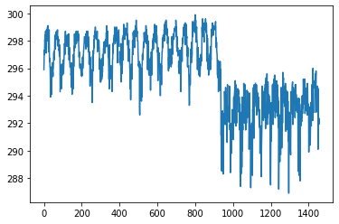
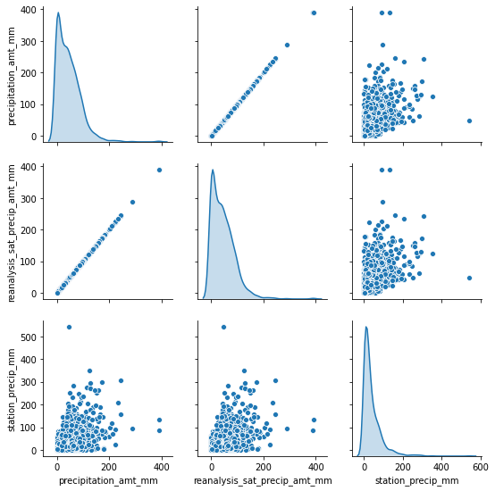
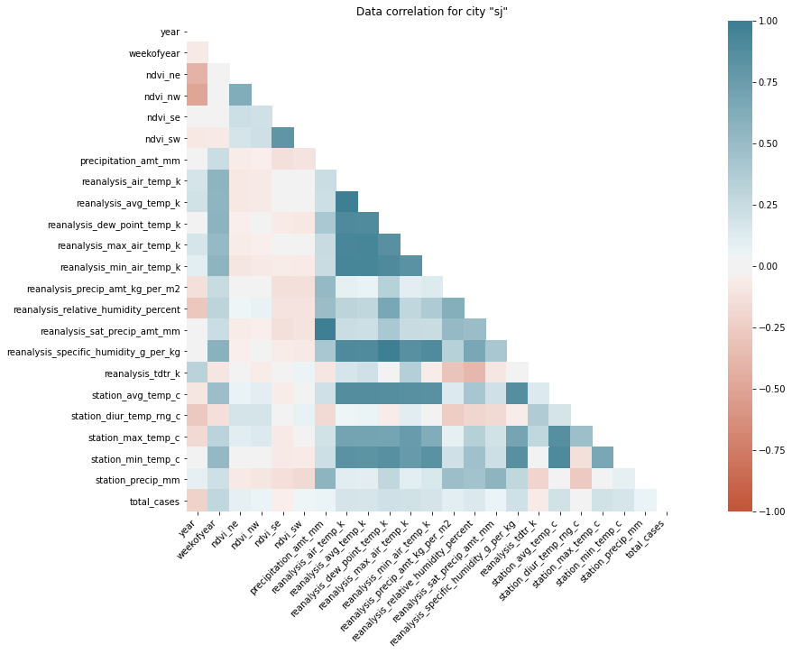
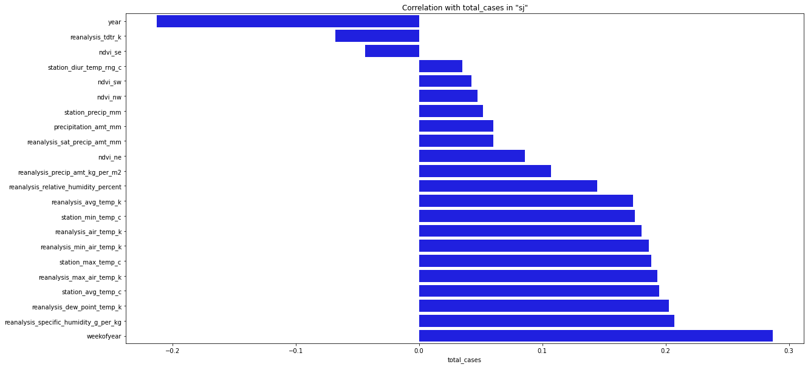
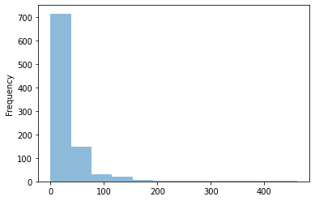
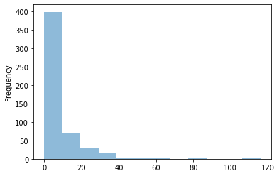

<figure class="image">
  
  <figcaption>Mosquito CC BY-NC-ND 2.0. Source: <a href="https://www.flickr.com/photos/sanofi-pasteur/5284040324/in/photolist-93W66w-arV2fF-3p8QNh-cnF7KE-cnF7Mj-cnF8a7-3p8RvU-cnF88u-cnF7Nu-arXFfy-cnF7J7-arXFto-arXDno-cnF7Hb-rwLX9d-cnF7UC-yM76y7-cnF7Ps-cnF85Q-cnF84G-cnF7TE-9wSDw-e4U78V-qRQpJa-e8GxDY-d4YEBA-d4YEwu-e8AVyt-e8GoTN-cnF873-4Gq9Y9-cnFty3-cnF7SQ-c3urbq-cnF7RY-qRJm2d-cnF7VL-62BwyV-qRJj2S-r9i7QB-r99a5k-62Bwt8-c3urhL-c3urd5-5xe7XE-pNRXZp-qRSbMx-pocK57-5xe13J-cnF7XY" target="_blank">flickr user Sanofi Pasteur</a></figcaption>
</figure>


> This article is based on my entry into [DengAI competition on the DrivenData platform](https://www.drivendata.org/competitions/44/dengai-predicting-disease-spread/). I've managed to score within 0.2% (14/9069 as on 02 Jun 2020). Some of the ideas presented here are strictly designed for competitions like that and might not be useful IRL.

Before we start I have to warn you that some parts might be obvious for more advanced data engineers, and it's a very long article. You might read it section by section of just pick the parts that are interesting for you.

## Problem description

First, we need to discuss the competition itself. DengAI's goal was (actually, at this moment even is, because the administration of DrivenData decided to make it "ongoing" competition, so you can join and try yourself) to predict a number of dengue cases in the particular week base on weather data and location. Each participant was given a [training dataset](https://github.com/burnpiro/dengai-predicting-disease-spread/blob/master/dengue_features_train.csv) and [test dataset](https://github.com/burnpiro/dengai-predicting-disease-spread/blob/master/dengue_features_test.csv) (not validation dataset). **MAE** (**Mean Absolute Error**) is a metric used to calculate score and the training dataset covers 28 years of weekly values for 2 cities (1456 weeks). Test data is smaller and spans over 5 and 3 years (depends on the city).

For those who don't know, Dengue fever is a mosquito-borne disease that occurs in tropical and sub-tropical parts of the world. Because it's carried by mosquitoes, the transmission is related to climate and weather variables.

## Dataset

If we look at the training dataset it has multiple features:

**City and date indicators:**
- **city** - City abbreviations: **sj** for San Juan and **iq** for Iquitos
- **week\_start\_date** - Date given in yyyy-mm-dd format

**NOAA’s GHCN daily climate data weather station measurements:**
- **station\_max\_temp\_c** - Maximum temperature
- **station\_min\_temp\_c** - Minimum temperature
- **station\_avg\_temp\_c** - Average temperature
- **station\_precip\_mm** - Total precipitation
- **station\_diur\_temp\_rng\_c** - Diurnal temperature range

**PERSIANN satellite precipitation measurements (0.25x0.25 degree scale):**
- **precipitation\_amt\_mm** - Total precipitation

**NOAA’s NCEP Climate Forecast System Reanalysis measurements (0.5x0.5
degree scale):**
- **reanalysis\_sat\_precip\_amt\_mm** - Total precipitation
- **reanalysis\_dew\_point\_temp\_k** - Mean dew point temperature
- **reanalysis\_air\_temp\_k** - Mean air temperature
- **reanalysis\_relative\_humidity\_percent** - Mean relative humidity
- **reanalysis\_specific\_humidity\_g\_per\_kg** - Mean specific humidity
- **reanalysis\_precip\_amt\_kg\_per\_m2** - Total precipitation
- **reanalysis\_max\_air\_temp\_k** - Maximum air temperature
- **reanalysis\_min\_air\_temp\_k** - Minimum air temperature
- **reanalysis\_avg\_temp\_k** - Average air temperature
- **reanalysis\_tdtr\_k** - Diurnal temperature range

**Satellite vegetation - Normalized difference vegetation index (NDVI) - NOAA’s CDR Normalized Difference Vegetation Index (0.5x0.5 degree scale) measurements:**
- **ndvi\_se** - Pixel southeast of city centroid
- **ndvi\_sw** - Pixel southwest of city centroid
- **ndvi\_ne** - Pixel northeast of city centroid
- **ndvi\_nw** - Pixel northwest of city centroid

Additionally, we have information about the number of **total\_cases** in each week.

It is easy to spot that for each row in the dataset we have multiple features describing similar kinds of data. There are four categories:

- temperature
- precipitation
- humidity
- ndvi (those four features are referring to different points in the cities, so they are not exactly the same data)

Because of that, we should be able to remove some of the redundant data from the input. Ofc, we cannot just pick one temperature randomly. If we look at just temperature data there is a distinguishment between ranges (min, avg, max) and even type (mean dew point or diurnal).

#### Input example:

```javascript
week_start_date 1994-05-07
total_cases 22
station_max_temp_c 33.3
station_avg_temp_c 27.7571428571
station_precip_mm 10.5
station_min_temp_c 22.8
station_diur_temp_rng_c 7.7
precipitation_amt_mm 68.0
reanalysis_sat_precip_amt_mm 68.0
reanalysis_dew_point_temp_k 295.235714286
reanalysis_air_temp_k 298.927142857
reanalysis_relative_humidity_percent 80.3528571429
reanalysis_specific_humidity_g_per_kg 16.6214285714
reanalysis_precip_amt_kg_per_m2 14.1
reanalysis_max_air_temp_k 301.1
reanalysis_min_air_temp_k 297.0
reanalysis_avg_temp_k 299.092857143
reanalysis_tdtr_k 2.67142857143
ndvi_location_1 0.1644143
ndvi_location_2 0.0652
ndvi_location_3 0.1321429
ndvi_location_4 0.08175
```

#### Submission format:

```javascript
city,year,weekofyear,total_cases
sj,1990,18,4
sj,1990,19,5
...
```

#### Score evaluation:

$$
{MAE} ={\frac {\sum _{i=1}^{n}\left|y_{i}-x_{i}\right|}{n}}={\frac {\sum _{i=1}^{n}\left|e_{i}\right|}{n}}
$$

## Data Analysis

Before even starting designing the models we need to look at the raw data and fix it. To accomplish that we're going to use [Pandas Library](https://pandas.pydata.org/). Usually, we can just import `.csv` files out of the box and work on the imported DataFrame, but sometimes (especially when there is no column description in the first row) we have to provide a list of columns.

```python {numberLines}
import pandas as pd
pd.set_option("display.precision", 2)

df = pd.read_csv('./dengue_features_train_with_out.csv')
df.describe()
```

Pandas has a build-in method called `describe` which displays basic statistical info about columns in a dataset.

<div class="center-all">

| year  | weekofyear | ndvi\_ne | ndvi\_nw | ndvi\_se | ndvi\_sw | precipitation\_amt\_mm | reanalysis\_air\_temp\_k | reanalysis\_avg\_temp\_k | reanalysis\_dew\_point\_temp\_k |
|-------|------------|---------|---------|---------|---------|----------------------|-----------------------|-----------------------|-----------------------------|
| count | 1456.00    | 1456.00 | 1262.00 | 1404.00 | 1434.00 | 1434.00              | 1443.00               | 1446.00               | 1446.00                     |
| mean  | 2001.03    | 26.50   | 0.14    | 0.13    | 0.20    | 0.20                 | 45.76                 | 298.70                | 299.23                      |
| std   | 5.41       | 15.02   | 0.14    | 0.12    | 0.07    | 0.08                 | 43.72                 | 1.36                  | 1.26                        |
| min   | 1990.00    | 1.00    | -0.41   | -0.46   | -0.02   | -0.06                | 0.00                  | 294.64                | 294.89                      |
| 25%   | 1997.00    | 13.75   | 0.04    | 0.05    | 0.16    | 0.14                 | 9.80                  | 297.66                | 298.26                      |
| 50%   | 2002.00    | 26.50   | 0.13    | 0.12    | 0.20    | 0.19                 | 38.34                 | 298.65                | 299.29                      |
| 75%   | 2005.00    | 39.25   | 0.25    | 0.22    | 0.25    | 0.25                 | 70.23                 | 299.83                | 300.21                      |
| max   | 2010.00    | 53.00   | 0.51    | 0.45    | 0.54    | 0.55                 | 390.60                | 302.20                | 302.93                      |

</div>

Naturally, this method works only on numerical data. If we have non-numerical columns we have to do some preprocessing first. In our case, the only column that is a categorical column is **city**. This column contains only two values **sj** and **iq** and we're going to deal with it later.

Back to the main table. Each row contains a different kind of information:
- **count** - describesthe number of non-NaN values, basically how many values are correct, not empty number
- **mean** - mean value from the whole column (useful for normalization)
- **std** - standard deviation (also useful for normalization)
- **min** --> **max** - shows us a range in which values are contained (useful for scaling)

Let us start with the **count**. It is important to know how many records in your dataset has missing data (one or many) an decide what to do with them. If you look at the **ndvi\_nw** value, it is empty in 13.3% of cases. That might be a problem if you decide to replace missing values with some arbitrary value like 0. Usually, there are two common solutions to this problem:
- set an **average** value
- do the **interpolation**

#### Interpolation (dealing with missing data)

When dealing with series data (like we do) it's easier to interpolate (average from just the neighbors) value from its neighbors instead of replacing it with just an average from the entire set. Usually, series data have some correlation between values in the series, and using neighbors gives a better result. Let me give you an example.

Suppose you're dealing with temperature data, and your entire dataset consists of the values from January to December. The average value from the entire year is going to be an invalid replacement for missing days throughout most of the year. If you take days from July then you might have values like **[28, 27, --, --, 30]** (or **[82, 81, --, --, 86]** for those who prefer imperial units). If that would be a London then an annual average temperature is **11C** (or 52F). Using 11 seams wrong in this case, doesn't it? That's why we should use interpolation instead of the average. With interpolation (even in the case when there is a wider gap) we should be able to achieve a better result. If you calculate values you should get $(27 + 30)/2 = 28.5$ and $(28.5 + 30)/2 = 29.25$ so at the end our dataset will look like **[28, 27, 28.5, 29.25, 30]**, way better than **[28, 27, 11, 11, 30]**.

#### Splitting dataset into cities

Because we've already covered some important things lets define a method which allows us to redefine our categorical column (**city**) into binary column vectors and interpolate data:

```python {numberLines}
def extract_data(train_file_path, columns, categorical_columns=CATEGORICAL_COLUMNS, categories_desc=CATEGORIES,
                 interpolate=True):
    # Read csv file and return
    all_data = pd.read_csv(train_file_path, usecols=columns)
    if categorical_columns is not None:
        # map categorical to columns
        for feature_name in categorical_columns:
            mapping_dict = {categories_desc[feature_name][i]: categories_desc[feature_name][i] for i in
                            range(0, len(categories_desc[feature_name]))}
            all_data[feature_name] = all_data[feature_name].map(mapping_dict)

        # Change mapped categorical data to 0/1 columns
        all_data = pd.get_dummies(all_data, prefix='', prefix_sep='')

    # fix missing data
    if interpolate:
        all_data = all_data.interpolate(method='linear', limit_direction='forward')

    return all_data
```

> All constants (like CATEGORICAL_COLUMNS) are defined in [this Gist](https://gist.github.com/burnpiro/30610b5cf9fd685905fe36a0572ab292).

This function returns a dataset with two binary columns called **sj** and **iq** which are having true values where **city** was set to be either **sj** or **iq**.

#### Plotting the data

It is important to plot your data to get a visual understanding of how values are distributed in the series. We're going to use a library called [Seaborn](https://seaborn.pydata.org/) to help us with plotting data.

```python
sns.pairplot(dataset[["precipitation_amt_mm", "reanalysis_sat_precip_amt_mm", "station_precip_mm"]], diag_kind="kde")
```

<figure class="image">
  
  <figcaption>reanalysis_min_air_temp_k in the training dataset</figcaption>
</figure>

Here we have just one feature from the dataset, and we can clearly distinguish seasons and cities (the point when the average value drops from ~297K to ~292K).

Another thing that could be useful is a **pair correlation** between different features. That way we could be able to remove some of the redundant features from our dataset.

<figure class="image">
  
  <figcaption>Precipitation pairplot</figcaption>
</figure>

As you can notice, we can drop one of the precipitation features right away. It might be unintentional at first but because we have data from different sources, the same kind of data (like precipitation) won't always be fully correlated with each other. This might be due to different measurement methods or something else.

#### Data Correlation

When working with a lot of features we don't really have to plot pair plots for every pair like that. Another option is just to calculate sth called **Correlation Score**. There are different types of correlations for a different types of data. Because our dataset consists only of numerical data we can use the builtin method called `.corr()` to generate correlations for each city.

> If there are categorical columns which shouldn't be treated as binary you could calculate [Cramér's V measure of association](https://en.wikipedia.org/wiki/Cram%C3%A9r%27s_V) to find out a "correlation" between them and the rest of the data.
 
```python {numberLines}
import pandas as pd
import seaborn as sns

# Importing our extraction function
from helpers import extract_data
from data_info import *

train_data = extract_data(train_file, CSV_COLUMNS)

# Get data for "sj" city and drop both binary columns
sj_train = train_data[train_data['sj'] == 1].drop(['sj', 'iq'], axis=1)

# Generate heatmap
corr = sj_train.corr()
mask = np.triu(np.ones_like(corr, dtype=np.bool))
plt.figure(figsize=(20, 10))
ax = sns.heatmap(
    corr, 
     mask=mask, 
    vmin=-1, vmax=1, center=0,
    cmap=sns.diverging_palette(20, 220, n=200),
    square=True
)
ax.set_title('Data correlation for city "sj"')
ax.set_xticklabels(
    ax.get_xticklabels(),
    rotation=45,
    horizontalalignment='right'
);
```

<figure class="image">
  
  <figcaption>Feature correlation for <b>sj</b> city</figcaption>
</figure>

You could do the same for **iq** city and compare both of them (correlations are different).

If you look at this heatmap it's obvious which features are correlated with each other and which are not. You should be aware there are positive and negative correlations (dark blueish and dark red). Features without correlation are white. There are groups of positively correlated features and unsurprisingly they are referring to the same type of measurement (correlation between *station\_min\_temp\_c* and *station\_avg\_temp\_c*). But there are also correlations between different kind of features (like *reanalysis\_specific\_humidity\_g\_per\_kg* and *reanalysis\_dew\_point\_temp\_k*). We should also focus on the correlation between **total\_cases** and the rest of the features because that's what we have to predict.

This time we're out of lack because nothing is really strongly correlated with our target. But we still should be able to pick the most important features for our model. Looking on the heatmap is not that useful right now so let me switch to the bar plot.

```python {numberLines}
sorted_y = corr.sort_values(by='total_cases', axis=0).drop('total_cases')
plt.figure(figsize=(20, 10))
ax = sns.barplot(x=sorted_y.total_cases, y=sorted_y.index, color="b")
ax.set_title('Correlation with total_cases in "sj"')
```

<figure class="image">
  
  <figcaption>Correlation to the target value for <b>sj</b> city</figcaption>
</figure>

Usually, when picking features to our model we're choosing features that have the **highest absolute correlation** value with our target. It's up to you to decide how many features you choose, you might even choose all of them but that's usually not the best idea.

#### Target value distribution

It is also important to look at how target values are distributed within our dataset. We can easily do that using pandas:

```python
sj_train_y = sj_train.pop(LABEL_COLUMN)
sj_train_y.plot.hist(bins=12, alpha=0.5)
```

<figure class="image">
  
  <figcaption><b>sj</b> total cases histogram</figcaption>
  
  <figcaption><b>iq</b> total cases histogram</figcaption>
</figure>

On an average number of cases for a week is quite low. Only from time to time (once a year), total number of cases jumps to some higher value. We need to remember that when designing our model because even if we manage to find that "jumps" we might lose a lot during the weeks with little or none cases.

#### What is an NDVI value?

Last thing we have to discuss in this article in an **NDVI index** ([Normalized difference vegetation index](https://en.wikipedia.org/wiki/Normalized_difference_vegetation_index)). This index is an indicator of vegetation. High negative values correspond to water, values close to 0 represent rocks/sand/snow, and values close to 1 tropical forests. In the given dataset, we have 4 different NDVI values for each city (each for a different corner on the map).

Even if the overall NDVI index is quite useful to understand a type of terrain we're dealing with and if we would need to design a model for multiple cities that might come in handy, but in this case, we have only two cities which climate and position on the map are known. We don't have to train our model to figure out which kind of environment we're dealing with, instead, we can just train two separate models for each city.

I've spent a while trying to make use of those values (especially that interpolation is hard in this case because we're using a lot of information during the process). Using the NDVI index might be also misleading because changes in values don't have to correspond to changes in the vegetation process.

If you want to check those cities out pleas refer to [San Juan, Puerto Rico](https://www.google.com/maps/place/San+Juan,+Puerto+Rico/@18.2818311,-67.176171,8.79z/data=!4m5!3m4!1s0x8c03686fe268196f:0xad6b7f0f5c935adc!8m2!3d18.4655394!4d-66.1057355), and [Iquitos, Peru](https://www.google.com/maps/place/Iquitos,+Peru/@-3.7626024,-73.5930914,9.54z/data=!4m5!3m4!1s0x91ea10b0e440c1cb:0x9210b8d7040a6692!8m2!3d-3.7436735!4d-73.2516326).

## Conclusion

At this point, you should be aware of how our dataset looks like. We didn't even start designing the first model but already know that some of the features are less important than others and some of them are just repeating the same data. If you would need to take with you one thing from this entire article, it is "Try to understand your data first!".

## References:
- DengAI: Predicting Disease Spread [https://www.drivendata.org/competitions/44/dengai-predicting-disease-spread/](https://www.drivendata.org/competitions/44/dengai-predicting-disease-spread/)
