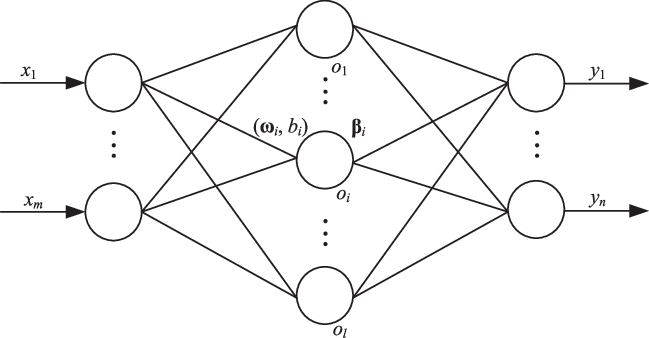
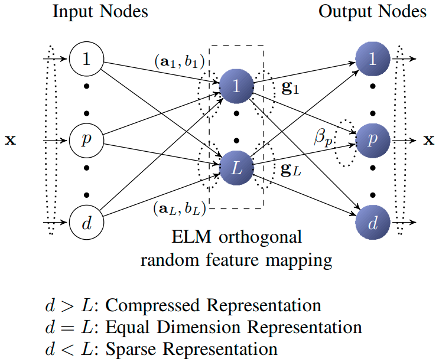
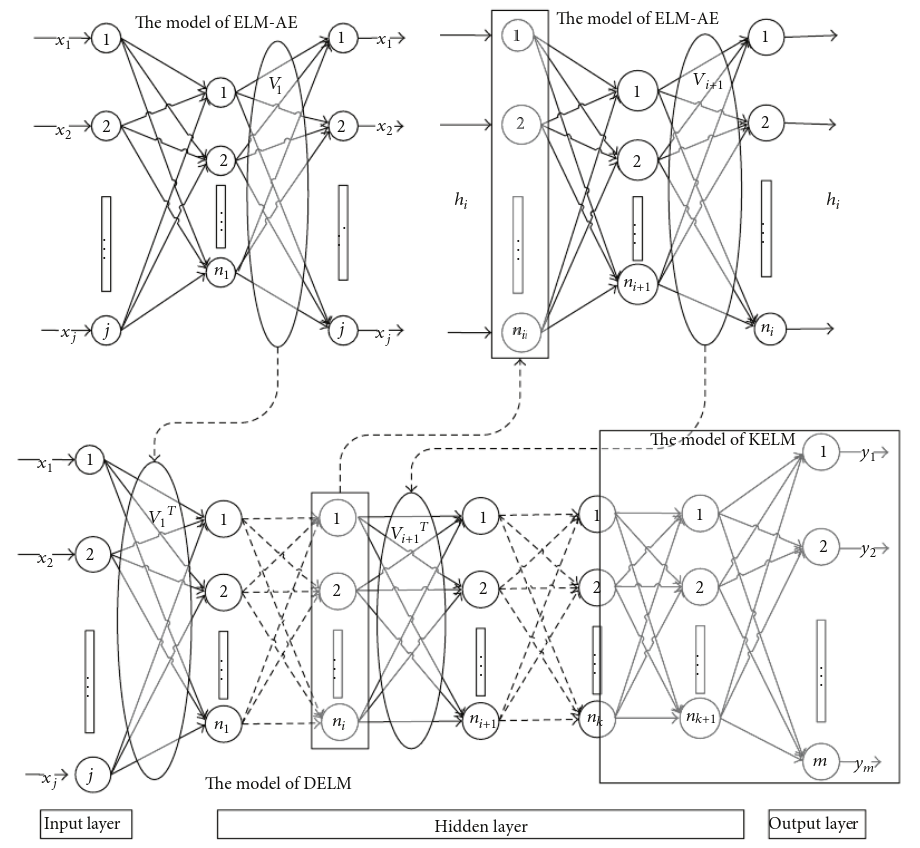

> Note! This is just a major overview of the ELM evolution. It doesn't include all possible versions and tweaks done to ELMs through the years.

## What is ELM?

ELM (Extreme Learning Machines) are feedforward neural networks. "Invented" in 2006 by _G. Huang_ and it's based on the idea of inverse matrix aproximation.

If you're not familiar with ELMs please check out my article ["Introduction to Extreme Learning Machines"](https://erdem.pl/2020/05/introduction-to-extreme-learning-machines) first. 

## When did evolution started?

### [I-ELM (2006)][i-elm]

<figure class="image">
  
  <figcaption>I-ELM structure. Source: <a href="https://www.researchgate.net/publication/341365884_An_improved_algorithm_for_incremental_extreme_learning_machine" target="_blank">An improved algorithm for incremental extremelearning machine</a></figcaption>
</figure>

After the original publication in 2006, Huang and his associates published another paper on a different type of ELMs called [I-ELM][i-elm] (Incremental ELM). As the name says, I-ELM is an incremental version of the standard ELM network. Idea of I-ELM is quite simple:

Define max number of hidden nodes **L** and expected training accuracy $\epsilon$
Starting from $l=0$ (l is a number of current hidden nodes):
- Increment $l_t = l_{t-1} + 1$
- Initialize weights $w_l$ and bias $b_l$ of the newly added hidden neuron randomly (do not reinitialize already existing neurons)
- Calculate output vector $H$
- Calculate weight vector $\hat\beta$
- Calculate error after adding node
- Check if $E < \epsilon$
- If not then increase the number of hidden nodes and repeat the process.

There is a chance that $l > L$ at some point in the process and $E > \epsilon$. At this point, we should repeat the whole process of training and initialization.

The idea of incrementing the size of the network is not new and usually produces better results than setting network size "by hand". There is one disadvantage which is especially important in terms of ELMs... computation time. If your network happens to be large (let's say 1000 hidden nodes), in worse cases we have to make 1000 matrix inversions.

If you're interested in I-ELM, you should know there are many variations of it:
 - II-ELM (improved I-ELM)
 - CI-ELM (convex I-ELM)
 - EI-ELM (enhance I-ELM)
 
 I'm not going to explain every one of them because this article should be just a quick summary and a place to start instead of the whole book about all variations of ELMs. Besides that probably every person reading this is here not by a mistake and know how to find more information about an interesting topic if he/she knows what to look for :P

### [P-ELM (2008)][p-elm]

After introducing an incremental version of ELM another improvement was to use pruning to achieve the optimal structure of the network. P-ELM (pruned ELM) was introduced in 2008 by Hai-Jun Rong. The algorithm starts with a very large network and removes nodes that are not relevant to predictions. By "not relevant" we mean that node is not taking part in predicting output value (i.e. output value is close to 0). This idea was able to produce smaller classifiers and is mostly suitable for pattern classification.

### [EM-ELM (2009)][em-elm]

This version of ELM is not a standalone version but an improvement of I-ELM. EM stands for Error-Minimized and allows to add a group of nodes instead of only one. Those nodes are inserted randomly into the network until the error is not below $\epsilon$.

### [Regularized ELM (2009)][reg-elm]

Starting in 2009, Zheng studied the stability and generalization performance of ELM. He and his team come up with the idea of adding regularization to the original formula for calculating $\hat\beta$.

Right now it looks like:

$$
\hat\beta = \left (\frac{1}{C}+H^TH \right )^{-1} H^TT
$$

### [TS-ELM (2010)][ts-elm]

Two-stage ELM (TS-ELM) was a proposition to once again minimize network structure. Like the name says, it consists of two stages:
1. Applying forward recursive algorithm to choose the hidden nodes from candidates generated randomly in each step. Hidden nodes are added until the stopping criterion is matched.
2. Review of an existing structure. Even if we created a network with the minimum number of nodes to match our criterion, some of them might no longer be that useful. In this stage, we're going to remove unimportant nodes.

### [KELM (2010)][kelm]

Kernel-based ELM (KELM) was introduced and uses kernel function instead of $H^TH$. This idea was inspired by SVM and the main kernel function used with ELMs is RBF ([Radial Basis Function](https://en.wikipedia.org/wiki/Radial_basis_function)). KELMs are used to design Deep ELMs.

### [V-ELM (2012)][v-elm]

Voting-based ELM (V-ELM) was proposed in 2012 to improve performance on classification tasks. Problem was that the standard training process of ELM might not achieve the optimal boundary for classification then adding nodes randomly. Because of that, some samples which are near that boundary might be misclassified. In V-ELM we're not training just one network but many of them and then, base on the majority voting method, selecting the optimal one.

### [ELM-AE (2013)][elm-ae]

When in 2013 ideas like [RBM](https://en.wikipedia.org/wiki/Restricted_Boltzmann_machine) and [autoencoders](https://en.wikipedia.org/wiki/Autoencoder) starting to get popular, Kasnu produces a paper on ELM-AE (ELM Auto-Encoders). The main goal is to be able to reproduce an input vector, as well as standard autoencoders does. Structure of ELM-AE looks the same as standard ELM

<figure class="image">
  
  <figcaption>ELM-AE structure. Source: <a href="https://pdfs.semanticscholar.org/8df9/c71f09eb0dabf5adf17bee0f6b36190b52b2.pdf" target="_blank">Representational Learning with ELMs for Big Data</a></figcaption>
</figure>

There are three types of ELM-AE:
- Compression. Higher-dimensional input space to the lower-dimensional hidden layer (less hidden nodes than input).
- Equal representation. Data dimensionality remains the same (same number of nodes in hidden and input)
- Sparsing. Lower-dimensional input space to the higher-dimensional hidden layer (more hidden nodes than input)

There are two main differences between standard ELMs and ELM-AE. The first one is that ELM-AE is unsupervised. As an output, we're using the same vectors as input. Second thing is that weights in ELM-AE are orthogonal, the same goes for bias in the hidden layer. This is important because ELM-AE is used to create a deep version of ELMs.

### [MLELM (2013)][elm-ae]

In the same paper (Representational Learning with ELMs for Big Data) Kasnu proposed a version of ELM called Multi-Layer ELM. This idea is based on stacked autoencoders and consists of multiple ELM-AE.

<figure class="image">
  
  <figcaption>MLELM structure. Source: <a href="https://pdfs.semanticscholar.org/8df9/c71f09eb0dabf5adf17bee0f6b36190b52b2.pdf" target="_blank">Representational Learning with ELMs for Big Data</a></figcaption>
</figure>

You might ask "Why even bother with creating something similar to stacked autoencoders but with ELMs?". If we look at how MLELM works we can see that it doesn't require fine-tuning. That makes it a lot faster to construct than standard autoencoders networks. Like I've said, MLELM uses ELM-AE to train the parameters in each layer and removes output layers, so we're left with only input and hidden layers of the ELM-AEs. 

### [DELM (2015)][delm]

Deep ELM is one of the newest (and last major iteration in ELM evolution at the point of writing this article). DELMs are based on the idea of MLELMs with the use of KELM as the output layer. 

<figure class="image">
  
  <figcaption>DELM structure. Source: <a href="https://www.researchgate.net/publication/277881335_Deep_Extreme_Learning_Machine_and_Its_Application_in_EEG_Classification" target="_blank">Deep Extreme Learning Machine and Its Application in EEG Classification.</a></figcaption>
</figure>

## Conclusion

ELMs were evolving through the years and definitely copying some major ideas from the field of machine learning. Some of those ideas work really great and could be useful when designing real-life models. You should remember that is just a brief summary of what happened in the field of ELM, not a complete review (not even close). It's highly probable that if you type some prefix before ELM there is already a version of ELM with that prefix :)

### References:
- Guang-Bin Huang, Qin-Yu Zhu, Chee-Kheong Siew. "Extreme learning machine: Theory and applications", 2006 [Publication][elm]
- Guang-Bin Huang, Lei Chen, Chee-Kheong Siew. "Universal Approximation Using Incremental Constructive Feedforward Networks With Random Hidden Nodes", 2006 [Publication][i-elm]
- Rong, Hai-Jun & Ong, Yew & Tan, Ah-Hwee & Zhu, Zexuan. (2008). A fast pruned-extreme learning machine for classification problem. Neurocomputing. [Publication][p-elm]
- Feng, Guorui & Huang, Guang-Bin & Lin, Qingping & Gay, Robert. (2009). Error Minimized Extreme Learning Machine With Growth of Hidden Nodes and Incremental Learning. [Publication][em-elm]
- Wanyu, Deng & Zheng, Qinghua & Chen, Lin. (2009). Regularized Extreme Learning Machine. [Publication][reg-elm]
- Lan, Y., Soh, Y. C., & Huang, G.-B. (2010). Two-stage extreme learning machine for regression. [Publication][ts-elm]
- Xiao-jian Ding, Xiao-guang Liu, and Xin Xu. 2016. An optimization method of extreme learning machine for regression. [Publication][kelm]
- Cao, Jiuwen & Lin, Zhiping & Huang, Guang-Bin & Liu, Nan. (2012). Voting based extreme learning machine. [Publication][v-elm]
- Kasun, Liyanaarachchi & Zhou, Hongming & Huang, Guang-Bin & Vong, Chi-Man. (2013). Representational Learning with ELMs for Big Data. [Publication][elm-ae]
- Ding, Shifei & Zhang, Nan & Xu, Xinzheng & Guo, Lili & Zhang, Jian. (2015). Deep Extreme Learning Machine and Its Application in EEG Classification. [Publication][delm]

[elm]: https://www.ntu.edu.sg/home/egbhuang/pdf/ELM-NC-2006.pdf
[i-elm]: https://www.researchgate.net/profile/Chee_Siew/publication/6928613_Universal_Approximation_Using_Incremental_Constructive_Feedforward_Networks_With_Random_Hidden_Nodes/links/00b4952f8672bc0621000000.pdf
[p-elm]: https://www.researchgate.net/publication/222429523_A_fast_pruned-extreme_learning_machine_for_classification_problem
[em-elm]: https://www.researchgate.net/publication/26665344_Error_Minimized_Extreme_Learning_Machine_With_Growth_of_Hidden_Nodes_and_Incremental_Learning
[reg-elm]: https://www.researchgate.net/publication/224453283_Regularized_Extreme_Learning_Machine
[ts-elm]: https://dl.acm.org/doi/10.1016/j.neucom.2010.07.012
[kelm]: https://dl.acm.org/doi/10.1145/2851613.2851882
[v-elm]: https://www.researchgate.net/publication/220313291_Voting_based_extreme_learning_machine
[elm-ae]: https://pdfs.semanticscholar.org/8df9/c71f09eb0dabf5adf17bee0f6b36190b52b2.pdf
[delm]: https://www.researchgate.net/publication/277881335_Deep_Extreme_Learning_Machine_and_Its_Application_in_EEG_Classification
