When hearing about [Siamese Networks][1] you probably think about "Face Recognition". That's the most common use of those types of networks. We were trying to do sth else, recognize animals based only on top-view camera footage.

<figure class="image">
  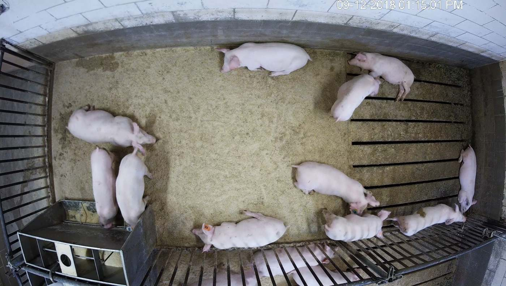
  <figcaption>Figure 1: Frame from the dataset, Source: <a href="http://psrg.unl.edu/Projects/Details/12-Animal-Tracking" target="_blank">PSRG Dataset</a></figcaption>
</figure>

If you're not interested in "intro" then skip to [Siamese Network Training](#siamese-network-training).

### Why Siamese Network?

As you might know, Siamese Networks are widely used in recognition tasks. The main advantage over standard classification is that we can use one picture of the object we want to be able to recognize, and it just works. It's not that simple of course, but the idea is not to retrain the whole network every time we want to add another class (person or animal or sth else). The basic structure of the Siamese Network looks like that:

<figure class="image">
  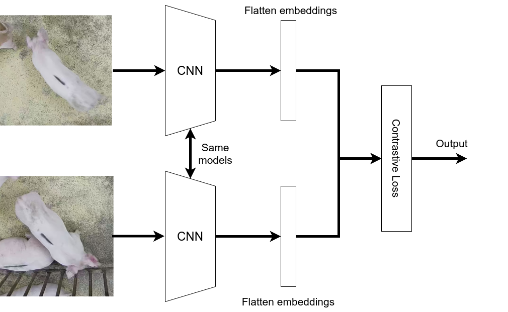
  <figcaption>Figure 2: Simple Siamese Network structure</figcaption>
</figure>

The first part of the network is simple, and it's just a basic feature extractor (ResNet or any other CNN-like network). Far more important is the loss function at the end. Currently, most of the SOTAs are using [Triplet Loss][9] but the basic idea is to maximize the distance between different embeddings (encoded images from CNNs). It's just a brief summary of the Siamese Networks. I really encourage you to read the [original paper][1] and the bit on Triplet Loss to get a better understanding.

### How recognition works IRL?

In Real Life, we're usually using images from the same device, taken under the same conditions, etc. Usually, that camera is in front of the security gate or somewhere where we're sure that every picture is more or less similar. But that's not the case when trying to recognize animals on the farm. Our study was dealing with multiple different cameras and lighting conditions (some of them were night videos). Because of that, we had to use two networks instead of just one. First to detect subjects and the second to recognize them.

### Detection and cropping

Detection was quite straightforward and didn't require a lot of work (except the annotations for training). We've taken standard SSD FPN Network with ResNet50 backbone and retrained it on our dataset.

<figure>

|                  | $mAP$ | $mAP_{50}$ | $mAP_{75}$ |
| ---------------- | ----- | ---------- | ---------- |
| SSD ResNet50 FPN | 72.92 | 97.03      | 81.82      |

<figcaption>Table 1: mAP score</figcaption>
</figure>

We're not going to focus on the detection model because it's just an extra to what we have to do. You can read more about training [on our GH Wiki][10].

### Siamese Network Training

Here where the magic happens :) As I've mentioned before, we're using [Triplet Loss][9] as our loss function. In our experiments, we were using three different baseline networks and then attaching custom layers on top of them. Those networks were:

- ResNet101 [Siamese Network Structure](https://github.com/burnpiro/farm-animal-tracking/blob/main/assets/ResNet101V2_model_fig.png)
- EfficientNetB5 [Siamese Network Structure](https://github.com/burnpiro/farm-animal-tracking/blob/main/assets/EfficientNetB5_model_fig.png)
- MobileNetV2 [Siamese Network Structure](https://github.com/burnpiro/farm-animal-tracking/blob/main/assets/MobileNetV2_model_fig.png)

We didn't just attach our custom layers on top of the last layer as people usually do. Our idea was to add them somewhere in the middle to use more fine-grained features instead of high-level ones.

- ResNet101 - attached to the output of _layer4_
- EfficientNetB5 - attached to the output of _layer3_
- MobileNetV2 - attached to the output of _layer10_

Now when we're done with the network structure we have to discuss the training process and how to prepare the data. We're using Tensorflow and their Triplet Loss method, which makes it easier to use but also requires us to prepare our batches in a specific way. This particular loss function selects positive and negative examples from the given batch. Because of that with 16 different animals, we have to create a batch size with __at least 2 examples from each class__. That makes the __minimum batch size to be 32__ (we've used 64). Second thing is that for every epoch we have to manually shuffle the batches to make sure that a minimal number of class examples is in every batch. Each manual shuffle, shuffles images per class and then merging shuffled datasets (dataset per class) into one and split them by given batch size.

<figure class="image">
  
  <figcaption>Figure 3: Data batching and training process</figcaption>
</figure>

Figure 3 is showing the simpler version of what I've just described. Notice that every batch has at least two inputs with the same class. Usually, we're not going to use batch size 10, but it will do as an example.

Our training script is [available on GitHub](https://github.com/burnpiro/farm-animal-tracking/wiki/Siamese-Network-Training-and-Evaluation).

### Mean Embedding approach

Usually, we're comparing an image with some anchor (true subject image). That works because of the same conditions. With multiple views and lightning conditions that just won't work. We might try to compare the image with multiple images of the same subject, which might cause your script to slow down because you have to check every condition. Our idea was to use already generated embeddings and create mean embedding for every class.

<figure class="image">
  
  <figcaption>Figure 4: Sample embedding space. Every dot represents the image's embedding vector, every color is assigned to a different class</figcaption>
</figure>

We can visualize 64D embedding in 3D space using [UMAP][2] with the help of [TensorFlow Embedding Projector][3]. You've noticed how different classes (colors) are clustered together. Fig. 4 is just an example, but we have to visualize space like that for every Siamese Network we've trained.

<figure class="image">
  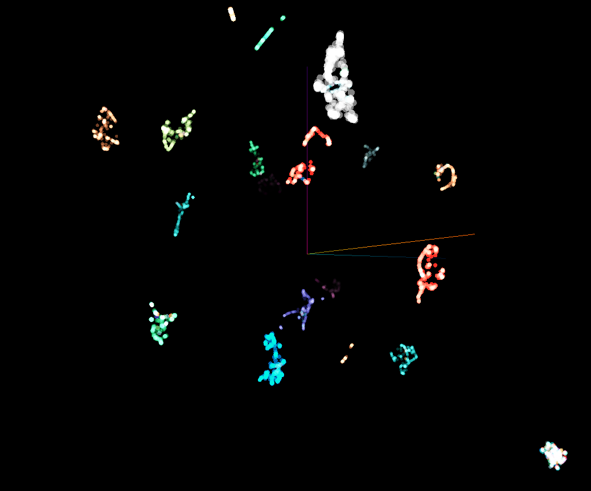
  <figcaption>Figure 6: Train Emb. space for MobileNetV2 base Siamese Network</figcaption>
</figure>

Network based on MobileNetV2 produced the best results, so we're going to start from it. If we compare Fig. 6 and Fig. 5, clusters are even more separable with one cluster of "outliers" (bottom right corner). That extra cluster has all the outliers which because of minimizing Loss Function were separated from other clusters (unfortunately sometimes is easier for the model to sacrifice some of the examples to minimize loss). That is going to cause a problem soon but for now, we can use the current embeddings.

<figure class="image">
  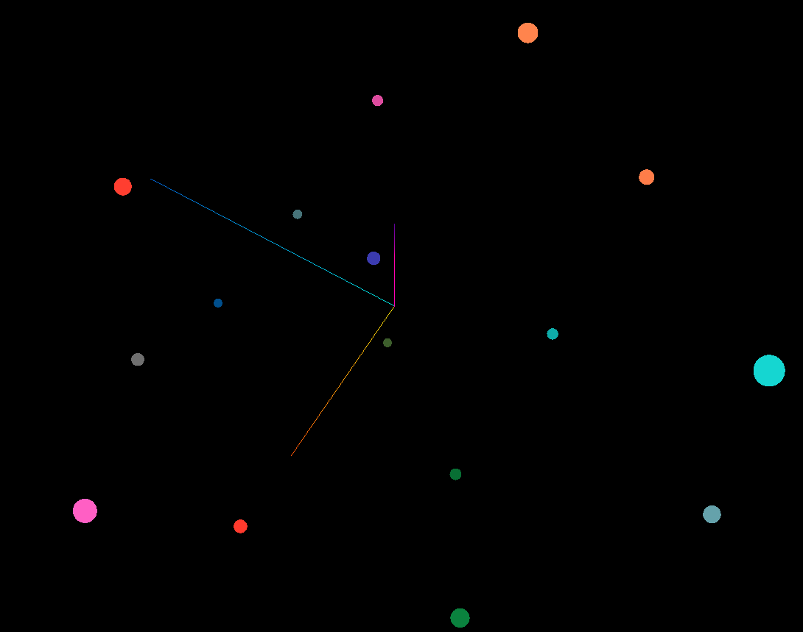
  <figcaption>Figure 7: Train Mean Emb. space for MobileNetV2 base Siamese Network</figcaption>
</figure>

Fig. 7 shows the different version of the embedding space. In this case, we've calculated the average position of all examples from the given class. There is no "outliers" cluster anymore and each class has only one point (vector to be precise) in the space. With that mean values for the whole class, we can calculate the distance from the test image to that class and take the closest one as a predicted class.

<figure class="image">
  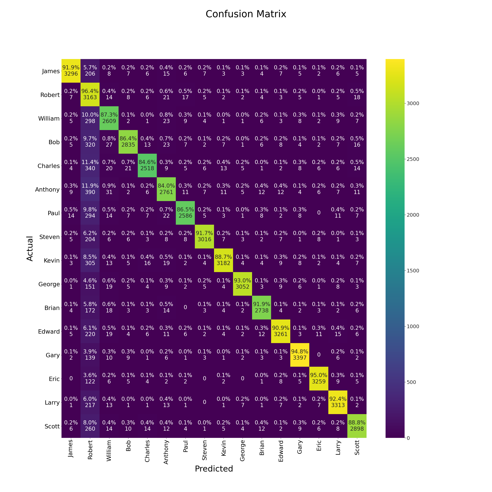
  <figcaption>Figure 8: Confusion Matrix for pig classification (MobileNetV2 base Siamese Network)</figcaption>
</figure>

__F1-score__ for this approach is __0.91__ which puts us way above the classifier we've used previously (F1 ~ 0.6).

### Problem with the mean

Looking at the score itself is not enough because there is a small detail we might miss. You probably remember our "outliers" cluster from the Fig. 6. That outlier exists also in the test dataset and because we're classifying examples base on the distance to the closest mean embedding, it results in __classifying all the outliers as "Robert"__ (Robert's mean is the closest one to the outliers, check Fig. 8 and Robert's column). We could fix that by adding another mean, called "outliers" but then we have to define how to assign examples to the class "outliers" (we could use clusterization metrics).

### Another network bases

As I've said, MobileNetV2 base was the best one to suit our problem. We've tried different approaches and __ResNet101__ was a quite interesting one (__F1 = 0.54__ on classification using mean embedding approach).

<figure class="image">
  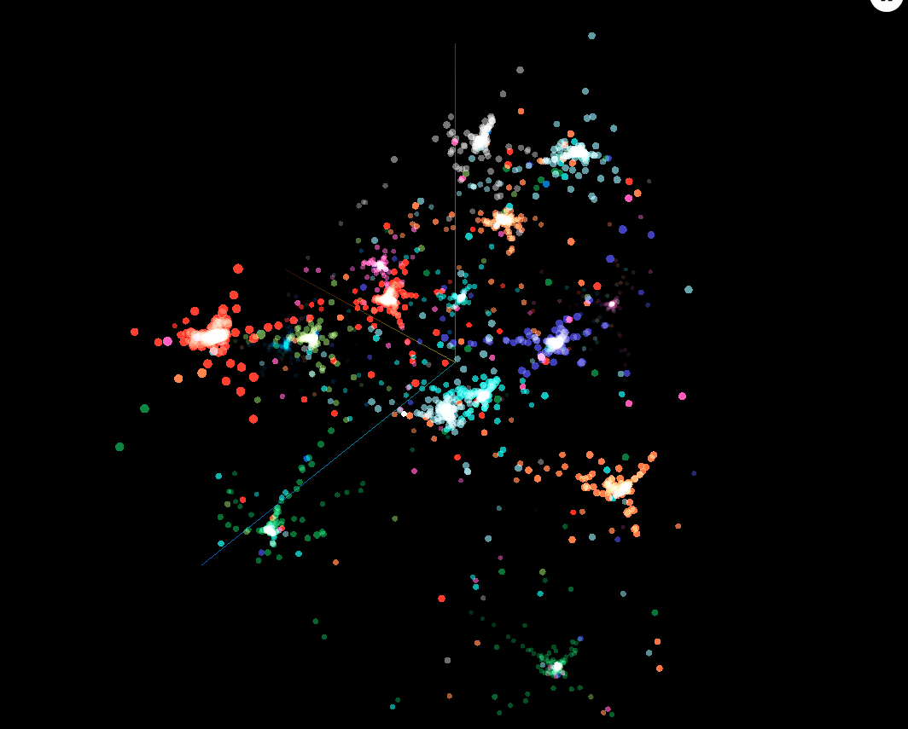
  <figcaption>Figure 9: Train Emb. space for ResNet101 base Siamese Network</figcaption>
</figure>

In this case, our embeddings look more like the Fig. 4. Results are worse than MobileNetV2 but on a similar level with a basic classifier.

<figure class="image">
  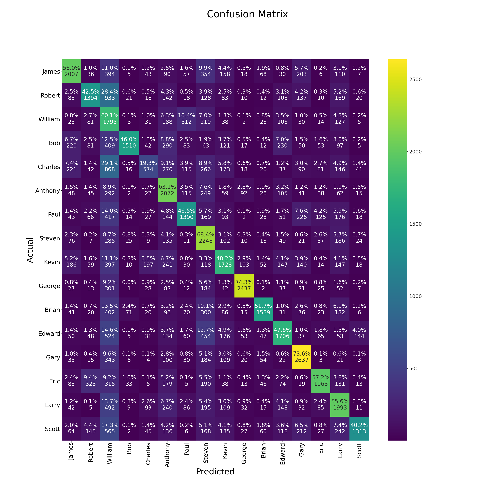
  <figcaption>Figure 10: Confusion Matrix for pig classification (ResNet101 base Siamese Network)</figcaption>
</figure>

A more interesting example is a network trained with __EfficientNetB5__ base. This network was the hardest to train (train loss at 0.25 in comparison with 0.06 MobileNetV2 and 0.01 ResNet101). Projecting train examples into embedding space had given a surprising result.

<figure class="image">
  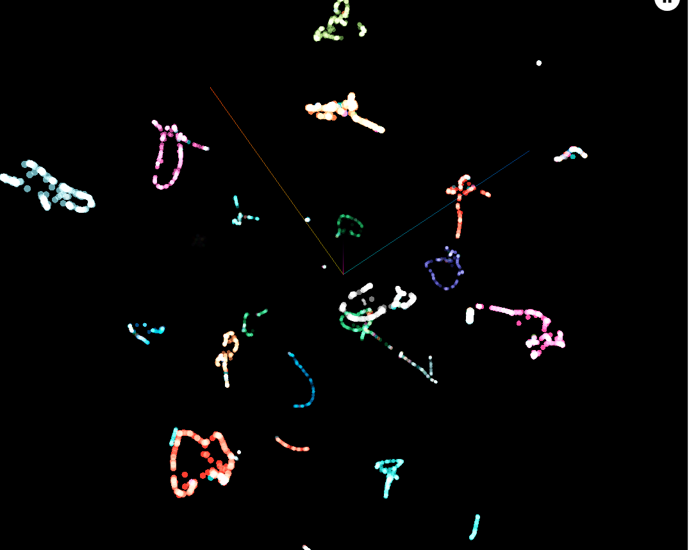
  <figcaption>Figure 11: Train Emb. space for EfficientNetB5 base Siamese Network</figcaption>
</figure>

As you can see, we have more than one cluster per class. Data itself is clustered but when calculating a mean value for every class, the end vector is nowhere near any of the positions of the clusters. Besides that, most of them are very close to the center of the space. That results in very low classification score (__F1 = 0.32__).

<figure class="image">
  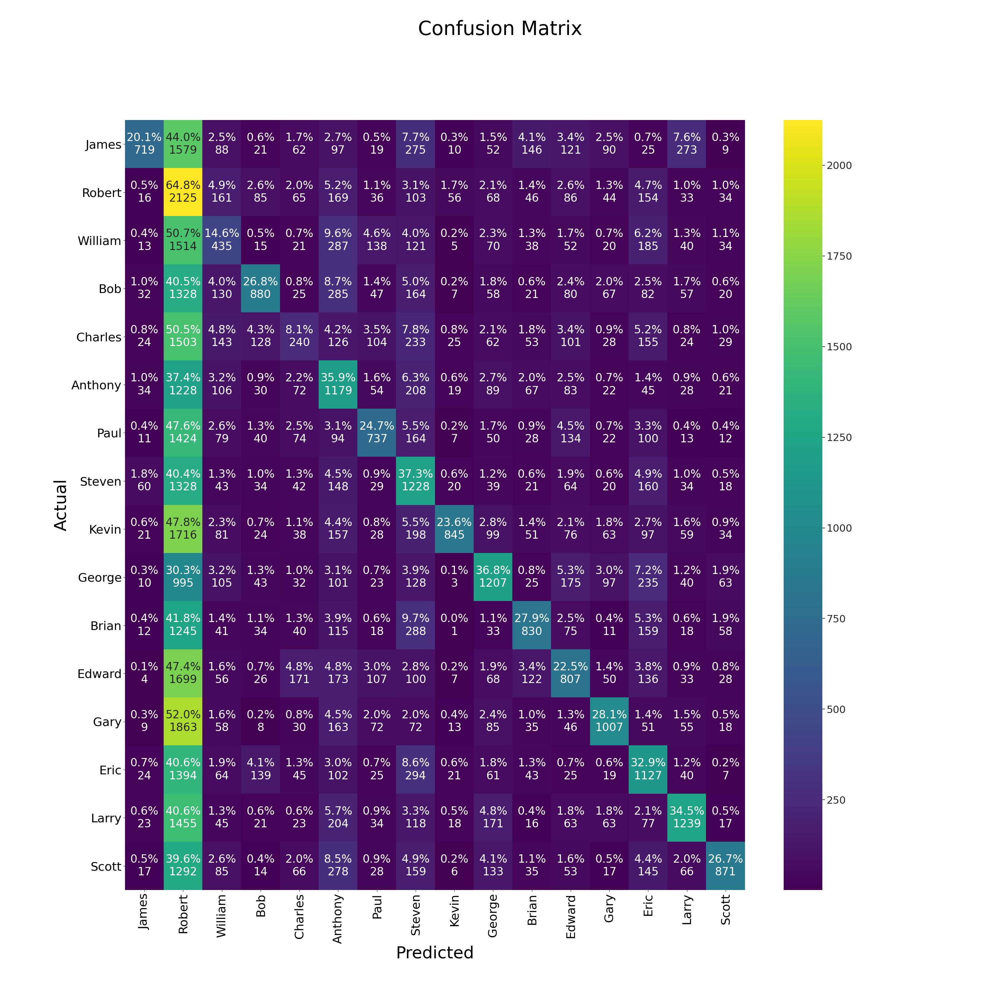
  <figcaption>Figure 12: Confusion Matrix for pig classification (EfficientNetB5 base Siamese Network)</figcaption>
</figure>

Most of the examples are assigned to one class and that class just happens to be the furthest from the space center :) Even if the version with EfficientNet base wasn't working as expected, it gave us knowledge on how that approach might work with the different types of networks.

### Why this approach is better?

- Less computation in production, you're calculating the mean for the class once and just comparing your example with all the means.
- You can easily add a new class just by computing a bunch of images from that class and calculating another mean embedding
- With some additional work, you might have an "outliers" class.

#### What about more animals?

This network works with 64D space and it might be beneficial to add more dimensions when dealing with more complex datasets (thousands of subjects).

### How did it work with the whole system?

That is a difficult part. I've mentioned that __the first part of the system is a detection network__. Siamese Network has to deal with cropped images from that detection and not with nicely cropped train/test dataset.

<figure class="image">
  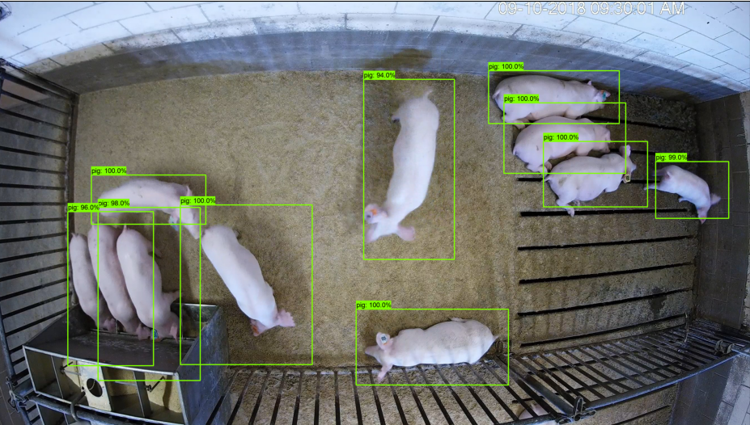
  <figcaption>Figure 13: Detection output</figcaption>
</figure>

<figure class="image">
  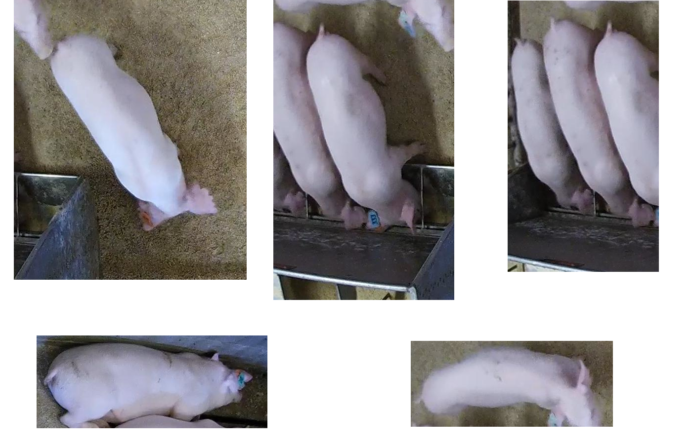
  <figcaption>Figure 14: Detection output cropped (only 5 elements from the output)</figcaption>
</figure>

Fig. 13 shows the sample output from the detection network. You can clearly see that some of the bounding boxes are covering more than one animal. Fig. 14 shows some of the cropped images using just that bounding box definition from the detection network. That cropped images are then sent to Siamese Network and compared with the mean embedding. Some of the cropped images are easily classified (i.e. left top) but some of them (i.e. right top) are having multiple animals on the same image. That might cause a network to output embedding base on features from the different animals that we want and in the end, misclassify the result. We're dealing with cases like that using some custom heuristics, but you should be aware of the problem.

### Conclusion

Using mean embeddings to classify animals with Siamese Network happens to work very well. We have to watch out for some edge cases (described above) but at least some of them could be fixed with some heuristics. If you're interested in the project (or just want to check out the code), we've published everything on the [GitHub repository](https://github.com/burnpiro/farm-animal-tracking).

The main project goal was to track and recognize animals on the video and here is a quick sample result.

<iframe width="560" height="315" src="https://www.youtube.com/embed/SEw_Tgrrg_E" frameborder="0" allow="accelerometer; autoplay; clipboard-write; encrypted-media; gyroscope; picture-in-picture" allowfullscreen></iframe>

### References:

- Gregory R. Koch. _“Siamese Neural Networks for One-Shot Image Recognition”._ 2015 [https://www.cs.utoronto.ca/~gkoch/files/msc-thesis.pdf][1]
- Leland McInnes, John Healy, and James Melville. _UMAP: Uniform Manifold Approximation and Projection for Dimension Reduction._ 2020 [https://arxiv.org/abs/1802.03426][2]
- Stefan Schneider et al. _Similarity Learning Networks for Animal Individual Re-Identification_ - Beyondthe Capabilities of a Human Observer. Feb. 2019.
- Tensorflow.Embedding Projector - Web Access Jan 2021 [https://projector.tensorflow.org/][3]
- Mingxing Tan and Quoc V. Le. _EfficientNet: Rethinking Model Scaling for Convolutional NeuralNetworks._ 2020 [https://arxiv.org/abs/1905.11946][4]
- Mark Sandler et al. _MobileNetV2: Inverted Residuals and Linear Bottlenecks._ 2019 [https://arxiv.org/abs/1801.04381][5]
- Kaiming He et al. _Deep Residual Learning for Image Recognition._ 2015 [https://arxiv.org/abs/1512.03385][6]
- Perceptual Systems Research Group - University of Nebraska [http://psrg.unl.edu/Projects/Details/12-Animal-Tracking][7]
- S. Schneider, G. Taylor, S. Linquist and S. Kremer _Similarity Learning Networks for Animal Individual Re-Identification -- Beyond the Capabilities of a Human Observer_ 2020 [https://arxiv.org/abs/1902.09324][8]
- Elad Hoffer, Nir Ailon _Deep metric learning using Triplet network_ 2014 [https://arxiv.org/abs/1412.6622][9]

[1]: https://www.cs.utoronto.ca/~gkoch/files/msc-thesis.pdf
[2]: https://arxiv.org/abs/1802.03426
[3]: https://projector.tensorflow.org/
[4]: https://arxiv.org/abs/1905.11946
[5]: https://arxiv.org/abs/1801.04381
[6]: https://arxiv.org/abs/1512.03385
[7]: http://psrg.unl.edu/Projects/Details/12-Animal-Tracking
[8]: https://arxiv.org/abs/1902.09324
[9]: https://arxiv.org/abs/1412.6622
[10]: https://github.com/burnpiro/farm-animal-tracking/wiki/Detection-training