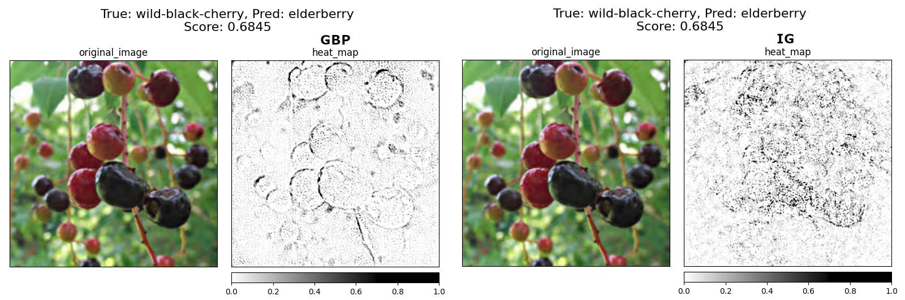
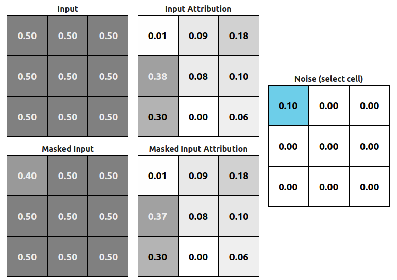
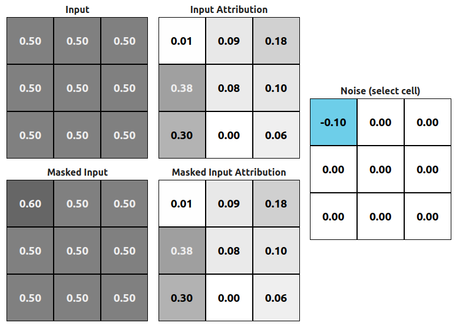
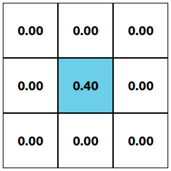

Explainable Artificial Intelligence (__XAI__) is getting more and more popular every year. Also every year we have more methods that aim to explain how our models work. The only problem with most of those approaches is comparison.

We have two types of methods:

- Quantitative - base on some numeric value
- Qualitative - base on opinions/polls

Let me show you where the problem is:

<figure class="image">
  
  <figcaption>Figure 1: Guided Backpropagation vs Integrated Gradients explanation of the same image, Image source: <a href="https://www.kaggle.com/gverzea/edible-wild-plants" target="_blank">Edible wild plants Dataset</a></figcaption>
</figure>

Here we have two explanations of the same prediction (done by ResNet18 model) using two methods, [Guided Backpropagation][gbp] (__GPB__) and [Integrated Gradients][ig] (__IG__). As you can see, the predicted class is incorrect but two explanations why this should be _elderberry_ are completely different. As someone who has no idea about the plants I would say that GPB explanation is better, and it probably is. We could ask more people and at the end gather all answers and decide which one is better. Before doing that let us jump to a different example.

<figure class="image">
  
  <figcaption>Figure 2: Guided Backpropagation vs GradCAM explanation of the same image, Image source: <a href="https://www.kaggle.com/gverzea/edible-wild-plants" target="_blank">Edible wild plants Dataset</a></figcaption>
</figure>

In this case, we're looking at a different method called __[GradCAM][gradcam]__. This example is not that obvious as the previous one. GradCAM's version has less noise (more focus on flowers) but without an expert, we cannot be sure which one is better. We still could poll people and get some answers but is that answer going to be a valid one? Sure we could test 100 or even 1000 images and come up with an excellent idea on which method is better but that won't scale up when our dataset has 10k images and we need to compare 5 different methods using 5 different models.

This is a problem with the _Qualitative_ approach. We're able to compare a handful of examples but that won't give us any meaningful metric if we want to add another method to our comparison poll. Here is when _Quantitative_ methods are coming. The idea of the quantitative method is to have some kind of metric which is replicable and allowing us to compare numeric values. In the paper [On the (In)fidelity and Sensitivity for Explanations][infsens], _Chih-Kuan Yeh_ and others are presenting two measures (called __infidelity__ and __sensitivity__) which should be an objective evaluation of that kind of explanation ([saliency map](https://en.wikipedia.org/wiki/Saliency_map)).

## Sensitivity

Let's start with the second one because it's easier to explain. As the name says, this measurement tells us how "sensitive" the method is. 

$$
\operatorname{SENS}_{\operatorname{MAX}}(\Phi, \mathbf{f}, \mathbf{x}, r)=\max _{\|\mathbf{y}-\mathbf{x}\| \leqslant r} \| \Phi(\mathbf{f}, \mathbf{y})-\Phi(\mathbf{f}, \mathbf{x}) \|
$$

#### Where:

- $\Phi$ is an explanation function
- $\mathbf{f}$ is a black-box model
- $\mathbf{x}$ is an input
- $r$ is called _input neighborhood radius_ 

Sensitivity is defined as a __change in the explanation with a small perturbation of the input__. To calculate __SENS__ value we have to make those small perturbations and check how our attributions have changed in respect to the original attribution for unchanged input.

> The original paper also refers to those _"small perturbations"_ as _"insignificant perturbations"_ and that wording is important because when measuring infidelity we're also performing perturbations, but those perturbations are _"significant perturbations"_. It's good to know that difference.

You might ask "What's with that _radius_?" (__r__ parameter). It is basically lower and upper bound of the uniform distribution ${\mathcal  {U}}\{-r,r\}$. Now when we know the parameters here are the examples:

<figure class="image">
  
  <figcaption>Figure 3: Attributions of the original input and perturbed one. This is not an <i>"insignificant perturbation"</i> but one to visually show the difference, Source: <i>Kemal Erdem</i></figcaption>
</figure>

Fig 3. is made with the help of a simple model which operates on 3x3x1 images (grayscale). We're subtracting __0.1 noise__ from the original __input__ and calculating attributions base on the new __masked input__. We can see that attribution changes (__(2,1)__ position on the __Masked Input Attribution__ grid). This example produces a __sensitivity value of ~0.01__ (it's a little more because other attributions also changed but that change is very small). There might be a case when the sensitivity value is going to be 0.

<figure class="image">
  
  <figcaption>Figure 4: Zero sensitivity example, Source: <i>Kemal Erdem</i></figcaption>
</figure>

This example is fake (check it in the application below) but I did it just to show you when the attribution might be equal to 0. In this case (Fig. 4) we've also applied some perturbation (-0.1 on the (1,1) position) but the attribution of the new masked input stays the same. This is the only case when the sensitivity value would have a value of 0. IRL sensitivity value is not calculated base on one perturbation but rather 10 or more.

## Infidelity

Infidelity is a little more complicated than sensitivity. The result is taking more values than just the attribution (also score and noise itself). The equation for infidelity looks like:

$$
\operatorname{INFD}(\Phi, \mathbf{f}, \mathbf{x})=\mathbb{E}_{\mathbf{I} \sim \mu_{\mathrm{I}}}\left[\left(\mathbf{I}^{T} \Phi(\mathbf{f}, \mathbf{x})-(\mathbf{f}(\mathbf{x})-\mathbf{f}(\mathbf{x}-\mathbf{I}))\right)^{2}\right]
$$

#### Where:

- $\Phi$ is an explanation function
- $\mathbf{f}$ is a black-box model
- $\mathbf{x}$ is an input
- $I$ is a _significant petrurbation_

This time we're dealing with a __significant perturbation__. The paper discusses that perturbation a lot but in the end, we're left with 2 main options:

- __Noisy Baseline__ - just use Gaussian random vector
- __Square Removal__ - remove random subsets of pixels

The first option is easier from an implementation and usage perspective. We just need to generate a vector (exactly it's a tensor) with the same shape as our input, using Gaussian distribution. All ML libraries have that method already build-in. Ok but how exactly that calculation looks like?

We can divide that infidelity equation into 2 or even 3 parts: 

1. $\mathbf{I}^{T} \Phi(\mathbf{f}, \mathbf{x})$
1. $\mathbf{f}(\mathbf{x})-\mathbf{f}(\mathbf{x}-\mathbf{I})$
1. $([...])^2$

#### @1

We need to calculate attribution using our original input and multiply it by transposed noise vector. This might look simple (and it is) but there is one important thing to notice. Because we're using our original noise vector if it has some 0 values then attribution values placed on the transposed positions of those values are going to be cleared (multiplication by 0).

<figure class="image">
  
  <figcaption>Figure 5: Noise with only one value not equal to 0, Source: <i>Kemal Erdem</i></figcaption>
</figure>

In the case of noise like in Fig. 5 only attribution value from (2,2) (transposed matrix looks exactly the same in this case) position is used for final score calculation.

#### @2

This part is even simpler because we're just getting our black-box model output and subtracting value after perturbation from that before perturbation.

#### @3

This is not exactly a separate part, but we don't want to have any negative numbers, so we're just squaring the result.

## Demo

Now you know how the calculation looks like and I've prepared a simple showcase application where you can play with different noises and check how it affects infidelity or/and sensitivity. Remember that noise values in this example are very large and usually even _significant perturbation_ is a lot smaller than that.

    <xai-infidelity></xai-infidelity>

This application is using a model that takes 3x3x1 input image and predicts assignment to one of two classes. This is just a simple model and you shouldn't bother with its usefulness (it has none). I've created it just for the purpose of showing the effect of selected noise on infidelity and sensitivity. It would be uncomfortable to show the same effect using a larger grid.

## Conclusions

I've presented to you two measures that could be used to quantitatively measure and compare different XAI methods. I'm currently in a process of writing a paper discussing how much those measures are useful and should we use them to compare methods with each other.

If you're interested in using those methods you can try [Captum Library](https://captum.ai/) and their implementation of those methods:

- [Infidelity in Captum](https://captum.ai/api/metrics.html#infidelity)
- [Sensitivity in Captum](https://captum.ai/api/metrics.html#sensitivity)

### References:

- Axiomatic Attribution for Deep Networks, Mukund Sundararajan et al. 2017 [arxiv 1703.01365][ig]
- Striving for Simplicity: The All Convolutional Net, Jost Tobias Springenberg et al. 2015 [arxiv 1412.6806][gbp]
- On the (In)fidelity and Sensitivity for Explanations, Chih-Kuan Yeh et al. 2019 [arxiv 1901.09392][infsens]
- Grad-CAM: Visual Explanations from Deep Networks via Gradient-based Localization, R. R. Selvaraju et al. 2016 [arxiv 1610.02391][gradcam]

[ig]: https://arxiv.org/abs/1703.01365
[gbp]: https://arxiv.org/pdf/1412.6806.pdf
[infsens]: https://arxiv.org/abs/1901.09392
[gradcam]: https://arxiv.org/abs/1610.02391