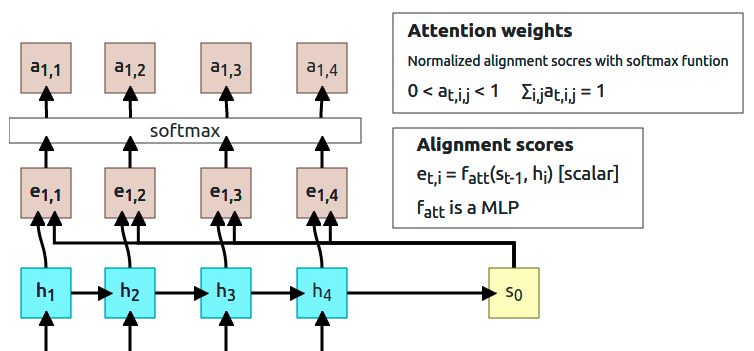
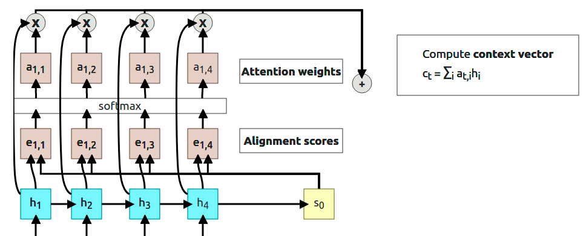
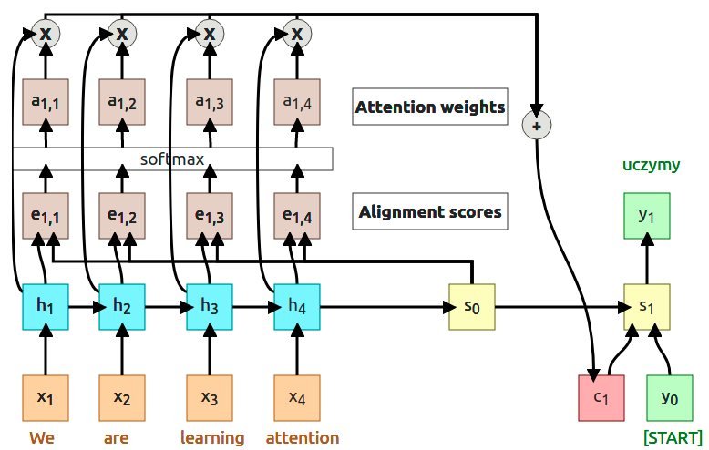
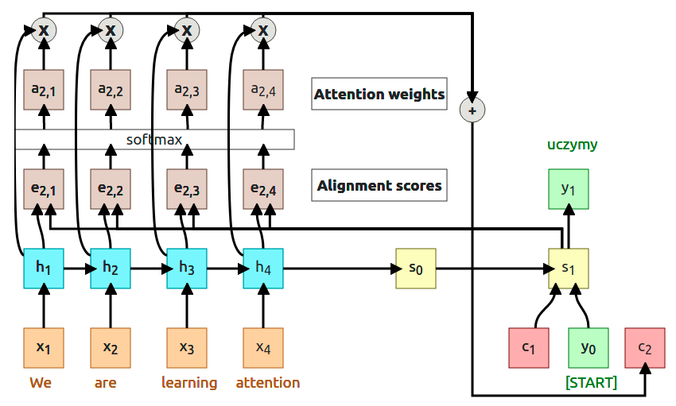

Attention mechanism is one of the most important inventions in Machine Learning, at this moment (2021) it's used to achieve impresive results in almost every field of ML and today I want to explain where it came from and how it works.

Before even start explaining Attention we have to go back and see the problem which Attention was suppose to solve. Before 2015, there was an issue with RNN which was occured when the input sequence was really long.

<figure>
    

        <rnn-process></rnn-process>
    

    <figcaption>Figure 1: Squence-to-sequence with RNN, Designed base on <a href="https://arxiv.org/abs/1409.3215" target="_blank"><i>“Sequence to sequence learning with neural networks”</i>, NeurIPS 2014</a> Paper</figcaption>
</figure>

This solution works fine as long as the sentence is short. After decoder is done with its job, we're left with the **context vector _c_** and the **initial decoder state $s_0$**. Those two vectors have to _"summarize"_ the whole input sequence because we're going to feed them into the decorer part of our model. You can treat the context vector as something that transfering information between the encoded sequence and the decoded sequence.

For long sentences, like **T=100**, it is highly probable that our context vector _**c**_ is not going to be able to hold all meaningfull information from encoded sequence. Consider this quote:

> "In a way, AI is both closer and farther off than we imagine. AI is closer to being able to do more powerful things than most people expect -- driving cars, curing diseases, discovering planets, understanding media. Those will each have a great impact on the world, but we're still figuring out what real intelligence is." - **Mark Zuckerberg** in _**"Building Jarvis"**_

It is a lot easier to compress the first sentence to the context vector than to do the same for a whole quote. We could create longer and longer context vectors but because RNNs are sequential that won't scale-up. That's where the Attention Mechanism comes in.

The idea is to create **a new context vector every timestep** of the decoder which attends differently to the encoded sequence.

<figure>
    

        <rnn-with-attention></rnn-with-attention>
    

    <figcaption>Figure 2: Squence-to-sequence with RNN (with Attention), Designed base on <a href="https://arxiv.org/abs/1409.0473" target="_blank"><i>“Neural machine transla$on by jointly learning to align and translate”</i>, NeurIPS 2015</a> Paper</figcaption>
</figure>

This time we're computing additional context vector on every step of the decoder. Lets go through one whole step to explain what is happening.

### 1. Compute alignment scores

<figure>
    
    <figcaption>Figure 3: Alignment Scores for <b>t=1</b>, <a target="_blank" href="https://erdem.pl/2021/04/introduction-to-attention-mechanism">Source: erdem.pl</a> </figcaption>
</figure>

At $t=1$ we're going to use $s_{t-1}$ decoder state to computer alignment scores. To compute alignment score for every encoder state we're using a function that is called _alignment function_ but it's just a MLP (MultiLayer Perceptron). Each alignment score can be treated as "how much $h_1$ is useful in predicting the output in the state $s_0$". Alignment function outputs a scalar value which is a real number and we cannot use it just like that, we have to normalize those values using softmax function.

### 2. Compute attention weights

<figure>
    
    <figcaption>Figure 4: Attention weights for <b>t=1</b>, <a target="_blank" href="https://erdem.pl/2021/04/introduction-to-attention-mechanism">Source: erdem.pl</a> </figcaption>
</figure>

Output from the softmax function is normalizes so all the nubmers sumup to 1. Those outputs are called **Attentions weights** and as the name says, they show the model "how much it should attend to corresponding hidden state".

### 3. Compute context vector

<figure>
    
    <figcaption>Figure 5: Context vector calculation for <b>t=1</b>, <a target="_blank" href="https://erdem.pl/2021/04/introduction-to-attention-mechanism">Source: erdem.pl</a> </figcaption>
</figure>

Now a lot of things happen (3 steps in the diagram above). First, we multiplied every attention weight by corresponding hidden state ($a_{1,1} \times h_{1,1}$, $a_{1,2} \times h_{1,2}$...). Then, all of the results are summed to use as a **context vector $c_1$**.

> **Note:** 
> You've probably noticed that at this point "context vector" is actually a "context scalar" but this is just because we decided to have only 1D output (easier to show and undestand for now). I'm going to switch to vectors when we get to abstracting attention to its own layer.

### 4. Compute first output

<figure>
    
    <figcaption>Figure 6: Decoder's output for <b>t=1</b>, <a target="_blank" href="https://erdem.pl/2021/04/introduction-to-attention-mechanism">Source: erdem.pl</a> </figcaption>
</figure>

At the end of the first timestep we can finally compute first output from the decoder. That output is computed using context vector $c_1$, previous decoder's state $s_0$ and start token $y_0$. Interesting thing is that in that whole process we don't have to train $f_{att}$ as a separate model. The **whole process is differentiable**, so we can just backpropagete through it.

### 5. And repeat...

<figure>
    
    <figcaption>Figure 7: New context vector for <b>t=2</b>, <a target="_blank" href="https://erdem.pl/2021/04/introduction-to-attention-mechanism">Source: erdem.pl</a> </figcaption>
</figure>

At the timestep $t=2$ only thing we have to do is to **change the input to calculate the alignment scores from $s_0$ to $s_1$**. Using the same process we compute new scores ($e_{2,1}$, $e_{2,1}$...) and attention weights ($a_{2,1}$, $a_{2,1}$...). Then multiply new attention weights and encoder's hidden states to compute new context vector $c_2$. At this point the whole process just runs in the loop untill decoder produces _[STOP]_ token (sometimes called _[EOS]_ token, ang. End Of Sentence).

<figure>
    

        <image-with-attention></image-with-attention>
    

    <figcaption>Figure 9: Image Captioning with Attention (still RNN), Designed base on <a href="https://arxiv.org/abs/1409.0473" target="_blank"><i>“Show, Attend, and Tell: Neural Image Caption Generation with Visual Attention”</i>, ICML 2015</a> Paper</figcaption>
</figure>

### References:

- Sutskever et al, “Sequence to sequence learning with neural networks”, NeurIPS 2014 [https://arxiv.org/abs/1409.3215][sq-to-sq]
- Bahdanau et al, “Neural machine transla$on by jointly learning to align and translate”, ICLR 2015 [https://arxiv.org/abs/1409.0473][rnn-with-attention]
- Xu et al, “Show, Attend, and Tell: Neural Image Caption Generation with Visual Attention”, ICML 2015 [https://arxiv.org/abs/1502.03044][show-attend-tell]

[sq-to-sq]: https://arxiv.org/abs/1409.3215
[rnn-with-attention]: https://arxiv.org/abs/1409.0473
[show-attend-tell]: https://arxiv.org/abs/1502.03044
