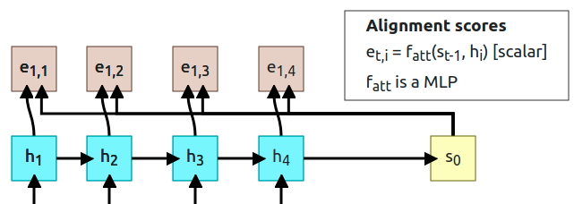
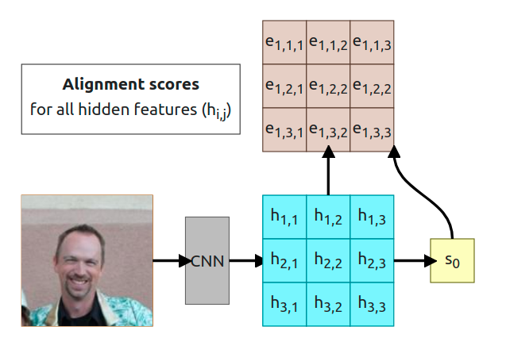
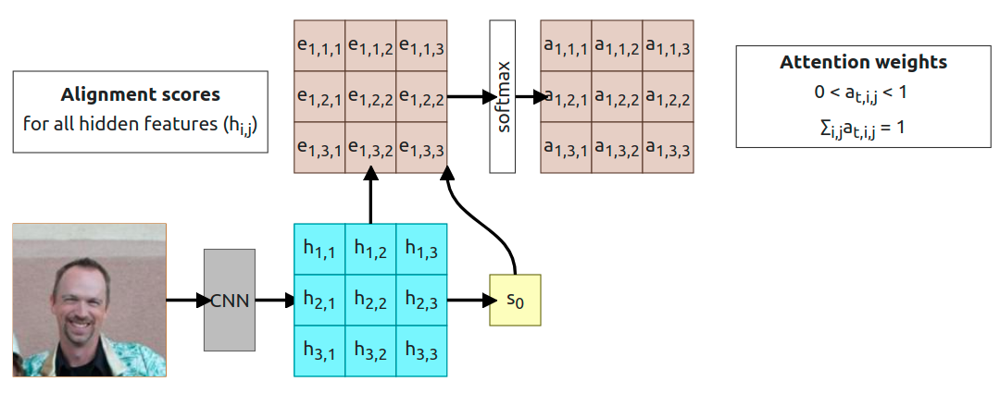
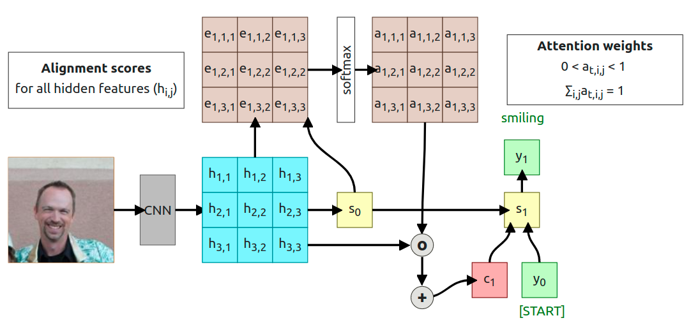
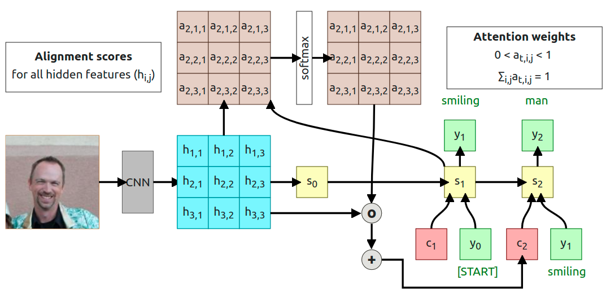
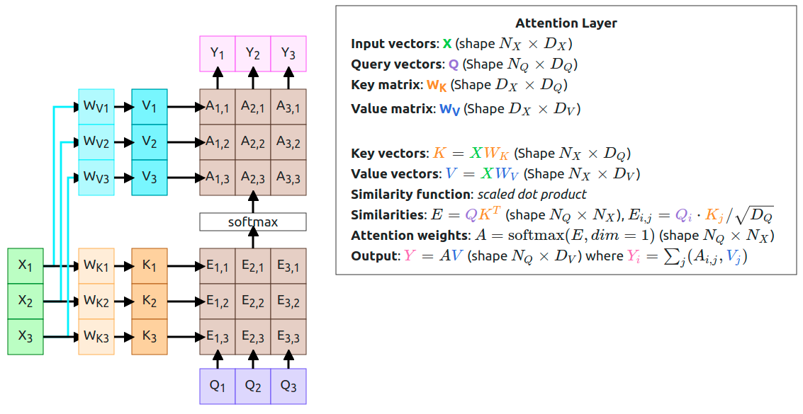
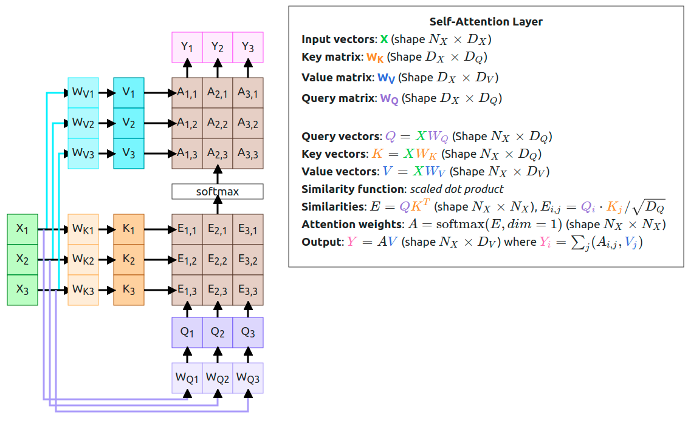
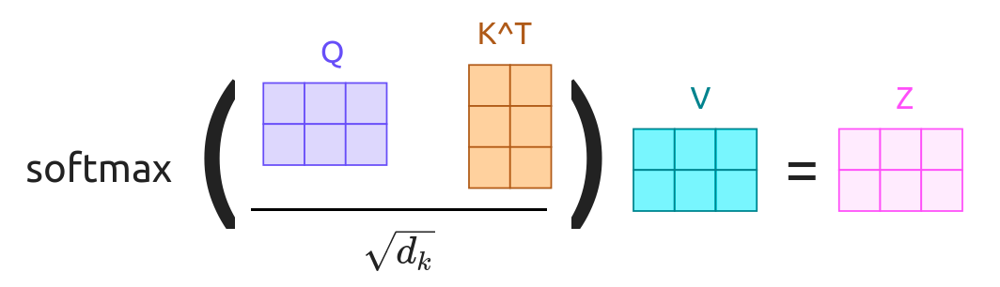

The attention mechanism is one of the most important inventions in Machine Learning, at this moment (2021) it's used to achieve impressive results in almost every field of ML, and today I want to explain where it came from and how it works.

Before even beginning to explain Attention we have to go back and see the problem which Attention was supposed to solve. Before 2015, there was an issue with RNN which was occurred when the input sequence was really long.

<figure>
    

        <rnn-process></rnn-process>
    

    <figcaption>Figure 1: Sequence-to-sequence with RNN, Designed base on <a href="https://arxiv.org/abs/1409.3215" target="_blank"><i>“Sequence to sequence learning with neural networks”</i>, NeurIPS 2014</a> Paper, <a href="https://web.eecs.umich.edu/~justincj/teaching/eecs498/FA2019/" target="_blank">UMich</a></figcaption>
</figure>

This solution works fine as long as the sentence is short. After the decoder is done with its job, we're left with the **context vector _c_** and the **initial decoder state $s_0$**. Those two vectors have to _"summarize"_ the whole input sequence because we're going to feed them into the decoder part of our model. You can treat the context vector as something that transferring information between the encoded sequence and the decoded sequence.

For long sentences, like **T=100**, it is highly probable that our context vector _**c**_ is not going to be able to hold all meaningful information from the encoded sequence. Consider this quote:

> "In a way, AI is both closer and farther off than we imagine. AI is closer to being able to do more powerful things than most people expect -- driving cars, curing diseases, discovering planets, understanding media. Those will each have a great impact on the world, but we're still figuring out what real intelligence is." - **Mark Zuckerberg** in _**"Building Jarvis"**_

It is a lot easier to compress the first sentence to the context vector than to do the same for a whole quote. We could create longer and longer context vectors but because RNNs are sequential that won't scale up. That's where the Attention Mechanism comes in.

The idea is to create **a new context vector every timestep** of the decoder which attends differently to the encoded sequence.

<figure>
    

        <rnn-with-attention></rnn-with-attention>
    

    <figcaption>Figure 2: Sequence-to-sequence with RNN (with Attention), Designed base on <a href="https://arxiv.org/abs/1409.0473" target="_blank"><i>“Neural machine transla$on by jointly learning to align and translate”</i>, NeurIPS 2015</a> Paper, <a href="https://web.eecs.umich.edu/~justincj/teaching/eecs498/FA2019/" target="_blank">UMich</a></figcaption>
</figure>

This time we're computing an additional context vector on every step of the decoder. Let us go through one whole step to explain what is happening.

### 1. Compute alignment scores

<figure>
    
    <figcaption>Figure 3: Alignment Scores for <b>t=1</b>, <a target="_blank" href="https://erdem.pl/2021/04/introduction-to-attention-mechanism">Source: erdem.pl</a> </figcaption>
</figure>

At $t=1$ we're going to use $s_{t-1}$ decoder state to computer alignment scores. To compute the alignment score for every encoder state we're using a function that is called _alignment function_ but it's just an MLP (MultiLayer Perceptron). Each alignment score can be treated as "how much $h_1$ is useful in predicting the output in the state $s_0$". The alignment function outputs a scalar value which is a real number and we cannot use it just like that, we have to normalize those values using the softmax function.

### 2. Compute attention weights

<figure>
    
    <figcaption>Figure 4: Attention weights for <b>t=1</b>, <a target="_blank" href="https://erdem.pl/2021/04/introduction-to-attention-mechanism">Source: erdem.pl</a> </figcaption>
</figure>

Output from the softmax function is normalized so all the numbers sum up to 1. Those outputs are called **Attention weights** and as the name says, they show the model "how much it should attend to corresponding hidden state".

### 3. Compute context vector

<figure>
    
    <figcaption>Figure 5: Context vector calculation for <b>t=1</b>, <a target="_blank" href="https://erdem.pl/2021/04/introduction-to-attention-mechanism">Source: erdem.pl</a> </figcaption>
</figure>

Now a lot of things happen (3 steps in the diagram above). First, we multiplied every attention weight by corresponding hidden state ($a_{1,1} \times h_{1,1}$, $a_{1,2} \times h_{1,2}$...). Then, all of the results are summed to use as a **context vector $c_1$**.

> **Note:** 
> You've probably noticed that at this point "context vector" is actually a "context scalar" but this is just because we decided to have only 1D output (easier to show and understand for now). I'm going to switch to vectors when we get to abstracting attention to its own layer.

### 4. Compute the first output

<figure>
    
    <figcaption>Figure 6: Decoder's output for <b>t=1</b>, <a target="_blank" href="https://erdem.pl/2021/04/introduction-to-attention-mechanism">Source: erdem.pl</a> </figcaption>
</figure>

At the end of the first timestep, we can finally compute the first output from the decoder. That output is computed using context vector $c_1$, previous decoder's state $s_0$, and start token $y_0$. Interesting thing is that in that whole process we don't have to train $f_{att}$ as a separate model. The **whole process is differentiable**, so we can just backpropagate through the computational graph.

### 5. And repeat...

<figure>
    
    <figcaption>Figure 7: New context vector for <b>t=2</b>, <a target="_blank" href="https://erdem.pl/2021/04/introduction-to-attention-mechanism">Source: erdem.pl</a> </figcaption>
</figure>

At the timestep $t=2$ only thing we have to do is to **change the input to calculate the alignment scores from $s_0$ to $s_1$**. Using the same process we compute new scores ($e_{2,1}$, $e_{2,1}$...) and attention weights ($a_{2,1}$, $a_{2,1}$...). Then multiply new attention weights and encoder's hidden states to compute the new context vector $c_2$. At this point, the whole process just runs in the loop until the decoder produces _[STOP]_ token (sometimes called _[EOS]_ token, eng. End Of Sentence).

## Attention weights visualization

<figure>
    
    <figcaption>Figure 8: Attention weights for English to French translation, Source:  <a target="_blank" href="https://arxiv.org/abs/1409.0473">Neural Machine Translation by Jointly Learning to Align and Translate</a> </figcaption>
</figure>

In the original paper, there is a simple visualization of the attention weights $a_{i,j}$ generated when translating the English sentence _"The agreement on the European Economic Area was signed in August 1992."_ into French _"L'accord sur la zone économique européenne a été signé en août 1992."_. This visualization shows us a couple of interesting things.

The first thing is a diagonal pattern which tells us that model put more attention to corresponding French word from the same position. The second thing is more interesting and it is the phrase _"European Economic Area"_ which in French has reverse order _"la zone économique européenne"_. We can see that when generating `la` token model puts more attention on `the` and `Area`, then when generating the `zone` token it attends to `Area` and `Economic` (ignoring `European`). Another interesting observation is _"a été signé"_ where when generating `a` and `été` tokens, the model attends to both `was` and `signed` (it makes sense in French because we need to know an exact variation of the word `étre`).

This heatmap is important because we didn't tell the model which words it should attend to, it learned this by itself. Additionally, we've got a kind of interpretability of the model’s decision.

## Attention doesn't know that input is a sequence

You probably started to worry about what happened with my information from the last step:

_"We're not using the fact that h vector is an ordered sequence. It is used as unordered set instead. To solve this we have to add a positional encoding to each element"_

I've written a piece on positional encoding as a separate article because there is too much information to squeeze into this one. If you're interested please check [Understanding Positional Encoding in Transformers](https://erdem.pl/2021/05/understanding-positional-encoding-in-transformers).

This is still a thing but instead of solving that problem, make use of it to abstract attention mechanism and use it for something different than a sequence of text. What about describing images with attention? There is a paper from the same year called [_"Show, Attend, and Tell: Neural Image Caption Generation with Visual Attention"_][show-attend-tell] that uses attention on CNN's embedding to generate image captioning with the help of an RNN decoder.

<figure>
    

        <image-with-attention></image-with-attention>
    

    <figcaption>Figure 9: Image Captioning with Attention (still RNN), Designed base on <a href="https://arxiv.org/abs/1502.03044" target="_blank"><i>“Show, Attend, and Tell: Neural Image Caption Generation with Visual Attention”</i>, ICML 2015</a> Paper, <a href="https://web.eecs.umich.edu/~justincj/teaching/eecs498/FA2019/" target="_blank">UMich</a></figcaption>
</figure>

In this paper, the authors are proposing a solution based on convolutional feature extraction instead of the standard RNN encoder network. We're using those features from CNN to compute state and then to compute alignment scores for every timestep of the RNN decoder. As in the previous example, I'm going to walk you through the whole process, but you probably are able to understand it base on the interactive diagram above :)

<figure>
    
    <figcaption>Figure 10: Alignment score calculation from extracted features, <a target="_blank" href="https://erdem.pl/2021/04/introduction-to-attention-mechanism">Source: erdem.pl</a> </figcaption>
</figure>

We're assuming that CNN is already trained and produces our 3x3 grid. We're going to use that initial grid to predict the initial hidden state $s_0$ (sometimes it could be randomly generated or even set to 0). Now we have to pass the same grid and $s_0$ to the alignment function to calculate corresponding alignment score for each value of the grid $e_{t,i,j} = f_{att}(s_{t-1}, h_{i,j})$. That gives us alignment scores for **t=1** timestep. As in the previous example, each alignment score is a scalar which tells us "how important is given feature in the current timestep".

<figure>
    
    <figcaption>Figure 11: Attention weights, <a target="_blank" href="https://erdem.pl/2021/04/introduction-to-attention-mechanism">Source: erdem.pl</a> </figcaption>
</figure>

With alignment scores calculated we need to apply softmax to normalize scores to some probability distribution that sums to one.

<figure>
    
    <figcaption>Figure 12: Compute context vector and generate first output, <a target="_blank" href="https://erdem.pl/2021/04/introduction-to-attention-mechanism">Source: erdem.pl</a> </figcaption>
</figure>

Now all we have to do is to compute [Hadamard product](https://en.wikipedia.org/wiki/Hadamard_product_(matrices)) (element-wise multiplication, $h_{i,j} \times a_{t,i,j}$ ...) and sum everything to get a context vector $c_1$. The rest works exactly like in the previous example so we use context vector $c_1$, start token $y_0$, and initial decoder state $s_0$ and pass it through $g_U$ function to calculate $s_1$ state and achieve some output token $y_1$.

> **Note** 
> The sum is not required at this point, I'm just doing it to have the same shape of the context vector as in the previous example. We could easily use a 3x3 matrix as an input to the $g_U$ function.

<figure>
    
    <figcaption>Figure 14: Second timestep (<b>t=2</b>), <a target="_blank" href="https://erdem.pl/2021/04/introduction-to-attention-mechanism">Source: erdem.pl</a> </figcaption>
</figure>

The same as before, we're using newly generated $s_1$ state to compute new alignment scores $e_{2,i,j}$, which then are normalized with softmax and computed into context vector $c_2$. The process stops when the decoder produces _[STOP]_ token as an output.

## Visualization of the attention weights

The same as in sequence to sequence translation we are able to visualize attention weights in this case. I'm going to use one of the examples provided by the authors.

<figure>
    
    <figcaption>Figure 15: Image attention visualization, white regions have higher value of the attention weight, Source:  <a target="_blank" href="https://arxiv.org/abs/1502.03044">Show, Attend, and Tell: Neural Image Caption Generation with Visual Attention</a> </figcaption>
</figure>

As you can see this is not an ideal solution for explaining a model but still could give you a kind of intuition about what is happening. Especially when we look at the tokens like `frisbee` or `park` when the model attends to those exact objects. In the case of the token `woman`, both people on the image save similar attention weights but that's still ok because the model could decide which one is the subject and how to name that person.

There is one more type of attention called **hard attention** where instead of using the softmax function, we're selecting a feature with the highest alignment score and using that feature's value as a context. It requires some changes in the training process which I'm not going to discuss right now. Here is an example of hard attention.

<figure>
    
    <figcaption>Figure 16: Hard attention visualization, white regions are the regions which model attends to, Source:  <a target="_blank" href="https://arxiv.org/abs/1502.03044">Show, Attend, and Tell: Neural Image Caption Generation with Visual Attention</a> </figcaption>
</figure>

As you can see, the caption has changed. Now it's saying _"A man and a woman playing frisbee in a field."_ instead _"A woman is throwing a frisbee in a park."_. Attention regions are not fully related to the generated token (as in soft attention), when generating token `frisbee` model attends to the child.

## Let's abstract the Attention

Now, when you know what the Attention is, we can start working on abstracting the idea to create the so-called _"Attention Layer"_. First, let's sum up what we have right now:

- **Input vectors**: <strong style="color: limegreen;">X</strong> (shape $N_X \times D_X$)
- **Query vector**: <strong style="color: mediumpurple;">q</strong> (shape $D_Q$), this is our previous hidden state, but I've changed the color to purpule to match the work from "The Illustrated Transformer"
- **Similarity function**: $f_{att}$
- **Similarities**: **e**, $e_i = f_{att}(\textcolor{mediumpurple}{q}, \textcolor{limegreen}{X_i})$
- **Attention weights**: $a = \text{softmax}(e)$ (shape $N_X$)
- **Output**: $y = \sum_i(a_i,\textcolor{limegreen}{X_i})$

Currently, our similarity function is $f_{att}$ which was correct, base on early attention papers but for the generalization, we can change it to be a **dot product** between <strong style="color: mediumpurple;">q</strong> and <strong style="color: limegreen;">X</strong> vectors. This is just a lot more efficient to calculate dot product, but it creates one product with the end results. As you remember, when calculating dot product of two vectors the results look like $\vec{a} \cdot \vec{b} = |\vec{a}| * |\vec{b}| * cos(\theta)$. This might cause a problem when the dimension of the vector is large. Why is it a problem? Look at the next step and the _softmax_ function. It is a great function but can cause a vanishing gradient problem when the value of an element is really large and our value magnitude increases with the increase of the input dimension. That's why you're not using just a dot product, but a **scaled dot product**, that way our new $e_i$ formula looks like $e_i = \textcolor{mediumpurple}{q} \cdot \textcolor{limegreen}{X_i} / \sqrt{D_Q}$. 

> If you're a having problem understanding why dot product creates a large number with high dimensional vectors please check 3Blue1Brown's [Youtube video on the subject][dot-product] 

Additionally, we want to be able to use more than one query vector <strong style="color: mediumpurple;">q</strong>. It was great to have a single query vector for each timestamp of the decoder but it can be a lot simpler when we use all of them at the same time, so we change our vector to vectors <strong style="color: limegreen;">Q</strong> (Shape $N_Q \times D_Q$). This also affects the output shapes of the similarities scores and the attention:

- **Input vectors**: <strong style="color: limegreen;">X</strong> (shape $N_X \times D_X$)
- **Query vectors**: <strong style="color: mediumpurple;">Q</strong> (Shape $N_Q \times D_Q$)
- **Similarity function**: _scaled dot product_
- **Similarities**: $E = \textcolor{mediumpurple}{Q}\textcolor{limegreen}{X^T}$ (shape $N_Q \times N_X$), $E_{i,j} = \textcolor{mediumpurple}{Q_i} \cdot \textcolor{limegreen}{X_j} / \sqrt{D_Q}$
- **Attention weights**: $A = \text{softmax}(E, dim=1)$ (shape $N_Q \times N_X$)
- **Output**: $\textcolor{hotpink}{Y} = A\textcolor{limegreen}{X}$ (shape $N_Q \times D_X$) where $\textcolor{hotpink}{Y_i} = \sum_j(A_{i,j},\textcolor{limegreen}{X_j})$

You might wonder why _softmax_ is calculated over _dim=1_? This is because we want to get a probability distribution for every query vector over input vectors. Another thing you should notice is that computation of the similarity scores simplified to just matrix multiplication.

### The Layer

<figure>
    

        <attention-layer></attention-layer>
    

    <figcaption>Figure 17: Attention and Self-Attention Layers, Credits: <a href="https://arxiv.org/abs/1706.03762" target="_blank"><i>“Attention Is All You Need”</i></a>, <a href="https://web.eecs.umich.edu/~justincj/teaching/eecs498/FA2019/" target="_blank">UMich</a>, <a href="http://jalammar.github.io/illustrated-transformer/" target="_blank">The Illustrated Transformer</a></figcaption>
</figure>

Now we're getting into the juicy stuff. The first step on the diagram is a standard approach to attention. We have only our <strong style="color: mediumpurple;">Query vectors</strong> and <strong style="color: limegreen;">Input vectors</strong>. We're using the input twice, once when computing **Similarities** and the second time when computing the <strong style="color: hotpink;">Output vectors</strong>. We might want to use those vectors in a slightly different way and this is where the idea of <strong style="color: darkorange;">Key</strong> and <strong style="color: royalblue;">Value</strong> comes.

<figure>
    
    <figcaption>Figure 18: <strong style="color: darkorange;">Key</strong> and <strong style="color: royalblue;">Value</strong> separation, Source:  <a target="_blank" href="http://localhost:8000/2021/05/introduction-to-attention-mechanism#the-layer">Attention Layer Diagram</a> </figcaption>
</figure>

You might wonder what those vectors are and why are they important? I've found one intuition behind the general concept of query/value/key on the [stackexchange](https://stats.stackexchange.com/a/424127):

> The key/value/query concepts come from retrieval systems. For example, when you type a query to search for some video on Youtube, the search engine will map your **query** against a set of **keys** (video title, description, etc.) associated with candidate videos in the database, then present you the best matched videos (**values**).

If we look at that from a usability perspective, they allow the model to decide on how to use the input data. By creating trainable weights (<strong style="color: darkorange;">WK</strong> and <strong style="color: royalblue;">WV</strong>) we can adjust the input to fit different tasks.

> **Notice**
> It just happens that all my vectors have the same length, exact shapes have to match (look at the shapes shown in the description), but they don't have to be the same.

At this moment our **Attention Layer** is ready! Can we do even better? YES!!!

#### Self-Attention Layer

<figure>
    
    <figcaption>Figure 19: Self-Attention Layer structure, Source:  <a target="_blank" href="http://localhost:8000/2021/05/introduction-to-attention-mechanism#the-layer">Attention Layer Diagram</a> </figcaption>
</figure>

All this time, when using Attention Layer we were creating separate <strong style="color: mediumpurple;">Query vectors</strong> and that has changed in the Self-Attention approach. This time we're adding another weights matrix (<strong style="color: mediumpurple;">WQ</strong>) which is going to use in the computation of the new <strong style="color: mediumpurple;">Query vectors</strong>. That way we're enabling our model to learn a transformation of the <strong style="color: limegreen;">Input vectors</strong> on its own. 

What we have here is called **Self-Attention Layer** which is a general-purpose layer you can use in your model. It accepts <strong style="color: limegreen;">Input vectors</strong> and outputs <strong style="color: hotpink;">Output vectors</strong>. The whole layer is **Permutation Equivariant** ($f(s(x)) = s(f(x))$), that means when you permute the <strong style="color: limegreen;">Input vectors</strong> output will be the same but permuted.

At last, I need to explain why I had changed the colors. The reason was to match the colors used in [The Illustrated Transformer][illustrated-transformer] blog post.

<figure>
    
    <figcaption>Figure 19: Self-Attention Layer matrix computation, Design from:  <a target="_blank" href="http://jalammar.github.io/illustrated-transformer/">The Illustrated Transformer</a> </figcaption>
</figure>

## Conclusions

From this point onwards we can use the **Self-Attention Layer** to create a **Transformer** but this article is too long already. You should have an intuition on how the attention mechanism works and why it works. I'm going to create another article on designing the **Transformers** and **Multi-Headed Attention** but for now please refer to [The Illustrated Transformer][illustrated-transformer].

**Jay Alammar** did a very good job explaining how transformers work and there is an additional example with vector computation. My post tries to explain how the idea of Attention and Self-Attention was created and because a lot of you come here after reading that blog post, I want you to feel familiar with the color schema.

I hope you've enjoyed the diagrams and if you have any questions please feel free to ask.

### References:

- Sutskever et al, “Sequence to sequence learning with neural networks”, NeurIPS 2014 [https://arxiv.org/abs/1409.3215][sq-to-sq]
- Bahdanau et al, “Neural machine translation by jointly learning to align and translate”, ICLR 2015 [https://arxiv.org/abs/1409.0473][rnn-with-attention]
- Xu et al, “Show, Attend, and Tell: Neural Image Caption Generation with Visual Attention”, ICML 2015 [https://arxiv.org/abs/1502.03044][show-attend-tell]
- Ashish Vaswani et al, “Attention Is All You Need”, NeurIPS 2017 [https://arxiv.org/abs/1706.03762][attention-is-all]
- Jay Alammar, “The Illustrated Transformer”, 2018 [http://jalammar.github.io/illustrated-transformer/][illustrated-transformer]
- 3Blue1Brown, "Dot products and duality | EoLA #9", 2016 [Youtube LyGKycYT2v0][dot-product]
- University of Michigan, "Deep Learning for Computer Vision", 2019 [Lectures][michigan-uni]

[sq-to-sq]: https://arxiv.org/abs/1409.3215
[rnn-with-attention]: https://arxiv.org/abs/1409.0473
[show-attend-tell]: https://arxiv.org/abs/1502.03044
[attention-is-all]: https://arxiv.org/abs/1706.03762
[illustrated-transformer]: http://jalammar.github.io/illustrated-transformer/
[dot-product]: https://www.youtube.com/watch?v=LyGKycYT2v0
[michigan-uni]: https://web.eecs.umich.edu/~justincj/teaching/eecs498/FA2019/
