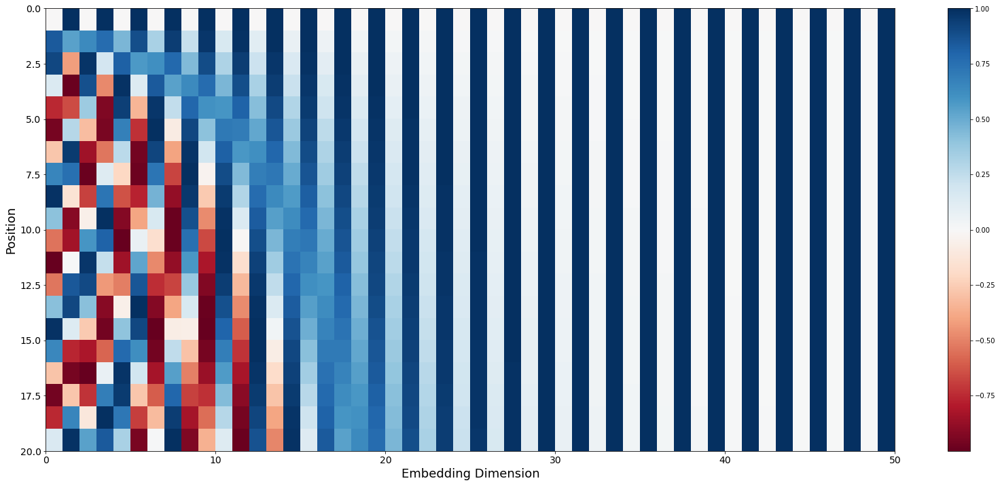
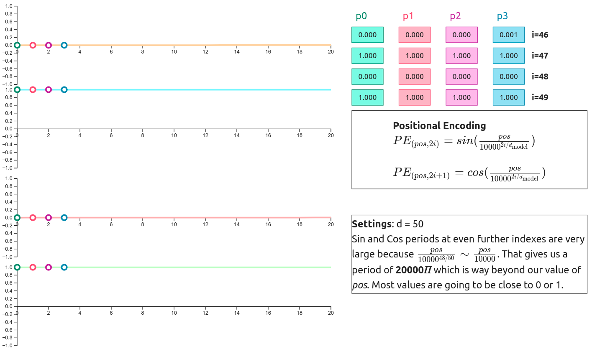
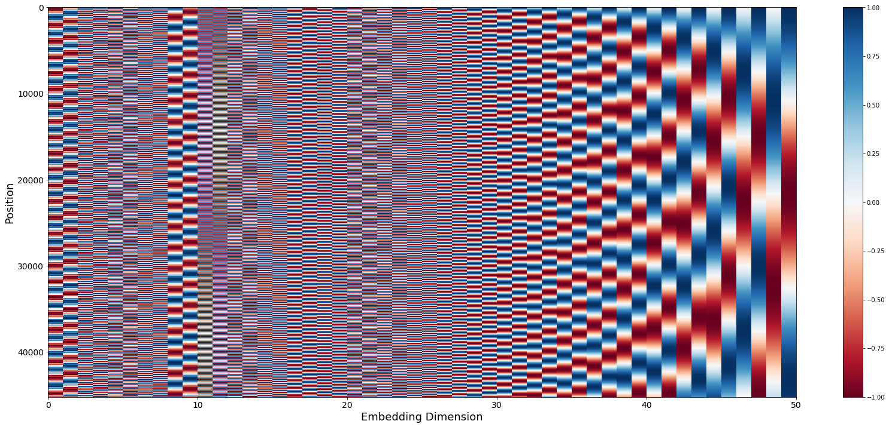

## What is positional encoding?

As I've explained in ["Introduction to Attention Mechanism"](https://erdem.pl/2021/05/introduction-to-attention-mechanism), attention doesn't care about the position of the inputs. To fix that problem we have to introduce something called **Positional Encoding**. This encoding is covered in the original ["Attention Is All You Need"][attention-is-all] paper and it's added to every input (not concatenated but added).

<figure>
    
    <figcaption>Figure 1: Original Transformer architecture, Source <a href="https://arxiv.org/abs/1706.03762" target="_blank"><i>“Attention Is All You Need”</i>, 2017</a></figcaption>
</figure>

The paper only considered fixed (non-trainable) positional encoding and that's what I'm going to explain. Right now encodings are trainied along with the model but that requires another article. To calculate the value of positional encoding we have to go to the section **3.5** in the paper. Authors are using **sin** and **cos** functions to calculate value for every input vector.

$$
PE_{(pos,2i)} = sin(\frac{pos}{10000^{2i/d_{\text{model}}}})
\newline \text{ }
\newline
PE_{(pos,2i+1)} = cos(\frac{pos}{10000^{2i/d_{\text{model}}}})
$$

As you can see these values depends on $d_{model}$ (input dimention) and $i$ (index of the position vector). Original paper operates on 512 dimentional vectors but for simplicity I'm going to use $d_{model} = 50$ or $d_{model} = 20$. Authors also attached the comment about why they had choose this kind of function:

> We chose this function because we hypothesized it would allow the model to easily learn to attend by relative positions, since for any fixed offset $k$, $PE_{pos+k}$ can be represented as a linear function of $PE_{pos}$.

## Positional encoding visualization

<figure>
    

        <sin-position-embedding></sin-position-embedding>
    

    <figcaption>Figure 2: Positional Encoding visualization, Designed base on <a href="https://arxiv.org/abs/1706.03762" target="_blank"><i>“Attention Is All You Need”</i>, NeurIPS 2017</a> Paper</figcaption>
</figure>

#### Values

We calculate the value for each index using the formula for given index. It's worth noticing that $2i$ value in $cos$ function is an even number so to calculate value for 0th and 1st indexes we're going to use $sin(\frac{pos}{10000^{0/50}}) = sin(pos)$ and $cos(\frac{pos}{10000^{0/50}}) = cos(pos)$. That's why value for 0th and 1st indexes are only dependent on the value of $pos$ instead of both $pos$ and $d_{model}$. This changes from the 2nd index onward because dividend is not longer equal to 0, so the whole divisor is larger than 1 $(10000^{2i/50})$.

#### Dimension dependency

If you switch to the second step, then you can compare how the $PE$ values changes depends on $d_{model}$.

<figure>
    
    <figcaption>Figure 3: <b>PE</b> values comparision with different dimensions (<i>d</i>), Source: <a href="https://erdem.pl/2021/05/understanding-positional-encoding-in-transformers#positional-encoding-visualization" target="_blank"><i>Positional encoding visualization</i></a></figcaption>
</figure>

The period of the first two indexes is not changing with the change of $d_{model}$, but the period of further indexes (2nd and greater) widens with the decrease of $d_{model}$. This might be obvious, but it's still good to see the difference.

#### Function periods

When we plot $PE$ values for first 20 $pos$ vectors we get result like that:

<figure>
    
    <figcaption>Figure 4: Positional Encoding values for first 20 positions, Generated with the use of <a href="https://www.tensorflow.org/tutorials/text/transformer#positional_encoding" target="_blank">Tensorflow - Positional encoding</a> code</figcaption>
</figure>

This plot is generated from one of [Tensorflow's Tutorials](https://www.tensorflow.org/tutorials/text/transformer) and you can run it with the help of Google Colab directly from their website. As you can see, lower dimensions of the position vector have very short wavelength (distance between identical points). Wavelength of the function at $i = 6$ index has a wavelength around 19 ($2 * 10^{12/25}$).

We know that periods are increasing with the increase of $i$. When $i$ reaches the side of $d_{model}$, you need a lot of $pos$ vectors to cover the whole function period.

<figure>
    
    <figcaption>Figure 5: Function values for further indexes, Source: <a href="https://erdem.pl/2021/05/understanding-positional-encoding-in-transformers#positional-encoding-visualization" target="_blank"><i>Positional encoding visualization</i></a></figcaption>
</figure>

The values of first 20 positions at the higher indexes are almost constant. You can see the same thing in the Fig. 4 where color of the columns 30-50 bearly change. To see that change we have to plot the values for tens of thousands of positions:

<figure>
    
    <figcaption>Figure 6: Positional Encoding periods for further indexes, Generated with the use of <a href="https://www.tensorflow.org/tutorials/text/transformer#positional_encoding" target="_blank">Tensorflow - Positional encoding</a> code</figcaption>
</figure>

> **Warning**
> This plot has builtin ilusion, it's not actually an inlusion but because it tries to print 40k+ values on 670px (height) it cannot show the correct value of anything with the wavelength smaller than 1px. That's why anything prior to column 24 is visually incorrect even if the right values were used to generate this plot.

## Conclusions

Positional embeddings are there to give a transformer knowledge about position of the input vectors. They are added (not concatenated) to corresponding input vectors. Encoding depends on three values:

- $pos$ - position of the vector
- $i$ - index within the vector
- $d_{model}$ - dimension of the input

Value is calculated alternately with the help of the periodic functions ($sin$ and $cos$) and the wavelength of those functions increase with higher dimensions of the input vector. Values for indexes closer to the top of the vector (lower indexes) are changing quickly when those further away require a lot of positions to change a value (large periods).

### References:

- Ashish Vaswani et al, “Attention Is All You Need”, NeurIPS 2017 [https://arxiv.org/abs/1706.03762][attention-is-all]

[attention-is-all]: https://arxiv.org/abs/1706.03762