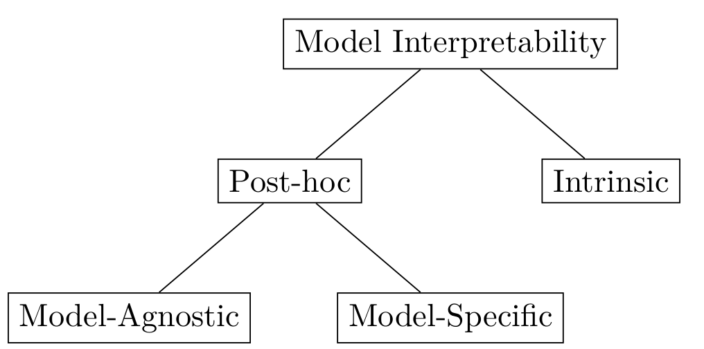
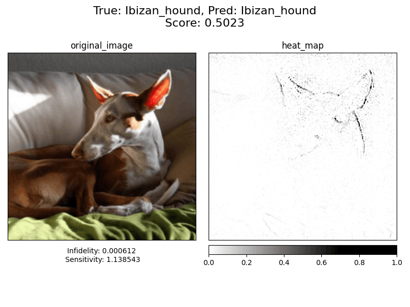
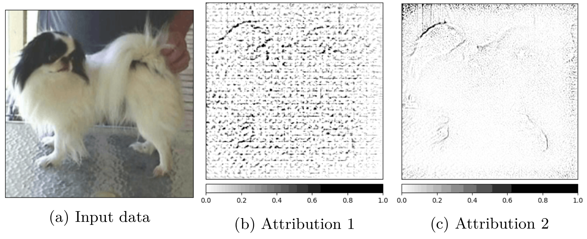

## Explainable Artificial Intelligence

Explainable Artificial Intelligence (XAI) is one of the youngest and one of the fastest developing branches of the field. The objective of the XAI method is to provide an explanation for the deep learning model that is understandable by humans. This is especially important in safety-critical domains like healthcare or security. The methods presented in the literature over the years often promise that they will provide a clear answer to the question of how the model made its decision.

### Right to explanation

The "right to explanation" is a term used by the European Parliament and Council in the [General Data Protection Regulation (GDPR)][gdpr-regulation] . This term is often mentioned in regard to XAI methods and requires a data controller to explain how the mechanism reached a decision. This part of the GDPR was created with an intent to prevent using the systems what decision cannot be interpreted by the human (like deep neural networks). The goal is to avoid discrimination and ethical/financial biases in such systems. As an example, we can use the automated credit scoring system. Systems like that are used in the mortgage loan process. It is legally forbidden to discriminate against a person base on a list of characteristics, but that discrimination can be hidden inside a black-box system (even without the knowledge of the creator of that system). If the application is refused by the bank, the applicant can require an explanation of why it was refused. This might help to potentially improve the score before the next application.

## Interpretability vs Explainability

There is no one formal definition of interpretability and/or explainability in the context of machine learning, and often it is used interchangeably[[2]][survery-of-methods]. Arrieta et al.[[3]][concepts-taxonomies] distinguish between the two and define them as:

> __Definition 1.1 (Interpretability)__ _Passive characteristic on a model refers to the level of understanding of the models’ internal decision process for a human observer._

> __Definition 1.2 (Explainability)__ _Active characteristic of a model, associated with the notion of explanation of the action or procedure taken by the model with the intent of clarifying its internal decision process._

The name of the field Explainable Artificial Intelligence (XAI) refers to the characteristic of a model, but any representation presented to the human (like input attribution) refers to the interpretability of the model.

### Taxonomy of interpretability

<figure id="figure-1">
    
    <figcaption>Figure 1: Taxonomy of the model interpretability.</figcaption>
</figure>

There are two major types of models: white-box models and black-box models. Interpretability of the first type is defined as the Intrinsic [[4]][taxonomy-survey]. This type of interpretability covers all models which have an interpretable internal structure. As an example, the structure of a decision tree is considered interpretable, as well as the internal structure of a shallow neural network. This does not apply to deep neural networks where post-hoc interpretability is used. The post-hoc interpretability means that we are trying to explain a prediction of the model without explaining the exact internal mechanism of that model. Because of the complexity of CNNs, post-hoc interpretability is the only way to interpret this kind of model.

> __Remark.__ This is not the only taxonomy of interpretability. The structure of the interpretability can be defined in many ways (either by the purpose, by the method, or by the application).

### Model-Agnostic and Model-Specific

As shown in the taxonomy (see [Fig. 1](#figure-1)), post-hoc interpretability is divided into model-agnostic and model-specific [[5]][model-agnostic-specific]. The model-agnostic methods are the methods that can be applied to any black-box model without the concern about the internal structure of the model. These methods are usually less precise but because they explain the models’ behavior only based on the input and the output. On the other hand, model-specific methods are associated with a particular type of model. The "type" is loosely defined and can refer to the whole domain like CNNs or the specific architecture of CNN.

## Attribution Methods

Attribution methods are one of the types of post-hoc methods (see section [1.2](##model-agnostic-and-model-specific)). Attribution methods, as the name says, attribute the input features to a given prediction. It can be defined as:

> __Definition 2.1 (Attribution method)__ Given an input vector $x ∈ R ^n$ where $n$ represents the number of dimensions, class $C$ and the model $F : R ^n → R ^C$ . The attribution method is defined as $A(F, x, C) : R ^n → R ^n$ . Provided explanation corresponds to the "importance" of an element from the input vector for a given class $C$ and model $F$ .

This definition can be rewritten to fit the input of the usual Convolutional Neural Network with the m×n input matrix:

> __Definition 2.2 (Attribution method - CNN)__ Given an input matrix $x ∈ R^{m×n}$ where $m × n$ represents the dimensions of the input, class $C$ and the model $F : R ^{m×n} → R ^C$. The attribution method is defined as $A(F, x, C) : R ^{m×n} → R ^{m×n}$. Provided explanation corresponds to the "importance" of an element from the input matrix for a given class $C$ and model $F$.

To better visualize the attribution, we can look at [Figure 2](#figure-2) For predicting a class of ibizan_hound, each pixel of the input image was given a value that defined its attribution to the prediction. Pixels (features) with higher attribution could be considered "more important" in predicting that class. We can see that the pixels with the highest attribution values are the pixels at the edges of the dog’s head and ears.

<figure id="figure-2">
    
    <figcaption>Figure 2: Visualization of the attribution by the <b>Guided GradCAM</b> generated for the class <i>ibizan_hound</i>. Image source: Stanford Dogs <a href="https://www.kaggle.com/jessicali9530/stanford-dogs-dataset">[6]</a></figcaption>
</figure>

As in the case of interpretability versus explainability (section [1](#interpretability-vs-explainability)), the is a lack of agreement on vocabulary. Attribution methods are often known
as _saliency methods_, _feature relevance_, _feature importance_, _heatmaps_, _neuron activations_, and _saliency masks_.

## Measuring XAI Methods

### Quantitative and Qualitative research

The type of research can be divided into qualitative or quantitative [[7]][educational-research]. The qualitative type of research is often related to the observation and processing of non-numerical data. The contrast to qualitative research is called quantitative research, and it relies on the numerical analysis of collected data. Interpretability of machine learning models is a human-centric field of study. That is why most of the XAI method researchers base their solutions on qualitative measures rather than quantitative ones.

### Qualitative measures

In qualitative research, the data is collected through observation, pools, or interviews. This kind of data is very subjective and related to the person providing the data. An example of such a subjective measure is shown in [Figure 3](#figure-3). If presented with two attributions for the same input image, the decision of which one is better may change with the person. This is even more likely when two attributions have similar "quality".

<figure id="figure-3">
    
    <figcaption>Figure 3: Comparison of attributions from two different methods for the same input data. Both attributions are generated for the same model with different XAI methods. Image source: Stanford Dogs <a href="https://www.kaggle.com/jessicali9530/stanford-dogs-dataset">[6]</a></figcaption>
</figure>

The results of the qualitative measures cannot be compared with each other without the specific context and prior knowledge about the data producers. Even with that knowledge, comparing the results might be difficult. The same issue applies to reproducibility, were to repeat the measurement, we have to be sure that all the participants are going to give the same answer. Another problem with qualitative measures is their scalability. Because most of the methods rely on human input, to measure the same method again or to compare it with another method, we have to repeat the work twice.

### Quantitative measures

The data in the quantitative research is stored in a numeric form. This numeric form has to be comparable with other data measured in the same way. Each measurement is repeatable, and when done once, it can be reused all over again. This type of research has a huge advantage over qualitative research because of its scalability. The problem with qualitative measurement is that we have to define the measure to return meaningful results. Defining a measure of human visual perception is a difficult task, and the measure itself should be objective, which is even harder when trying to measure complex things like attributions. Having such a measure allows us to easily compare and reproduce experiments.

### Sensitivity and Infidelity

If you're interested in quantitative methods, I had written an article about Infidelity and Sensitivity metrics. Two the most popular metrics already implemented in [Captum library](https://captum.ai/). Article is available here:

[Measuring XAI methods with Infidelity and Sensitivity](https://erdem.pl/2021/03/measuring-xai-methods-with-infidelity-and-sensitivity)

### References:

1. [Reg (EU) 2016/679][gdpr-regulation] of the European Parliament and of the Council of 27 April 2016 on the protection of natural persons with regard to the processing of personal data and on the free movement of such data, and repealing Dir 95/46/EC (General Data Protection Regulation) 2016.
2. R. Guidotti, A. Monreale, S. Ruggieri, F. Turini, F. Giannotti, D. Pedreschi. [A survey of methods for explaining black box models.][survery-of-methods] ACM computing surveys (CSUR), 51(5):1–42, 2018.
3. A. B. Arrieta, N. Díaz-Rodríguez, J. Del Ser, A. Bennetot, S. Tabik, A. Barbado, S. García, S. Gil-López, D. Molina, R. Benjamins, i in. [Explainable artificial intelligence (xai): Concepts, taxonomies, opportunities and challenges toward responsible ai.][concepts-taxonomies] Information Fusion, 58:82–115, 2020.
4. O. Biran, C. Cotton. [Explanation and justification in machine learning: A survey.][taxonomy-survey] IJCAI-17 workshop on explainable AI (XAI), wolumen 8, strony 8–13, 2017.
5. A. Adadi, M. Berrada. [Peeking inside the black-box: a survey on explainable artificial intelligence (xai).][model-agnostic-specific] IEEE access, 6:52138–52160, 2018.
6. A. Khosla, N. Jayadevaprakash, B. Yao, L. Fei-Fei. Stanford dogs dataset. [https://www.kaggle.com/jessicali9530/stanford-dogs-dataset][stanford-dogs], 2019. Accessed: 2021-10-01.
7. J. W. Creswell. [Educational research: Planning, conducting, and evaluating quantitative.][educational-research] Prentice Hall Upper Saddle River, NJ, 2002.

[gdpr-regulation]: https://op.europa.eu/en/publication-detail/-/publication/3e485e15-11bd-11e6-ba9a-01aa75ed71a1
[survery-of-methods]: https://arxiv.org/abs/1802.01933
[concepts-taxonomies]: https://arxiv.org/abs/1910.10045
[taxonomy-survey]: http://www.cs.columbia.edu/~orb/papers/xai_survey_paper_2017.pdf
[model-agnostic-specific]: https://ieeexplore.ieee.org/document/8466590
[stanford-dogs]: https://www.kaggle.com/jessicali9530/stanford-dogs-dataset
[educational-research]: http://repository.unmas.ac.id/medias/journal/EBK-00121.pdf