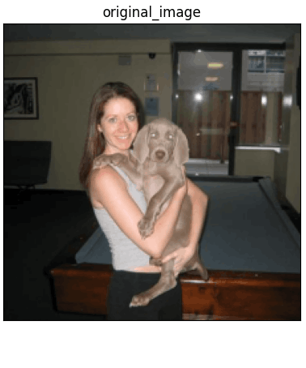
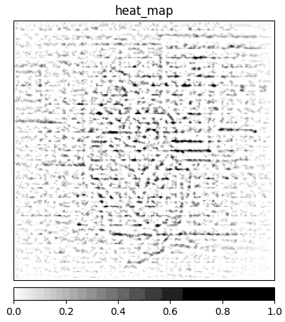
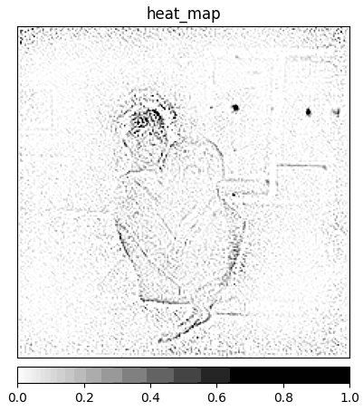
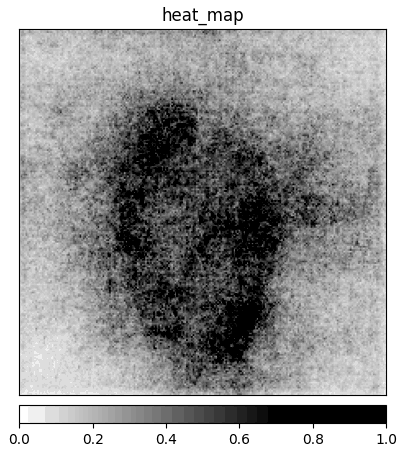

## What is Guided Backpropagation?

**Guided Backpropagation** (GBP) [[3]][gbp] is an approach designed by Springenberg et al., relying on the ideas of **_[Deconvolution](https://erdem.pl/2022/02/xai-methods-deconvolution)_** [[1]][deconv] and **_[Saliency](https://erdem.pl/2022/02/xai-methods-saliency)_** [[2]][saliency]. Authors argue that the approach taken by Simonyan et al. [[2]][saliency] has an issue with the flow of negative gradients, which decreases the accuracy of the higher layers we are trying to visualize. Their idea is to combine two approaches and add a "guide" to the _Saliency_ with the help of deconvolution.

To achieve that, we have to focus on the **_ReLU_** activation function in the CNN. When computing values at the _Rectification_ component of the _deconvnet_, we are masking all non-positive values with the _ReLU_. In that layer, the computed values are calculated only base on the top signal (reconstruction from the upper layer), and the input is ignored. On the other hand, in the _Saliency_ method, we are focusing on the gradient values computed base on the input image. If we take deconvnet masking of the _Rectification_ layer and apply it on the gradient values of the _Saliency_ method, we could remove noise caused by the negative gradient values. This noise removal is the reason why the method has the prefix "guided". Deconvolution guides backpropagation values of the _Saliency_ method to produce sharper images ([Fig. 1c](#figure-3)).

    <figure id="figure-1" class="full-fig-width" style="transform: translateX(0)">
        
        <figcaption>(a) Original Image.</figcaption>
    </figure>
    <figure id="figure-2" class="full-fig-width" style="transform: translateX(0)">
        
        <figcaption>(b) Deconvolution results.</figcaption>
    </figure>
    <figure id="figure-3" class="full-fig-width" style="transform: translateX(0)">
        
        <figcaption>(c) GBP results.</figcaption>
    </figure>
    <figure id="figure-4" class="full-fig-width" style="transform: translateX(0)">
        
        <figcaption>(d) Saliency results.</figcaption>
    </figure>

    Figure 1: Visualisation of saliency maps produced by Saliency [Fig. 1d], Deconvolution [Fig. 1b], and GBP [Fig. 1c] of the same input image [Fig. 1a] for a class <i>"weimaraner"</i>. All the maps are generated using the same model (ResNet18). Image source: <a href="https://www.kaggle.com/jessicali9530/stanford-dogs-dataset">Stanford Dogs</a> 

As we can see in [Figure 1c](#figure-3), the use of the "guide" significantly reduces the amount of noise generated by the _Saliency_ method ([Fig. 1d](#figure-4)). ___The idea of GBP is often misunderstood and interpreted as "applying deconvolution results on the saliency results"___. This is not true because _ReLU_ masking extracted from the deconvnet is applied on every level and therefore affects the gradient values all the way down to the input of the CNN, not only at the first level of the CNN.

### References:

1. M. D. Zeiler, R. Fergus. [Visualizing and Understanding Convolutional Networks][deconv], 2013.
2. K. Simonyan, A. Vedaldi, A. Zisserman. [Deep inside convolutional networks: Visualising image classification models and saliency maps][saliency], 2014.
3. J. T. Springenberg, A. Dosovitskiy, T. Brox, M. Riedmiller. [Striving for Simplicity: The All Convolutional Net][gbp], 2014.
4. A. Khosla, N. Jayadevaprakash, B. Yao, L. Fei-Fei. Stanford dogs dataset. [https://www.kaggle.com/jessicali9530/stanford-dogs-dataset][stanford-dogs], 2019. Accessed: 2021-10-01.

[saliency]: https://arxiv.org/abs/1312.6034
[gbp]: https://arxiv.org/abs/1412.6806
[deconv]: https://arxiv.org/abs/1311.2901
[stanford-dogs]: https://www.kaggle.com/jessicali9530/stanford-dogs-dataset
