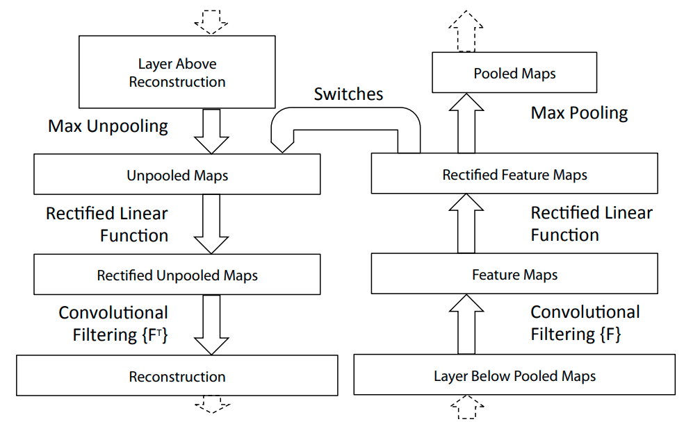
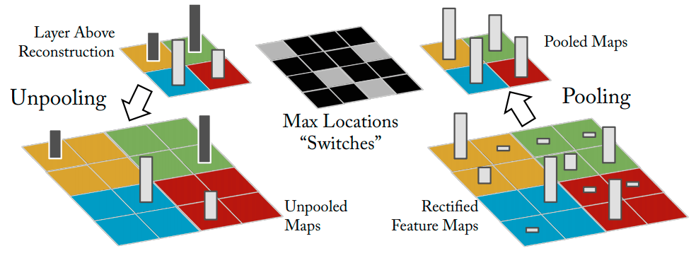
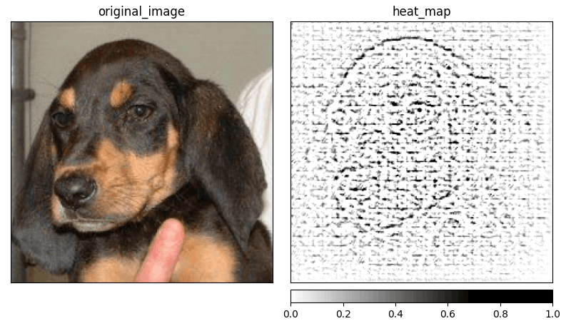

## What is Deconvolution?

The idea of ___Deconvolution___ [[2]][deconv] comes from the work of Zeiler et al. [[1]][deconv-origin] about __Deconvolutional Networks__ (___deconvnets___}. Deconvnets are designed to work similar to convolutional networks but reverse (reversing pooling component, reversing filter component etc.), and they can be trained using an unsupervised approach. In a deconvolutional approach to explaining the model, we are not training a deconvnet but rather probe our CNN with it.

To reconstruct the activation on a specific layer, we are attaching __deconv layers__ to corresponding __CNN layers__ (see [Fig. 1](#figure-1)). Then an image is passed through the CNN, and the network computes the output. To examine a reconstruction for a given class $c$, we have to set all activations except the one responsible for predicting class $c$ to zero. Then we can propagate through deconvnet layers and pass all the feature maps as inputs to corresponding layers.

<figure id="figure-1">
    
    <figcaption>Figure 1: A deconvnet layer (left) attached to a CNN layer (right), source <a href="https://arxiv.org/abs/1311.2901">[1]</a>.</figcaption>
</figure>
<figure id="figure-2">
    
    <figcaption>Figure 2: The unpooling layer, source <a href="https://arxiv.org/abs/1311.2901">[1]</a>.</figcaption>
</figure>

To calculate the reconstruction, deconvnet layer has to be able to reverse operations performed by the CNN layers. Authors designed specific components to compote the reverse operations done by CNN layers:

### Filtering
_Filtering_ in the original CNN computes ___feature maps___ using learned filters. Reversing that operation requires the use of a transposed version of the same filters. Those transposed filters are then applied to the ___Rectified Unpooled Maps___.

### Rectification
_Rectification_ uses the same _ReLU_ non-linearity [[4]][relu] to compute _Rectified Unpooled Maps_ as it is used in CNN. It is simply just rectifying the values and propagate only non-negative ones to the _filtering_ layer.

### Unpooling
_Unpooling_ corresponds to the _Pooling Layer_ of CNN (see [Fig. 2](#figure-2)). The original max-pooling operation is non-invertible, but this approach uses additional variables called ___switch variables___, which are responsible for remembering the locations of the maxima for each pooling region. The unpooling layer uses these variables to make a reconstruction into the same locations as when the pooling was calculated.

<figure id="figure-3">
    
    <figcaption>Figure 3: Visualization of the saliency map generated by deconvolution for the class <i>"black-and-tan-coonhound"</i>. Image source: <a href="https://www.kaggle.com/jessicali9530/stanford-dogs-dataset">Stanford Dogs</a>.</figcaption>
</figure>

Propagation through the whole deconvnet gives us a representation of the features from the first layer of the original CNN (the last deconvnet layer corresponds to the first CNN layer). This approach causes the saliency map to feature some biases from the first convolutional layer and the representation looks like a localized edge detector (see [Fig. 3](#figure-3)). It usually works better when there is a clear distinction in the feature importance rather than similar values for the whole image.

### Further reading
I’ve decided to create a series of articles explaining the most important XAI methods currently used in practice. Here is the main article: [XAI Methods - The Introduction](https://erdem.pl/2021/10/xai-methods-the-introduction)

### References:

1. M. D. Zeiler, G. W. Taylor, R. Fergus. [Adaptive deconvolutional networks for mid and high level feature
   learning][deconv-origin], 2011.
2. D. Zeiler, R. Fergus. [Visualizing and Understanding Convolutional Networks][deconv], 2013.
3. A. Khosla, N. Jayadevaprakash, B. Yao, L. Fei-Fei. Stanford dogs dataset. [https://www.kaggle.com/jessicali9530/stanford-dogs-dataset][stanford-dogs], 2019. Accessed: 2021-10-01.
4. R. Hahnloser, R. Sarpeshkar, M. Mahowald, R. J. Douglas, S. Seung. [Digital selection and analogue amplification coexist in a cortex-inspired silicon circuit][relu], 2000.

[deconv]: https://arxiv.org/abs/1311.2901
[deconv-origin]: https://ieeexplore.ieee.org/document/6126474
[stanford-dogs]: https://www.kaggle.com/jessicali9530/stanford-dogs-dataset
[relu]: https://www.nature.com/articles/35016072