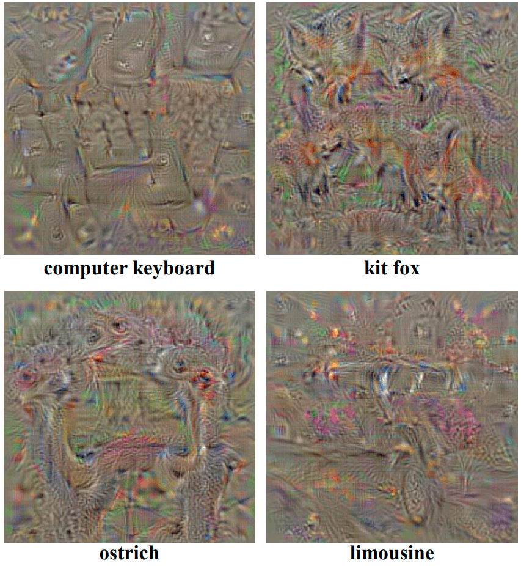

## What is Saliency and why the same is confusing?

Saliency [[1]][saliency] is one of the first attribution methods designed to visualize the input attribution of the Convolutional Network. Because the word _saliency_ is often related to the whole approach to display input attribution called _Saliency Map_, this method is also known as _Vanilla Gradient_.

The idea of the Saliency method starts from the class visualization by finding $L_2\text{-regularized}$ image $I$ that maximizes score $S_c$ for a given class $c$. It can be written formally as:

$$$
\arg \max _{I} S_{c}(I)-\lambda\|I\|_{2}^{2}
$$$

Where $\lambda$ is a regularisation parameter. To find the value of $I$, we can use the back-propagation method. Unlike in the standard learning process, we are going to back-propagate with respect to the input image, not the first convolution layer. This optimization allows us to produce images that visualize a particular class in our model (see [Fig. 1](#figure-1)).

<figure id="figure-1">
    
    <figcaption>Figure 1: The class model visualizations for several classes, source <a href="https://arxiv.org/abs/1312.6034">[1]</a>.</figcaption>
</figure>

This idea can be extrapolated, and with minor modifications, we should be able to query for spatial support of class $c$ in a given image $I_0$. To do this, we have to rank pixels of $I_0$ in relation to their importance in predicting score $S_c(I_0)$. Authors assume that we can approximate $S_c(I)$ with a linear function in the neighborhood of $I_0$ with:

$$$
S_{c}(I) \approx w^\intercal I + b
$$$

For a pair of input image $I_0 \in \mathbb{R}^{m \times n}$ and the class $c$, we are able to compute saliency map $A \in \mathbb{R}^{m \times n}$ (where $m$ and $n$ are the height and width of the input in pixels). All we have to do is to compute derivative $w$ and rearrange elements in the returned vector.

This method uses different approaches base on the number of channels in the input image $I_0$. For grey-scale pixels (one color channel), we can rearrange the pixels to match the shape of the image. If the number of channels is greater than one, we are going to use the maximum value from each set of values related to the specified pixel.

$$$
A_{i,j} = \max _{ch}|w_{h(i,j,ch}|
$$$

where $ch$ is a color channel of the pixel $(i,j)$ and $h(i,j,ch)$ is an index of the $w$ corresponding to the same pixel $(i,j)$. With the obtained map, we can visualize pixel importance for the input image $I_0$ as shown in the [Figure 2](#figure-2).

<figure id="figure-2">
    
    <figcaption>Figure 2: Visualization of the saliency map by the Saliency generated for the class <i>"pug"</i>. Image source: <a href="https://www.kaggle.com/jessicali9530/stanford-dogs-dataset">Stanford Dogs</a></figcaption>
</figure>

The original _Saliency_ method produces a lot of additional noise but still gives us an idea of which part of the input image is relevant when predicting a specific class. This often causes a problem when the object on the image has a lot of details and the model is using most of them to make a prediction.

### References:

1. K. Simonyan, A. Vedaldi, A. Zisserman. [Deep inside convolutional networks: Visualising image classification models and saliency maps][saliency], 2014.
2. A. Khosla, N. Jayadevaprakash, B. Yao, L. Fei-Fei. Stanford dogs dataset. [https://www.kaggle.com/jessicali9530/stanford-dogs-dataset][stanford-dogs], 2019. Accessed: 2021-10-01.

[saliency]: https://arxiv.org/abs/1312.6034
[stanford-dogs]: https://www.kaggle.com/jessicali9530/stanford-dogs-dataset