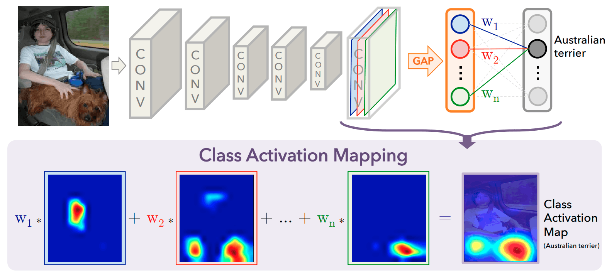
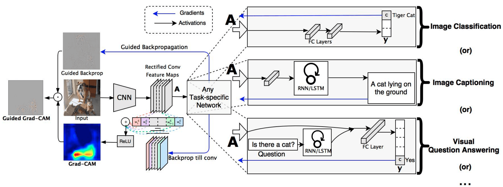
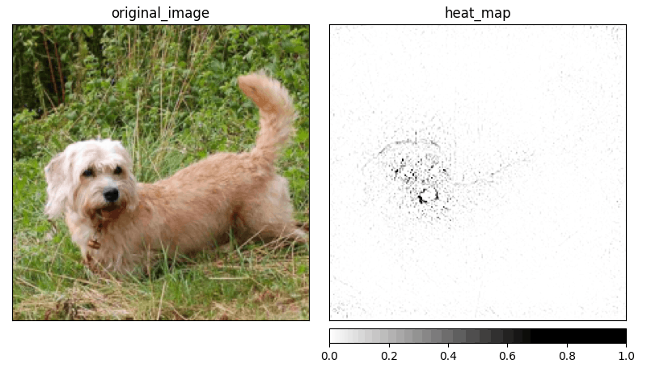

## What is Guided GradCAM method?

__Guided GradCAM__ is a method created by Selvaraju et al. [[1]][selvaraju2017grad] which combines both __GBP__ and __GradCAM__ (also created by the same authors). To explain the idea of Guided GradCAM, we have to split it into separate components.

### Class Activation Mapping

Class Activation Mapping (__CAM__) [[2]][zhou2016learning] is an approach to localizing regions responsible for a class prediction. This idea replaces the fully connected layers on the CNN with more convolutional layers and global average pooling (GAP) [[3]][lin2013network].

<figure id="figure-1">
    
    <figcaption>Figure 1: The modified architecture of the CNN that produces CAMs. Source: <a href="https://arxiv.org/abs/1312.4400"><b>Learning Deep Features for Discriminative Localization</b></a></figcaption>
</figure>

As shown in [Figure 1](#figure-1), just before the Softmax layer, the GAP operation is performed. This computes the spatial average of the feature map from the last CNN layer for every unit. The weighted sum of these spatial averages is calculated to produce the final output, and the Softmax layer gives us a normalized output used for classification. Class activation maps are computed similarly to the output, but the process is reversed. As an input, we have a class $c$, and the activation map for that class can be computed as:

$$
M_c(x,y) = \sum_{k=1}^{n} w_k^c f_k(x,y)
$$

Where $w_k^c$ is a weight corresponding to the unit $k$ and class $c$, and $f_k(x,y)$ is an activation of the last convolutional layer at the location $(x,y)$ for unit $k$ (visualized in [Fig. 1](#figure-1), the bottom part of the image).

Selvaraju et al. argue that the CAM approach has a major drawback which is a requirement to modify the network and replace all fully-connected layers with convolutional layers. This makes CAM only applicable to certain tasks and reduces the performance of the network itself. They introduce the method that fixes all mentioned issues and calls it __GradCAM__. This method is implementation agnostic (within the CNNs) and can be applied without any modifications to the network. As the name says, GradCAM uses a gradient to generate CAMs. Unlike in the original CAM paper, GradCAM allows selecting the convolutional layer we use as a feature map against which we compute the gradient. The gradient is computed for a given score $y^c$ ($c$ indicated a class) before the softmax layer. Then we use a feature map from the selected layer and calculate weight $a_k^c$ for every neuron (see eq. below) (similar to calculating weight for every unit in CAM).

$$
a_k^c = \frac{1}{Z} \sum_{i} \sum_{j} \frac{\partial y^c}{\partial A_{ij}^k}
$$

$\frac{1}{Z} \sum_{i} \sum_{j}$ defines a global average pooling over the width ($i$) and height ($j$) and $\frac{\partial y^c}{\partial A_{ij}^k}$ is the gradient of score with respect to selected layers' feature map. With all $a_k^c$ calculated, we can perform a linear combination of feature maps $A^k$ and the neuron importance weights $a_k^c$:

$$
M^c_{\text{GradCAM}} = \text{ReLU} \left(\sum_{k} a_k^c A^k \right)
$$

The ReLU is used there to cutoff any non-positive values. The intuition behind using ReLU is that negative values more likely belong to other classes, which are also present in the image. The size of the map $M^c_{\text{GradCAM}}$ is the same as the size of the convolutional feature map used to compute the gradient. Values from the map then have to be mapped on the original image to visualize which region was relevant in predicting class $c$.

<figure id="figure-2">
    
    <figcaption>Figure 2: Guided GradCAM computation process. Source: <a href="https://arxiv.org/abs/1610.02391">Grad-CAM: Visual Explanations from Deep Networks via Gradient-based Localization</a></figcaption>
</figure>

Guided GradCAM is a combination of GradCAM's map and GBP attribution. To compute the Guided GradCAM value, we are performing the Hadamard product (also known as element-wise multiplication) of the attribution from GBP with a map from GradCAM (see [Fig. 2](#figure-2)). Combining GBP and GradCAM allows us to generate sharp attributions, as presented in [Figure 3](#figure-3).

<figure id="figure-3">
    
    <figcaption>Figure 3: Visualization of the saliency map by the Guided GradCAM generated for the class <b>dandie_dinmont</b>. Image source: Stanford Dogs <a href="https://www.kaggle.com/jessicali9530/stanford-dogs-dataset">[4]</a></figcaption>
</figure>

### Further reading
I’ve decided to create a series of articles explaining the most important XAI methods currently used in practice. Here is the main article: [XAI Methods - The Introduction](https://erdem.pl/2021/10/xai-methods-the-introduction)

### References:

1. R. R. Selvaraju, M. Cogswell, A. Das, R. Vedantam, D. Parikh, D. Batra. [Grad-cam: Visual explanations from deep networks via gradient-based localization][selvaraju2017grad]. Proceedings of the IEEE international conference on computer vision, pages 618–626, 2017.
2. B. Zhou, A. Khosla, A. Lapedriza, A. Oliva, A. Torralba. [Learning deep features for discriminative localization][zhou2016learning]. Proceedings of the IEEE conference on computer vision and pattern recognition, pages 2921–2929, 2016.
3. M. Lin, Q. Chen, S. Yan. [Network in network][lin2013network]. arXiv preprint arXiv:1312.4400, 2013.
4. A. Khosla, N. Jayadevaprakash, B. Yao, L. Fei-Fei. Stanford dogs dataset. [https://www.kaggle.com/jessicali9530/stanford-dogs-dataset][stanford-dogs], 2019. Accessed: 2021-10-01.

[selvaraju2017grad]: https://arxiv.org/abs/1610.02391
[zhou2016learning]: https://arxiv.org/abs/1512.04150
[lin2013network]: https://arxiv.org/abs/1312.4400
[stanford-dogs]: https://www.kaggle.com/jessicali9530/stanford-dogs-dataset