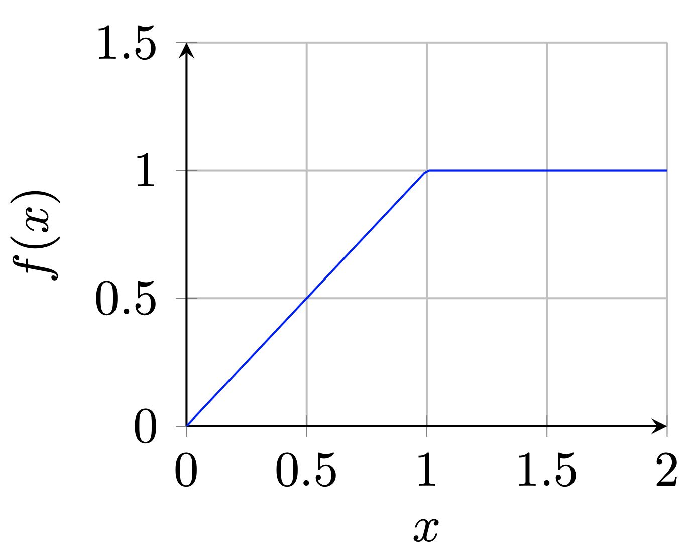
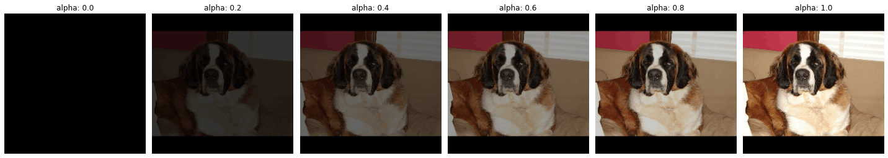
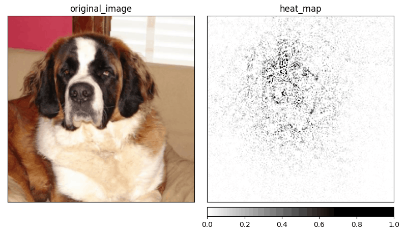
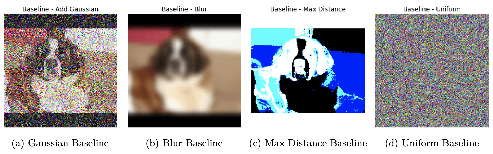

## What is Integrated Gradients method?

Integrated Gradients (__IG__) [[1]][sundararajan2017axiomatic] is a method proposed by Sundararajan et al. that bases on two axioms: __Sensitivity__ and __Implementation Invariance__. Authors argue that those two axioms should be satisfied by all attribution methods. The definition of those two axioms is as follows:

> __Definition 1 (Axiom: Sensitivity)__ _An attribution method satisfies **Sensitivity** if for every input and baseline that differ in one feature but have different predictions, then the differing feature should be given a non-zero attribution. If the function implemented by the deep network does not depend (mathematically) on some variable, then the attribution to that variable is always zero._

> __Definition 2 (Axiom:  Implementation Invariance)__ _Two networks are functionally equivalent if their outputs are equal for all inputs, despite having very different implementations. Attribution methods should satisfy Implementation Invariance, i.e., the attributions are always identical for two functionally equivalent networks._

The sensitivity axiom introduces the __baseline__ which is an important part of the IG method. Baseline is defined as an __absence of feature__ in an input. This definition is confusing, especially when dealing with complex models, but the baseline could be interpreted as _"input from the input space that produces a neutral prediction"_. A baseline can be treated as an input to produce a counterfactual explanation by checking how the model behaves when moving from baseline to the original image.

The authors give the example of the baseline for an object recognition network, which is a black image. I personally think that a black image doesn't represent an _"absence of feature"_, because this absence should be defined based on the manifold that represents data. This means that a black image could work as an absence of a feature in one network but may not work for a network trained on a different dataset, allowing a network to use black pixels in prediction.

<figure id="figure-1">
    
    <figcaption>Figure 1: f(x) = 1 − ReLU(1 − x) where x ∈< 0, 2 ></figcaption>
</figure>

Authors argue that gradient-based methods are violating Sensitivity (Def. 1). As an example, we are presented with the case of simple function, $f(x) = 1 - \text{ReLU}(1 - x)$ (see [Fig. 1](#figure-1)) and the baseline being $x = 0$. When trying to generate attribution for $x = 2$, the functions' output changes from 0 to 1 but after $x=1$, it becomes flat and causes the gradient to equal zero. Obviously, $x$ attributes to the result, but because the function is flat at the input we are testing results in invalid attribution and breaks the Sensitivity. Sundararajan et al. think that breaking Sensitivity causes gradients to focus on irrelevant features.

### How IG is calculated?

In IG definition we have a function $F$ representing our model, input $x \in \mathbb{R}^{n}$ ($x$ is in $\mathbb{R}^n$ because this is a general definition of IG and not CNN specific), and the baseline $x' \in \mathbb{R}^{n}$. We assume straightline path between $x$ and $x'$ and compute gradients long that path. The integrated gradient along $i^th$ dimension is defined as:

<figcaption>Equation 1</figcaption>

$$
IntegratedGrads_{i}(x) ::= (x_{i} - x'_{i})\times\int_{\alpha=0}^1\frac{\partial F(x'+\alpha \times (x - x'))}{\partial x_i}{d\alpha}
$$

The original definition of Integrated Gradients is incalculable (because of integral). Therefore, the implementation of the method uses approximated value by replacing the integral with summation:

<figcaption>Equation 2</figcaption>

$$
IntegratedGrads^{approx}_{i}(x)::=(x_{i}-x'_{i})\times\sum_{k=1}^{m}\frac{\partial F(x' + \frac{k}{m}\times(x - x'))}{\partial x_{i} } \times \frac{1}{m}
$$

In the approximated calculation (Eq. 2), $m$ defines a number of interpolation steps. As an example, we can visualize the interpolations with $m$ equals five (see [Fig. 2](#figure-2)). In practice, the number of interpolation steps is usually between 20 and 300, but the mode value is equal to 50. The results of applying IG can be seen in [Figure 3](#figure-3).

<figure id="figure-2">
    
    <figcaption>Figure 2: Five-step interpolation between the baseline <b>x'</b> and the input image <b>x</b>. The first image on the left (alpha:0.0) is not a part of the interpolation process. Image source: Stanford Dogs <a href="https://www.kaggle.com/jessicali9530/stanford-dogs-dataset">[5]</a></figcaption>
</figure>

<figure id="figure-3">
    
    <figcaption>Figure 3: Visualization of the saliency map by the IG generated for the class <b>saint_bernard</b>. The result is averaged over 50 interpolation steps. Image source: Stanford Dogs <a href="https://www.kaggle.com/jessicali9530/stanford-dogs-dataset">[5]</a></figcaption>
</figure>

### Baselines

In recent years there was discussion about replacing constant color baseline with an alternative. One of the first propositions was to add Gaussian noise to the original image (see [Fig. 4a](#figure-4)). __Gaussian baseline__ was introduced by Smilkov et al. [[2]][smilkov2017smoothgrad] and used a Gaussian distribution centered on the current image with a variance $\sigma$. This variance is the only parameter when tuning the method. Another baseline is called __Blur baseline__ and uses a multi-dimensional gaussian filter (see [Fig. 4b](#figure-4)). The idea presented by Fong and Vedaldi [[3]][fong2017interpretable] blurred version of the image is a domain-specific way to represent missing information and therefore be a valid baseline according to the original definition. Inspired by the work of Fong and Vedaldi, Sturmfels et al. [[4]][sturmfels2020] introduced another version of the baseline, which is based on the original image. This baseline is called the __Maximum Distance baseline__ and creates a baseline by constructing an image with the largest value of the $L1$ distance from the original image. The result of that can be seen in [Figure 4c](#figure-4). The problem with the maximum distance is that it doesn't represent the "absence of feature". It contains the information about the original image, just in a different form. In the same work, Sturmfels et al. created another baseline called __Uniform baseline__. This time, the baseline doesn't require an input image and uses only uniform distribution to generate a baseline (see [Fig. 4d](#figure-4)). The problem with selecting a baseline is not solved, and for any further experiments, the "black image" baseline is going to be used.

<figure id="figure-4">
    
    <figcaption>Figure 4: Alternative baselines for IG. Gaussian baseline is using <b>σ = 0.5</b> to generate noise. Blur baseline is using <b>σ = 5</b> in a gaussian filter. All the values are clipped at <b><0,1></b> to be within the range of the scaled colors. Image source: Stanford Dogs <a href="https://www.kaggle.com/jessicali9530/stanford-dogs-dataset">[5]</a></figcaption>
</figure>

### Further reading
I’ve decided to create a series of articles explaining the most important XAI methods currently used in practice. Here is a main article: [XAI Methods - The Introduction](https://erdem.pl/2021/10/xai-methods-the-introduction)

### References:

1. M. Sundararajan, A. Taly, Q. Yan. [Axiomatic attribution for deep networks.][sundararajan2017axiomatic] International Conference on Machine Learning, pages 3319–3328. PMLR, 2017.
2. D. Smilkov, N. Thorat, B. Kim, F. Viégas, M. Wattenberg. [Smoothgrad: removing noise by adding noise.][smilkov2017smoothgrad] arXiv preprint arXiv:1706.03825, 2017.
3. R. C. Fong, A. Vedaldi. [Interpretable explanations of black boxes by meaningful perturbation][fong2017interpretable]. Proceedings of the IEEE International Conference on Computer Vision, pages 3429–3437, 2017.
4. P. Sturmfels, S. Lundberg, S.-I. Lee. [Visualizing the impact of feature attribution baselines][sturmfels2020]. Distill, 5(1):e22, 2020.
5. A. Khosla, N. Jayadevaprakash, B. Yao, L. Fei-Fei. Stanford dogs dataset. [https://www.kaggle.com/jessicali9530/stanford-dogs-dataset][stanford-dogs], 2019. Accessed: 2021-10-01.

[sundararajan2017axiomatic]: https://arxiv.org/abs/1703.01365
[smilkov2017smoothgrad]: https://arxiv.org/abs/1706.03825
[fong2017interpretable]: https://arxiv.org/abs/1704.03296
[sturmfels2020]: https://distill.pub/2020/attribution-baselines/
[stanford-dogs]: https://www.kaggle.com/jessicali9530/stanford-dogs-dataset