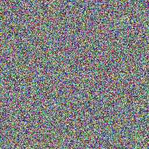
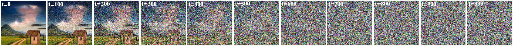
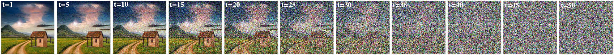
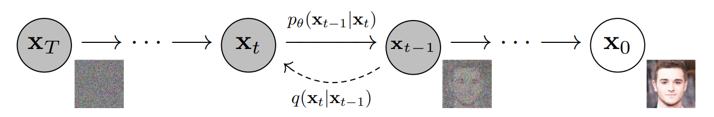
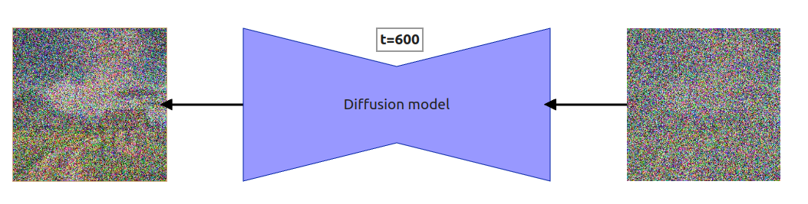
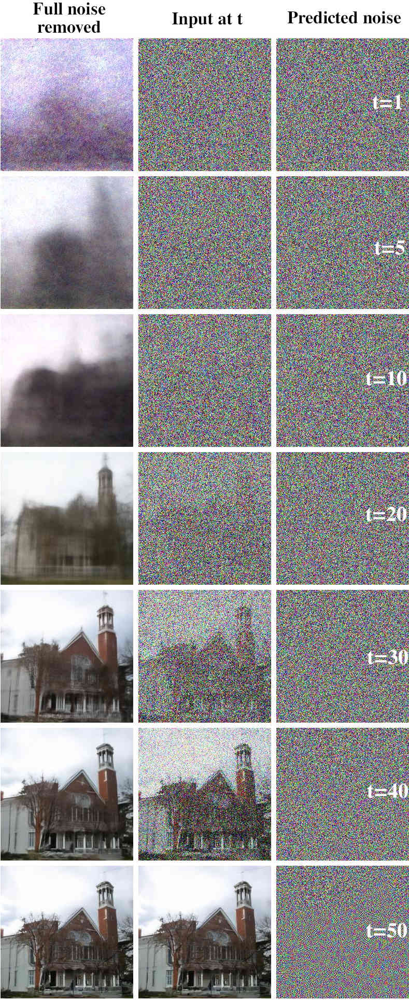
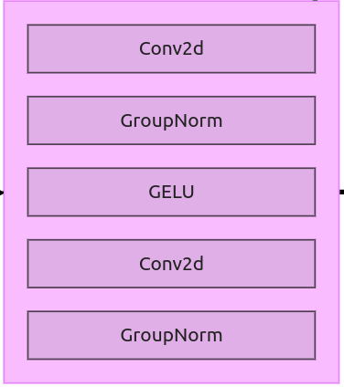
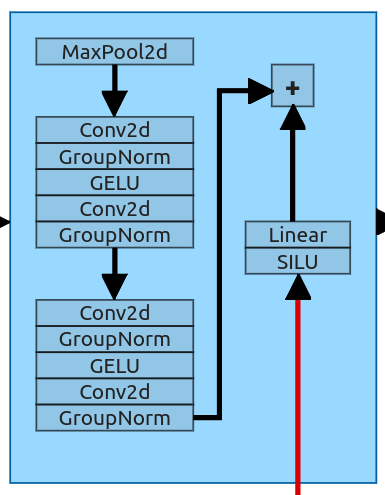
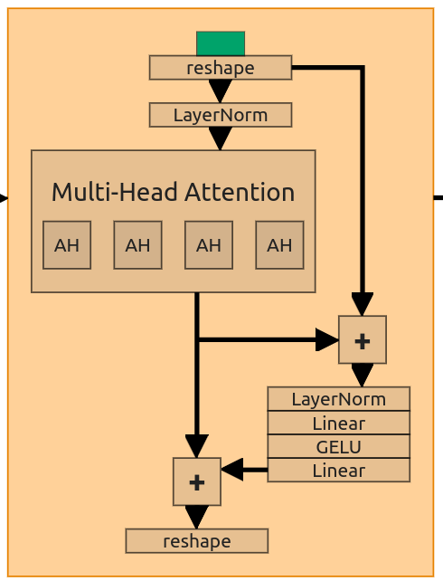
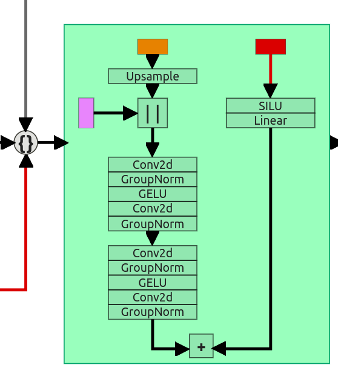

## What is a diffusion model?

The idea of the diffusion model is not that old. In the 2015 paper called **"Deep Unsupervised Learning using Nonequilibrium Thermodynamics"** [[1]][diffusionmodels2015], the Authors described it like this:

> The essential idea, inspired by non-equilibrium
> statistical physics, is to systematically and **slowly
> destroy structure in a data distribution** through
> an **iterative forward diffusion process**. We then
> learn a **reverse diffusion process** that **restores
> structure in data**, yielding a highly flexible and
> tractable generative model of the data.

Here **_diffusion process_** is split into **_forward_** and **_reverse_** diffusion processes. The forward diffusion process is a process of turning an image into noise, and the reverse diffusion process is supposed to turn that noise into the image again.

## Forward diffusion process

If the previous definition doesn't explain much, don't worry, we can explain why and how it works. First, you need to know how to destroy structure in a data distribution.

    <figure id="figure-1" class="full-fig-width" style="transform: translateX(0)">
        
        <figcaption>(a) Original Image.</figcaption>
    </figure>
    <figure id="figure-2" class="full-fig-width" style="transform: translateX(0)">
        
        <figcaption>(b) Pure noise.</figcaption>
    </figure>

    Figure 1: Input and output of the forward diffusion process

If we take any image (Fig. 1a), it has some none-random distribution. We don't know the distribution, but our goal is to destroy it so we can do it by adding a noise to it. At the end of that process, we should end up with noise similar to pure noise.

<figure>
    

        <diffusion-diagram src="diffusion/forward_diffusion"></diffusion-diagram>
    

    <figcaption>Figure 2: Forward diffusion process using only 10 steps,</figcaption>
</figure>

Each step of the forward diffusion process is defined as $$q(x_{t}|x_{t-1}) = \mathcal{N}(x_{t}, \sqrt{1 - \beta_t}x_{t-1}, \beta_tI )$$. Where **q** is our forward process, $$x_t$$ is the output of the forward process at step **t** (naturally $$x_{t-1}$$ is an input at step **t**). **N** is a _normal distribution_, $$\sqrt{1 - \beta_t}x_{t-1}$$ is our _mean_ and finally $$\beta_tI$$ defines a _variance_.

#### Schedule

$$\beta_t$$ refers to something called **schedule** and values can range from 0 to 1. The values are usually kept low to prevent variance from exploding. The 2020 paper[[2]][ddpm2020] uses a **linear schedule** so the output looks like that:

<figure id="figure-3">
    
    <figcaption>Figure 3: Entire forward diffusion process using <b>linear schedule</b> with 1000 time steps.</figcaption>
</figure>

In this case, $$\beta_t$$ ranges from **0.0001** to **0.02** for the mean and variance behaves like in the Fig. 4.

<figure id="figure-4">
    
    <figcaption>Figure 4: Change in <i>mean</i> and <i>variance</i> for a given timestep</figcaption>
</figure>

Researchers from OpenAI in their 2021 paper[[3]][iddpm2021] decided that using a linear schedule is not that efficient. As you've seen before, most of the information from the original image is lost after around half of the total steps. They designed their own schedule and called it the **cosine schedule** (Fig. 5). The improvement in schedule allowed them to reduce the number of steps to **50**.

<figure id="figure-5">
    
    <figcaption>Figure 5: Forward diffusion process using <b>cosine schedule</b>.</figcaption>
</figure>

#### Real noising process (only last equation is important)

As you can imagine, adding noise to the image using a forward diffusion process is going to be slow. **The training process doesn't use examples in line with the forward process but rather it uses samples from arbitrary timestep t**. This means at each training step we would need to iterate through t steps to generate 1 training sample. But 2020 paper has the solution, but first, we have to define the entire noise to be added at _T_ as:

$$
q(x_{1:T}|x_0) := \prod_{t=1}^{T}q(x_t|x_{t-1})
$$

The paper describes the whole transition very poorly (maybe because the authors are just doing that kind of math in their heads). We're going to do it manually. First, we need to apply the reparameterization trick ($$\mathcal{N}(\mu, \sigma^2) = \mu + \sigma *\epsilon$$) on a single forward step definition.

$$
q(x_{t}|x_{t-1}) = \mathcal{N}(x_{t}, \sqrt{1 - \beta_t}x_{t-1}, \beta_tI ) \\
= \sqrt{1 - \beta_t}x_{t-1} + \sqrt{\beta_t}\epsilon
$$

- $$\epsilon$$ is from $$\mathcal{N}(0,1)$$

Now authors introduced some notation:

- $$\alpha_t = 1 - \beta_t$$
- $$\bar\alpha_t := \prod_{s=1}^{t} a_s$$

This notation is only for the ease of transformation. Now our function looks like this:

$$
q(x_{t}|x_{t-1}) = \sqrt{\alpha_t}x_{t-1} + \sqrt{1- \alpha_t}\epsilon
$$

And we can extend it to previous timesteps:

$$
q(x_{t}|x_{t-1}) = \sqrt{\alpha_t}x_{t-1} + \sqrt{1- \alpha_t}\epsilon \\
= \sqrt{\alpha_t\alpha_{t-1}}x_{t-2} + \sqrt{1- \alpha_t\alpha_{t-1}}\epsilon \\
= \sqrt{\alpha_t\alpha_{t-1}\alpha_{t-2}}x_{t-3} + \sqrt{1- \alpha_t\alpha_{t-1}\alpha_{t-2}}\epsilon \\
= \sqrt{\alpha_t\alpha_{t-1}\alpha_{t-2}\alpha_{t-3}}x_{t-4} + \sqrt{1- \alpha_t\alpha_{t-1}\alpha_{t-2}\alpha_{t-3}}\epsilon \\
$$

In the end, we can make use of the second extra notation and compress all the $$\alpha$$'s to one definition starting at $$x_0$$:

$$
q(x_{t}|x_{0}) = \sqrt{\bar\alpha_t}x_{0} + \sqrt{1- \bar\alpha_t}\epsilon = \mathcal{N}(x_{t}, \sqrt{\bar\alpha_t}x_{0}, (1 - \bar\alpha_t)I )
$$

With that equation, we can calculate noise at any arbitrary step **t** ($$\bar\alpha_t$$ is known because $$\beta_t$$ is known) without going through the process.

## Reverse diffusion process

As you probably figured out, the goal of the reverse diffusion process is to convert pure noise into an image. To do that, we're going to use some neural network (ignore architecture for now, we'll get into it soon). If you're familiar with GANs (Generative Adversarial Networks) (Fig. 6), we're trying to train something similar to the _generator network_. The only difference is that our network will have an easier job because it doesn't have to do all the work in one step.

<figure id="figure-6">
    
    <figcaption>Figure 6: GAN architecture. (source: <a href="https://developers.google.com/machine-learning/gan/generator">Google for Developers</a>)</figcaption>
</figure>

Okay, so why not just use GANs? It took some very smart people a long time to figure out how to achieve decent results with that architecture. It is extremely difficult to train a network to convert some random noise into a meaningful image. The authors of the 2015 paper [[1]][diffusionmodels2015] figured out that switching to a multistep framework and removing some noise at the time is just more efficient and easy to train.

> Learning in this framework involves estimating small perturbations to a diffusion process. **Estimating small perturbations is more tractable** than explicitly describing the full distribution with a single, non-analytically-normalizable, potential function. Furthermore, since a diffusion process exists for any smooth target distribution, this method can capture data distributions of arbitrary form.

### Reverse diffusion misconception

You've probably heard that the _"Diffusion probabilistic model is a parameterized Markov Chain"_. That is true, but for some reason, people have a wrong idea about what the **neural network** does in the diffusion model. In the 2020 paper [[2]][ddpm2020] authors are using this graph to describe the process.

<figure id="figure-7">
    
    <figcaption>Figure 7: The directed graphical model. (source: <a href="https://developers.google.com/machine-learning/gan/generator">Deep Unsupervised Learning using Nonequilibrium Thermodynamics, arXiv:1503.03585, 2015.</a>)</figcaption>
</figure>

Usually, the neural network is visualized like this:

<figure id="figure-8">
    
    <figcaption>Figure 8: High level visualization of one step from the reverse diffusion process.</figcaption>
</figure>

Because of that, a lot of people think that a neural network (called _diffusion model_ for even more confusion) is removing noise from an input image or predicting the noise to be removed from an input. Both are incorrect. **Diffusion model predicts the entire noise to be removed in a given timestep**. This means that if we have timestep **t=600** then our Diffusion model tries to predict the entire noise on which removal we should get to **t=0**, not **t=599**. I'll explain everything in a second but first, just look at the step by step reverse diffusion process.

Please notice that I've scaled the number of steps from 1000 to 10. This is because it wouldn't be very distinguishable for humans to compare results between steps 785 and 784.

<figure>
    

        <diffusion-diagram src="diffusion/reverse_diffusion"></diffusion-diagram>
    

    <figcaption>Figure 9: Reverse diffusion process</figcaption>
</figure>

### Some math (you can skip but probably worth reading)

The process looks very simple, but you probably have some questions like _"where did you get that equation for output from?"_. First, we need to copy the equation for the reverse process from the 2020 paper[[2]][ddpm2020]:

$$
p_\theta(x_{0:T}) := p(x_T)\prod_{t=1}^{T}p_\theta(x_{t-1}|x_t)
$$

where:

$$
p_\theta(x_{t-1}|x_{t}) = \mathcal{N}(x_{t-1}, \mu_\theta(x_t,t), \sum_{\theta}(x_t,t))
$$

This might seem complicated but it basically says that $$p_\theta(x_{0:T})$$ (diffusion process) is a **chain of gaussian transitions** starting at $$p(x_T)$$ and **iterating T times** using the equation for one diffusion process step $$p_\theta(x_{t-1}|x_{t})$$.

Now it's time to explain how the single step works and how to get something to implement. $$\mathcal{N}(x_{t-1}, \mu_\theta(x_t,t), \sum_{\theta}(x_t,t))$$ has 2 parts:

- $$\mu_\theta(x_t,t)$$ (mean)
- $$\sum_{\theta}(x_t,t)$$ which equals $$\sigma_t^2I$$ (variance)

The Authors of the 2020 paper decided to set the second part to be **time-dependent but not trainable**. It's not set to be constant but rather set to equal $$\beta_TI$$. This is the same beta from the schedule before. Now the only thing that is left is the first part (mean). To be honest, I'm not the best person to explain what happens next (mostly because I don't consider myself to be a mathematical mid). There are far smarter people, and one of them is _Lilian Weng_ who described the hard math of the reverse process [in his blogpost][lilian2021blog] (also check Appendix A in the 2020 paper [[2]][ddpm2020]). What we need to know from all of this is that

$$
\mu_\theta(x_t,t) = \frac{1}{\sqrt{\alpha_t}} ( x_t - \frac{1 - \alpha_t}{\sqrt{1 - \bar\alpha_t}} \epsilon_\theta(x_t, t) )
$$

and that gives us

$$
x_{t-1} = \mathcal{N}(x_{t-1}, \frac{1}{\sqrt{\alpha_t}}(x_t - \frac{\beta_t}{\sqrt{1 - \bar\alpha_t}} \epsilon_\theta(x_t, t)), \sqrt{\beta_t}\epsilon)
$$

which we can use to calculate the output value for a given timestep t

$$
x_{t-1} = \frac{1}{\sqrt{a_t}} (x_t - \frac{\beta_t}{\sqrt{1-\bar\alpha}} \epsilon_\theta(x_t,t)) + \sqrt{\beta_t}\epsilon
$$

where:

- $$\epsilon_\theta(x_t,t)$$ is our **model's output** (predicted noise)

As shown in Fig. 9, the last iteration of the reverse process doesn't add the noise $$\sqrt{\beta_t}\epsilon$$ to the output. This is because we're at the last step, and we wouldn't be able to remove it.

### Reverse diffusion output visualization

Before we get into architecture, I want to show you one thing that was very interesting to me (and might be for you). As described previously, each time we predict the noise using a neural network, we subtract part of it and move to the next step. That is how the diffusion process works. But **what will happen if we just subtract all the noise?** I've generated an example of such subtraction for every timestep (<1,50> with a linear schedule).

> **Notice!**
> Because this is a reverse process when we say **t=1**, the value of the $$\beta_t$$ is set to $$\beta_{T-t+1}$$, where **T** is the total number of steps. E.g. when _t=1_ we're using $$\beta_{50}$$ for _t=2_ we're using $$\beta_{49}$$ and so on.

<figure id="figure-10">
    
    <figcaption>Figure 10: Result of full noise removal</figcaption>
</figure>

The middle image is an input at step t. At t=0 that input is just a random noise. The Image on the right is the noise predicted by the neural network. The Image on the left is just the input at step t with the whole noise subtracted. This is done separately at each step. The result of that subtraction is not used as input at step t+1. I've picked only some of the steps, but if you want to see all of them please check the [full diffusion process with noise removed (gDrive)](https://drive.google.com/file/d/13UCkMZCs_AktbkEAAmJ_jeumuZlGFC0e/view?usp=sharing).

As said at the start of the article, a diffusion model used in the diffusion process works similarly to GAN's generator only worse. Well, maybe not worse but rather worse in one-step denoising. If you look at the result of removing the entire noise generated at _t=1_, you can see that the result is kind of similar to the end image generated by the whole process. The reason for it is that we're training the network to predict the whole noise, not the diff. A perfect model should predict exactly the noise that would produce the right image. It doesn't because it would require learning exact data distribution, which is practically impossible.

There are 2 things you can take from this example:

1. You can use **fewer timesteps in your schedule** when doing the inference after the model is trained.
2. You can use a **different schedule** when doing the inference.

First should be obvious when your network predicts the noise that is already quite good, you can make larger "jumps". Larger because the $$\beta$$ range remains the same, only the slope changes. The second is less straightforward, but you can use different schedules with different slopes (e.g. you can train with a _linear schedule_ and inference with a _cosine schedule_).

## Architecture

Finally, we can move to discussing the architecture.

For those who like reading pytorch visualizations, [HERE (gDrive)](https://drive.google.com/file/d/1XVwlD8wuTazW2myf4sV-TZF_YkIfwL7z/view?usp=sharing) is a full model (including label embedder).

<figure>
    

        <diffusion-diagram src="diffusion/diffusion_model"></diffusion-diagram>
    

    <figcaption>Figure 11: Diffusion model architecture. </figcaption>
</figure>

Model architecture is a modified U-Net [[7]][unet] architecture. It is quite simple, but it gets complicated later with further improvements to diffusion models (e.g. stable diffusion added the entire latent layer for image data embedding). We're discussing only the first versions of the diffusion model because if you know that you'll be able to understand improvements later.

#### Embeddings

Before we get to the architecture of individual blocks, we should discuss how the information about timestep and prompt is passed to the network. If you look at [Fig. 8](#figure-8), it shows as if the diffusion model just processes the input image with noise. This isn't true, each step in the process adds embedding with information about the current timestep and prompt (if the model supports prompting, first diffusion models weren't). To do that, we need to use **sinusoidal encoding for encoding timestep t**, and some kind of **embedder for our prompt**. I've described how this type of encoding works in my article about [positional encoding in transformers](/2021/05/understanding-positional-encoding-in-transformers#positional-encoding-visualization).

##### Embedder

Embedder could be any network that embeds your prompt. In the first conditional diffusion models (ones with prompting) there was no reason to use complicated embedders. E.g. in the network I've trained for this article, I've used the [CIFAR-10 dataset][cifar] which has only 10 classes. In this case, the job of the embedder is just to encode these classes. If you're working with more complicated datasets, especially those without annotations, you might want to use embedders like CLIP. Then you'll be able to prompt the model with any text you want to generate images. At the same time, you need to use that embedder in the training process.

Outputs from the positional encoding and text embedder are added to each other and passed into downsample and upsample blocks.

##### ResNet Block

<figure id="figure-12">
    
    <figcaption>Figure 12: ResNet block</figcaption>
</figure>

The First block we're going to discuss is ResNet Block. The the ResNet block in this version is simple and linear. This block is used later as a part of downsample and upsample blocks.

##### Downsample Block

<figure id="figure-13">
    
    <figcaption>Figure 13: Downsample block</figcaption>
</figure>

Downsample block is the first block that receives not only data from the previous layer but also data about timestep and prompt. **This block has 2 inputs** and behaves as a standard downsample from the U-Net architecture. It gets an input and downsample it to the size of the next layer. It uses the MaxPool2d layer (kernel size 2) which halves the input size (64x64 -> 32x32). After that, we have **2 ResNet blocks** (the same as the entire layer just before in Fig. 12).

Embeddings are processed with a Sigmoid Linear Unit and sent through a simple linear layer to achieve the same shape as the output from the ResNet block. After that, **two tensors are added to each other** and sent to the next block.

##### Self-Attention Block

<figure id="figure-14">
    
    <figcaption>Figure 14: Self-Attention block</figcaption>
</figure>

Some of the ResNet blocks from the original U-Net were replaced with Attention Blocks. If you don't know what Attention is, I've written an [article about it](/2021/05/introduction-to-attention-mechanism).

To make attention work, we need to reshape our input. All attention blocks are structured the same, so I'm going to use the first one to describe all of them (the one just after the first downsample). It receives a downsampled tensor with shape (128, 32, 32). This is going to be Multi-Head Attention (MHA) with embedding dimension set to 128 and 4 attention heads. **Embedding dimension changes** between attention blocks (depending on the input length), and the **number of heads stays the same**.

To use our MHA we need to modify the input and create **Q,K,V** tensors. Our input has a length of 128 and a size of 32x32. First, we **squash the last two dimensions and then flip the resulting tensor** (128,32,32) -> (128, 1024) -> (1024, 128). We pass that through the Layer Normalization and use it as all 3 input tensors (Q,K,V).

Inside the block, the authors added **2 skip connections** to be combined with self-attention output. The first one adds pure reshaped input to the output from the attention layer and passes it through the forward layer (Normalization -> Linear -> GELU -> Linera). The second one gets output from that layer and adds it back to the output from the attention. In the end, we need to **reverse initial reshaping** of the tensor (1024, 128) -> (128, 32, 32).

##### Upsample block

<figure id="figure-15">
    
    <figcaption>Figure 15: Upsample block</figcaption>
</figure>

Upsample is a little more complicated because we have 3 inputs. Input from the previous layer (in the case 5th self-attention block) **has incompatible dimensions**. Because it is the "upsample" block, it uses a simple Upsample layer with a scale factor of 2. After passing the input tensor through the upsample layer, we can **concatenate it with residual connection** (from the first ResNet block). Now both of them have the same shapes (64, 64, 64). Concatenated tensors are then sent through 2 ResNet blocks (the same as we did in the downsample block).

3rd input is (the same as in the downsample block again) sent through SILU and Linear layer and later added to the result from the 2nd ResNet block.

The Entire architecture ends with Conv2d layer, which uses a kernel size of 1 to scale our tensor from (64,64,64) back to (3, 64,64). **This is our predicted noise**.

## Training

This is going to be the shortest section of them all. Training is just dead simple, here is the entire pseudocode from the paper:

$$
\begin{alignat*}{2}
& 1: \textbf{repeat}\\
& 2: \space\space   \mathbf{x}_0 \sim q\left(\mathbf{x}_0\right)\\
& 3: \space\space   t \sim \operatorname{Uniform}(\{1, \ldots, T\})\\
& 4: \space\space   \boldsymbol{\epsilon} \sim \mathcal{N}(\mathbf{0}, \mathbf{I})\\
& 5: \space\space   \text{Take gradient descent step on}\\
&  \space\space\space\space\space\space\space\space\space\space\space\space  \nabla_\theta\left\|\epsilon-\epsilon_\theta\left(\sqrt{\bar{\alpha}_t} \mathbf{x}_0+\sqrt{1-\bar{\alpha}_t} \epsilon, t\right)\right\|^2\\
& 6: \text{\textbf{until} converged}
\end{alignat*}
$$

First, we sample an image from our dataset (2:). Then we sample timestep **t** (3:) and finally sample noise from the normal distribution (4:). As you remember, we've defined how to apply noise at **t** without going through the iterative process:

$$
q(x_{t}|x_{0}) = \sqrt{\bar\alpha_t}x_{0} + \sqrt{1- \bar\alpha_t}\epsilon
$$

Now we optimize the objective via the gradient descent (5:). That's it, now we repeat the entire process until it converges and the model is ready.

## Conclusions

I know that the article is quite lengthy, and it could be shortened to half of it (if we drop the math part), but I hope it's easy to read and understand. This is just an explanation of the early versions of the diffusion models. It doesn't include some further work like CFG (Classifier-Free Guidance [[5]][cfg2022]), negative prompting, LORAs, ControlNets, and many others. I'll try to describe all of that in the upcoming articles, but for now, let me summarize the most important things you should remember about diffusion models:

- The Diffusion process consists of **forward diffusion** and **reverse diffusion**
- Forward diffusion is used to add noise to the input image using a **schedule**
- There are different types of schedules (we've used linear), and they decide how much noise is added at the given step **t**
- We don't have to use an iterative process to add noise, it can be done in one step with the equation described in the **[Real noising process](#real-noising-process-only-last-equation-is-important)** section
- Reverse diffusion consists of multiple steps in which a **small amount of noise is removed at every step** (**[equation](#some-math-you-can-skip-but-probably-worth-reading)**)
- **Diffusion model predicts the entire noise**, not the difference between step **t** and **t-1**
- You might use a different schedule for inference than for training (including a different number of steps)
- Diffusion model uses a **modified U-Net architecture**
- To add information about timestep **t** and prompt, we use **[sinusoidal encoding](/2021/05/understanding-positional-encoding-in-transformers#positional-encoding-visualization)** and **[text embedder](#embedder)**
- Some of the ResNet blocks are replaced with **Self-Attention blocks**

### References:

1. Jascha Sohl-Dickstein, Eric A. Weiss, Niru Maheswaranathan, Surya Ganguli. [Deep Unsupervised Learning using Nonequilibrium Thermodynamics][diffusionmodels2015], arXiv:1503.03585, 2015.
2. Jonathan Ho, Ajay Jain, Pieter Abbeel. [Denoising Diffusion Probabilistic Models][ddpm2020], arXiv:2006.11239, 2020.
3. Alex Nichol, Prafulla Dhariwal [Improved Denoising Diffusion Probabilistic Models][iddpm2021], arXiv:2102.09672, 2021.
4. Prafulla Dhariwal, Alex Nichol [Diffusion Models Beat GANs on Image Synthesis][ddpmbeatgans2021], arXiv:2105.05233, 2021.
5. Jonathan Ho, Tim Salimans [Classifier-Free Diffusion Guidance][cfg2022], arXiv:2207.12598, 2022.
6. Weng, Lilian. [What are diffusion models? Lil’Log.][lilian2021blog], Jul 2021.
7. Olaf Ronneberger, Philipp Fischer, Thomas Brox, [U-Net: Convolutional Networks for Biomedical Image Segmentation][unet], arXiv:1505.04597, 2015.
8. Alec Radford, et al. [Learning Transferable Visual Models From Natural Language Supervision][clip], PMLR, 2021.

[diffusionmodels2015]: https://arxiv.org/abs/1503.03585
[ddpm2020]: https://arxiv.org/abs/2006.11239
[iddpm2021]: https://arxiv.org/abs/2102.09672
[ddpmbeatgans2021]: https://arxiv.org/abs/2105.05233
[cfg2022]: https://arxiv.org/abs/2207.12598
[lilian2021blog]: https://lilianweng.github.io/posts/2021-07-11-diffusion-models/#reverse-diffusion-process
[unet]: https://arxiv.org/abs/1505.04597
[cifar]: https://www.cs.toronto.edu/~kriz/cifar.html
[clip]: https://arxiv.org/abs/2103.00020
